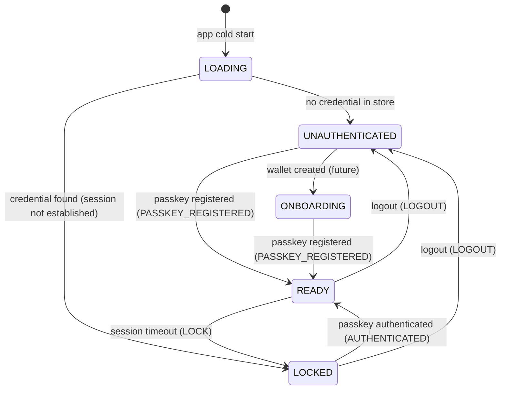
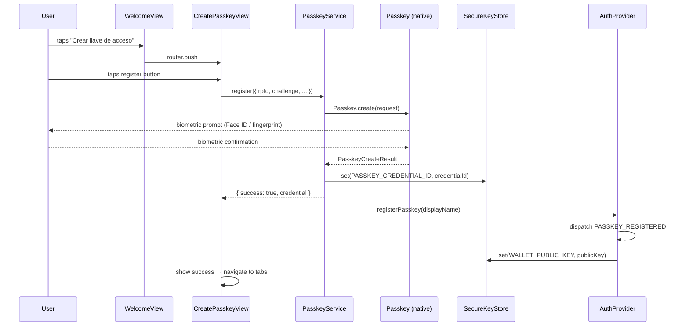
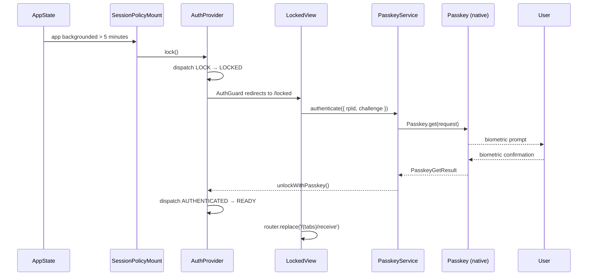

# Auth Flow — Ding Payments (C06)

This document describes the complete passkey authentication lifecycle for the Ding Payments mobile client.

## File ownership

| Area | Files |
|---|---|
| Service layer | `src/features/auth/services/PasskeyService.ts` |
| Error mapping | `src/features/auth/services/authErrors.ts` |
| Service types | `src/features/auth/services/types.ts` |
| API stub | `src/features/auth/services/AuthApiClient.ts` |
| State machine | `src/features/auth/state/authStore.ts` |
| React hook | `src/features/auth/hooks/useAuth.ts` |
| Session policy | `src/features/auth/hooks/useSessionPolicy.ts` |
| Re-auth gate | `src/features/auth/hooks/useReAuth.ts` |
| Route guard | `src/features/auth/components/AuthGuard.tsx` |
| Re-auth modal | `src/features/auth/components/ReAuthModal.tsx` |
| Session mount | `src/features/auth/components/SessionPolicyMount.tsx` |
| Settings UI | `src/features/auth/components/SettingsAuthSection.tsx` |
| Welcome view | `src/features/auth/views/WelcomeView.tsx` |
| Create passkey view | `src/features/auth/views/CreatePasskeyView.tsx` |
| Locked view | `src/features/auth/views/LockedView.tsx` |
| Secure store wrapper | `src/lib/SecureKeyStore.ts` |
| Secure store types | `src/lib/SecureKeyStore.types.ts` |
| Session constants | `src/constants/session.ts` |
| Onboarding routes | `src/app/(onboarding)/` |
| Root layout | `src/app/_layout.tsx` |
| Tabs layout | `src/app/(tabs)/_layout.tsx` |
| Unit tests | `src/features/auth/services/__tests__/PasskeyService.test.ts` |

---

## Auth state machine



### States

| State | Meaning |
|---|---|
| `LOADING` | App rehydrating auth state from SecureStore — render nothing |
| `UNAUTHENTICATED` | No passkey registered — redirect to onboarding welcome |
| `ONBOARDING` | Transitional state if wallet exists but passkey not yet created |
| `READY` | Fully authenticated — all protected tabs accessible |
| `LOCKED` | Session expired — passkey re-auth required before proceeding |

### Actions

| Action | Trigger | Transition |
|---|---|---|
| `REHYDRATE` | App cold start | `LOADING → UNAUTHENTICATED` or `LOADING → LOCKED` |
| `PASSKEY_REGISTERED` | Successful `PasskeyService.register()` | Any → `READY` |
| `AUTHENTICATED` | Successful `PasskeyService.authenticate()` | `LOCKED` → `READY` |
| `LOCK` | Session policy timeout | `READY → LOCKED` |
| `LOGOUT` | User logout or dev reset | Any → `UNAUTHENTICATED` |
| `SET_ERROR` | Auth failure | State unchanged, `lastError` updated |

---

## Registration flow



---

## Authentication / unlock flow



---

## Session policy

Implemented in `useSessionPolicy` (CLI-026) and `src/constants/session.ts`.

| Policy | Value | Configurable in |
|---|---|---|
| Idle lock | 15 minutes of no activity | `SESSION.IDLE_LOCK_MS` |
| Background lock | 5 minutes backgrounded | `SESSION.BACKGROUND_LOCK_MS` |
| Background grace | 30 seconds (skip re-auth for quick task switches) | `SESSION.BACKGROUND_GRACE_MS` |

### NFC lock exemption

The `useSessionPolicy` hook accepts an `nfcActive` boolean prop. When `true`, background lock is suppressed — this is the hook point for future NFC coordination. Wire via the NFC feature's active state:

```ts
// In SessionPolicyMount — update when NFC state is available:
useSessionPolicy({ nfcActive: nfcIsActive });
```

---

## Route guard

`AuthGuard` wraps the `(tabs)` layout. It reads `state.status` from `useAuth()` and performs `<Redirect>` using Expo Router's `replace` semantics to prevent back-button loops.

```
LOADING       → null (splash handles it)
UNAUTHENTICATED → /(onboarding)/welcome
ONBOARDING    → /(onboarding)/create-passkey
LOCKED        → /(onboarding)/locked
READY         → render children (tabs)
```

---

## Re-authentication modal

`ReAuthModal` + `useReAuth` provide a reusable gate for sensitive transaction actions (e.g. send payment, sign contract).

```tsx
const { withReAuth } = useReAuth();

// In a send-payment handler:
await withReAuth(async () => {
  await sendPayment(amount, recipient);
});
```

---

## Error handling

All native passkey errors are mapped through `mapNativePasskeyError()` in `authErrors.ts`. Every `AuthErrorCode` has a user-safe Spanish message. Raw native error objects are attached as `cause` for internal diagnostics only — they are never surfaced in toasts or analytics.

```
UserCancelled      → USER_CANCELLED  → "Autenticación cancelada…"
NotSupported       → NOT_SUPPORTED   → "Este dispositivo no es compatible…"
NoCredentials      → NO_CREDENTIAL   → "No se encontró ninguna llave de acceso…"
CredentialAlreadyExists → CREDENTIAL_EXISTS → "Ya existe una llave de acceso…"
Timeout            → TIMEOUT         → "La solicitud tardó demasiado…"
Interrupted        → INTERRUPTED     → "La autenticación fue interrumpida…"
(catch-all)        → UNKNOWN         → "Ocurrió un error inesperado…"
```

---

## Security notes

- **No private keys in passkey payloads** — credentials carry only the authenticator's public key and assertion data.
- **SecureKeyStore** uses `requireAuthentication: true` for sensitive keys (credential ID, wallet public key).
- **Dev reset** is gated behind `__DEV__` and never included in production builds.
- **Error sanitization**: `sanitizeAuthError()` strips `cause` before any analytics emission.
- **Challenges**: For production, challenges MUST come from the server (S06) to prevent replay attacks. The current MVP generates them locally.

---

## Server coordination (future)

`AuthApiClient` (CLI-025) provides typed stub interfaces that mirror anticipated S06/S10 server DTOs:

- `POST /v1/auth/register/challenge` → `RegisterChallengeResponse`
- `POST /v1/auth/register/verify` → `RegisterVerifyResponse`
- `POST /v1/auth/challenge` → `AuthChallengeResponse`
- `POST /v1/auth/verify` → `AuthVerifyResponse`
- `POST /v1/auth/revoke` → `RevokeTokenResponse`

Replace stub bodies with real `fetch` calls when S06 endpoints are live. Review with S19 observability conventions before shipping to keep client/server auth telemetry compatible.
