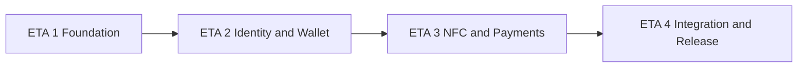

# Ding Payments — Client MVP Build Plan (Consolidated)

> **Executive backlog for `ding-payments/`** — 20 deliverables across 4 stages.
>
> Version: 1.1 · Date: 2026-06-17 · Scope: client MVP
>
> **Companion document:** [build-plan-client-mvp.md](./build-plan-client-mvp.md) — atomic spec (120 `CLI-###` tasks). Use this consolidated plan for sprints and GitHub Issues; use the atomic plan for implementation detail per sub-task.

**References**

- Product spec: [ding-payments.md](./ding-payments.md)
- Server consolidated plan: `ding-server/docs/server-build-plan-consolidated.md`
- Code layout: [FOLDER_LAYOUT](../.cursor/rules/FOLDER_LAYOUT.mdc)

---

## How to use this document

1. Execute **ETA 1 → ETA 4** in order; respect `Depends on`.
2. Each deliverable (`C##`) is one **sprint-sized** ticket (~1–2 weeks); atomic `CLI-###` IDs are a checklist inside the ticket.
3. For files, steps, tests and acceptance criteria per atomic task, open [build-plan-client-mvp.md](./build-plan-client-mvp.md) and search the `CLI-###` heading.
4. Target: **1 deliverable per 2-week sprint** ≈ 20 sprints to MVP beta (can parallelize late stages).

### Field legend

| Field | Meaning |
|-------|---------|
| ETA | Macro stage (1–4), 5 deliverables each |
| Priority | P0 = MVP blocker, P1 = release quality, P2 = nice-to-have |
| Complexity | E = Easy, M = Medium, H = Hard (multi-day / multi-area) |
| Atomic tasks | Original `CLI-###` IDs merged into this deliverable |

### Stage flow

---

## Task summary table

| ID | Title | ETA | P | C | Depends on | Atomic tasks |
|----|-------|-----|---|---|------------|--------------|
| C01 | CI and code quality toolchain | 1 | P0 | E | — | CLI-001, CLI-002 |
| C02 | Project structure and environment configuration | 1 | P0 | M | C01 | CLI-003, CLI-004, CLI-005, CLI-006 |
| C03 | EAS dev build and native plugins | 1 | P0 | H | C01 | CLI-007, CLI-008 |
| C04 | UI shell and global infrastructure | 1 | P0 | M | C02 | CLI-009, CLI-010, CLI-011, CLI-012 |
| C05 | Technical research ADRs (passkey, Stellar, NFC) | 1 | P0 | H | C03 | CLI-013, CLI-027, CLI-045 |
| C06 | Passkey authentication system | 2 | P0 | H | C04, C05 | CLI-014–CLI-026 |
| C07 | Stellar wallet: SDK and key management | 2 | P0 | H | C05, C06 | CLI-028, CLI-029, CLI-030, CLI-031, CLI-032 |
| C08 | Stellar wallet: accounts, balances and assets | 2 | P0 | H | C07 | CLI-033, CLI-034, CLI-035, CLI-036, CLI-037, CLI-038 |
| C09 | Stellar wallet: transactions, integration and tests | 2 | P0 | H | C08 | CLI-039, CLI-040, CLI-041, CLI-042, CLI-043, CLI-044 |
| C10 | NFC protocol and session management | 3 | P0 | H | C05, C09 | CLI-046, CLI-047, CLI-048, CLI-049, CLI-050, CLI-051, CLI-052 |
| C11 | NFC platform config, security and documentation | 3 | P0 | H | C10 | CLI-053, CLI-054, CLI-055, CLI-056, CLI-057, CLI-058, CLI-059, CLI-060 |
| C12 | Receive payment flow (end-to-end) | 3 | P0 | H | C10, C11, C09 | CLI-061–CLI-072 |
| C13 | Send payment: parse, review, simulate and sign | 3 | P0 | H | C11, C09, C06 | CLI-073, CLI-074, CLI-075, CLI-076, CLI-077, CLI-078, CLI-079 |
| C14 | Send payment: outcomes, orchestration and documentation | 3 | P0 | M | C13 | CLI-080, CLI-081, CLI-082, CLI-083, CLI-084, CLI-085, CLI-086 |
| C15 | Transaction history feature | 4 | P0 | M | C09, C04 | CLI-087–CLI-096 |
| C16 | Server HTTP integration | 4 | P0 | H | C06, C13, C02 | CLI-097–CLI-106 |
| C17 | UX hardening (network, a11y, i18n, branding, perf) | 4 | P1 | M | C04, C15 | CLI-107–CLI-111 |
| C18 | Security checklist and E2E manual NFC matrix | 4 | P0 | H | C12, C14 | CLI-112, CLI-113 |
| C19 | Production build and client safeguards | 4 | P1 | M | C03, C04 | CLI-114, CLI-115, CLI-116 |
| C20 | Beta release and success metrics | 4 | P0/P1 | M | C18, C19 | CLI-117–CLI-120 |

---

## ETA 1 — Foundation (5 deliverables)

Repo basics, dev build, UI shell, and technical spikes. **Milestone: installable dev build with navigation shell.**

### C01 — CI and code quality toolchain

| Atomic | CLI-001, CLI-002 | Depends on | — | Complexity | Easy |

**Objective:** CI passes on every PR with `build`, `lint`, and Prettier.

**Done when:** `.github/workflows/ci-client.yml` green; `package.json` scripts aligned.

---

### C02 — Project structure and environment configuration

| Atomic | CLI-003, CLI-004, CLI-005, CLI-006 | Depends on | C01 | Complexity | Medium |

**Objective:** `src/features/` layout, `@/` aliases, README, and Stellar `.env.example`.

**Done when:** Imports use `@/`; new dev configures testnet from docs + env template.

---

### C03 — EAS dev build and native plugins

| Atomic | CLI-007, CLI-008 | Depends on | C01 | Complexity | Hard | **Hard blocker**

**Objective:** EAS development profile with NFC and secure-store native modules.

**Done when:** Dev build installs on physical device (not Expo Go).

---

### C04 — UI shell and global infrastructure

| Atomic | CLI-009, CLI-010, CLI-011, CLI-012 | Depends on | C02 | Complexity | Medium |

**Objective:** Theme tokens, base components, tab/stack navigation, error boundary, toasts, logging/analytics stub.

**Done when:** App navigates main tabs; global errors and toasts work; `log` / `analytics.track` available.

---

### C05 — Technical research ADRs (passkey, Stellar, NFC)

| Atomic | CLI-013, CLI-027, CLI-045 | Depends on | C03 | Complexity | Hard |

**Objective:** Three ADRs documenting library choices, constraints, payload limits, and polyfill requirements.

**Done when:** `docs/adr/` (or equivalent) has approved spikes for passkeys, stellar-sdk, and NFC; proof-of-concept notes on device.

---

## ETA 2 — Identity and wallet (5 deliverables)

Passkey auth and full self-custodial Stellar wallet. **Milestone: funded testnet wallet with XLM/USDC balances.**

### C06 — Passkey authentication system

| Atomic | CLI-014–CLI-026 | Depends on | C04, C05 | Complexity | Hard |

**Includes:** PasskeyService + tests, onboarding screens, SecureKeyStore, auth state machine, route guards, re-auth, error handling, settings, auth docs, API stub, session lock policy.

**Done when:** User completes onboarding with passkey; session lock after background; `docs/auth-flow.md` exists.

---

### C07 — Stellar wallet: SDK and key management

| Atomic | CLI-028, CLI-029, CLI-030, CLI-031, CLI-032 | Depends on | C05, C06 | Complexity | Hard |

**Includes:** stellar-sdk + polyfills, Horizon client, Ed25519 keygen, encrypted persistence, WalletStore states.

**Done when:** Keypair generated and encrypted; wallet state `none → ready`.

---

### C08 — Stellar wallet: accounts, balances and assets

| Atomic | CLI-033, CLI-034, CLI-035, CLI-036, CLI-037, CLI-038 | Depends on | C07 | Complexity | Hard |

**Includes:** `useWallet` hook, setup UI, friendbot funding, BalanceService, USDC trustline, AssetSelector.

**Done when:** Testnet account funded; XLM and USDC balances displayed; trustline created when needed.

---

### C09 — Stellar wallet: transactions, integration and tests

| Atomic | CLI-039, CLI-040, CLI-041, CLI-042, CLI-043, CLI-044 | Depends on | C08 | Complexity | Hard |

**Includes:** TransactionBuilder, fee validation, Horizon error mapping, AuthGuard/Settings integration, unit tests, `docs/wallet-flow.md`.

**Done when:** Payment operations buildable; wallet integrated in app shell; tests pass.

---

## ETA 3 — NFC and payment flows (5 deliverables)

NFC protocol, receive and send flows. **Milestone: first NFC payment signed and submitted on testnet.**

### C10 — NFC protocol and session management

| Atomic | CLI-046–CLI-052 | Depends on | C05, C09 | Complexity | Hard |

**Includes:** react-native-nfc-manager setup, NfcService, Zod schema, payload codec, writer/reader sessions, NfcSessionStore.

**Done when:** Two devices exchange payment-request JSON via NFC; session state tracked.

---

### C11 — NFC platform config, security and documentation

| Atomic | CLI-053–CLI-060 | Depends on | C10 | Complexity | Hard |

**Includes:** Availability banner, expiry/replay validation, no-secrets policy, iOS Core NFC, Android foreground dispatch, `useNfc` hook, error analytics, `docs/nfc-flow.md`.

**Done when:** NFC works on iOS and Android dev builds; security rules enforced; docs complete.

---

### C12 — Receive payment flow (end-to-end)

| Atomic | CLI-061–CLI-072 | Depends on | C10, C11, C09 | Complexity | Hard |

**Includes:** Receive home, validation, PaymentRequestBuilder, listening view, orchestrator hook, all UI states, timeout, trustline check, analytics, `docs/receive-flow.md`.

**Done when:** Receiver can enter amount, emit NFC request, and see success/fail/timeout states.

---

### C13 — Send payment: parse, review, simulate and sign

| Atomic | CLI-073–CLI-079 | Depends on | C11, C09, C06 | Complexity | Hard | **Critical path**

**Includes:** Send home, parse NFC, review screen, simulation, confirm UI, re-auth modal, sign and submit tx to Horizon.

**Done when:** Sender completes tap → review → passkey → signed tx broadcast.

---

### C14 — Send payment: outcomes, orchestration and documentation

| Atomic | CLI-080–CLI-086 | Depends on | C13 | Complexity | Medium |

**Includes:** Success/fail screens, insufficient balance UX, `useSendPayment` hook, analytics, unified errors, `docs/send-flow.md`.

**Done when:** Full send UX including retries and error recovery; orchestrator hook drives flow.

---

## ETA 4 — Integration and release (5 deliverables)

History, server API, polish, beta. **Milestone: beta build ready for testers.**

### C15 — Transaction history feature

| Atomic | CLI-087–CLI-096 | Depends on | C09, C04 | Complexity | Medium |

**Includes:** Horizon history service, list/detail views, hook, pagination, pull-to-refresh, badges, empty state, cache, `docs/history-flow.md`.

**Done when:** User browses transaction history with filters and detail view.

---

### C16 — Server HTTP integration

| Atomic | CLI-097–CLI-106 | Depends on | C06, C13, C02 | Complexity | Hard |

**Includes:** HttpClient, env validation, auth/wallet/tx API clients, retry policy, health check, onboarding integration, offline fallback, `docs/server-integration.md`.

**Done when:** App registers with ding-server when available; payments work offline via Horizon.

---

### C17 — UX hardening (network, a11y, i18n, branding, perf)

| Atomic | CLI-107–CLI-111 | Depends on | C04, C15 | Complexity | Medium |

**Includes:** Connectivity banner, accessibility audit, Spanish i18n, app icon/splash, FlatList performance.

**Done when:** App meets MVP polish bar for beta testers.

---

### C18 — Security checklist and E2E manual NFC matrix

| Atomic | CLI-112, CLI-113 | Depends on | C12, C14 | Complexity | Hard |

**Done when:** Pre-release security checklist signed off; manual E2E matrix executed on target devices.

---

### C19 — Production build and client safeguards

| Atomic | CLI-114, CLI-115, CLI-116 | Depends on | C03, C04 | Complexity | Medium |

**Includes:** Production EAS profile, Sentry stub, duplicate-payment debounce.

**Done when:** Production binary buildable; crash reporting wired; rate limit on payments.

---

### C20 — Beta release and success metrics

| Atomic | CLI-117–CLI-120 | Depends on | C18, C19 | Complexity | Medium |

**Includes:** Deep link scaffolding (P2), beta testing guide, MVP release checklist, success metrics wiring.

**Done when:** Beta cohort can install and test; release checklist complete; metrics events fire.

---

## Hard blockers

| Deliverable | Why |
|-------------|-----|
| **C03** | No NFC or passkeys without EAS dev build |
| **C05** | ADRs before native payment integrations |
| **C07** | Wallet keygen before any on-chain action |
| **C10** | NFC sessions before receive/send |
| **C13** | Sign/submit before beta release |

---

## Client ↔ server alignment

| Client | Server | Integration |
|--------|--------|-------------|
| C10, C11 | S08, S09 | `payment-request.v1` payload |
| C12, C13 | S09, S10 | Validate, authorize, submit |
| C16 | S06, S07, S11 | Auth, wallet, payment status APIs |
| C18 | S11 | Full E2E payment matrix |

---

## Sprint planning guide

| Sprint | Deliverable | Milestone |
|--------|-------------|-----------|
| 1 | C01 | Green CI |
| 2 | C02 | Project configured |
| 3 | C03 | Dev build on device |
| 4 | C04 | App shell |
| 5 | C05 | ADRs approved |
| 6 | C06 | Passkey auth |
| 7–8 | C07–C08 | Wallet funded |
| 9 | C09 | Wallet complete |
| 10–11 | C10–C11 | NFC working |
| 12 | C12 | Receive flow |
| 13–14 | C13–C14 | **First E2E payment** |
| 15 | C15 | History |
| 16 | C16 | Server integration |
| 17 | C17 | UX polish |
| 18 | C18 | QA matrix |
| 19 | C19 | Production build |
| 20 | C20 | Beta release |

---

*Consolidated from 120 atomic tasks (v1.1: 20 deliverables). Detail: [build-plan-client-mvp.md](./build-plan-client-mvp.md)*
