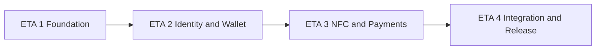

# Ding Payments — Client MVP Build Plan (Consolidated)

> **Executive backlog for `ding-payments/`** — 20 deliverables across 4 ETAs (stages).
>
> **Version: 1.2** · Date: 2026-06-17 · Scope: client MVP
>
> **v1.2 note:** GitHub Issue ready — copy each `### C##` section (from heading through Definition of done) as the issue body. One deliverable = one GitHub Issue = one sprint ticket.
>
> **Companion document:** [build-plan-client-mvp.md](./build-plan-client-mvp.md) — atomic spec (120 `CLI-###` tasks). This consolidated plan is the sprint/GitHub Issue layer; the atomic plan is the implementation checklist inside each issue.

**References**

- Product spec: [ding-payments.md](./ding-payments.md)
- Server consolidated plan: `ding-server/docs/server-build-plan-consolidated.md`
- Code layout: [FOLDER_LAYOUT](../.cursor/rules/FOLDER_LAYOUT.mdc)

---

## How to use for GitHub Issues

1. **Create one Issue per deliverable** (`C01`–`C20`). Title format: `[C##] Short title` (e.g. `[C03] EAS dev build and native plugins`).
2. **Copy the entire `### C##` block** from this file into the Issue body (starts at `### C## — Title`, ends at the final Definition of done checklist).
3. **Add labels** (suggested): `client`, `eta-{1-4}`, priority (`P0`/`P1`), complexity (`easy`/`medium`/`hard`).
4. **Link dependencies** in the Issue sidebar or description: paste `Depends on: C##` and link sibling Issues.
5. **Use atomic sub-tasks** as checklist items inside the Issue (or spawn sub-issues from the Atomic sub-task checklist table for parallel agents).
6. **Acceptance criteria** are the merge gate — every checkbox must pass before closing the Issue.
7. **Cross-repo:** When a deliverable lists Server coordination, open/link matching `S##` Issues in `ding-server`.

### Field legend

| Field | Meaning |
|-------|---------|
| ETA | Macro stage (1–4), 5 deliverables each |
| Priority | P0 = MVP blocker, P1 = release quality, P2 = nice-to-have |
| Complexity | E = Easy, M = Medium, H = Hard (multi-day / multi-area) |
| Atomic tasks | Original `CLI-###` IDs merged into this deliverable |
| Est. effort | Calendar days for one developer; assumes dependencies met |

### Stage flow



### Client architecture (reference)

See full diagram in [build-plan-client-mvp.md](./build-plan-client-mvp.md#client-architecture). Layers:

| Layer | Responsibility |
|------|-----------------|
| `src/app/` | Thin expo-router routes; no domain logic |
| `src/features/*` | Vertical slices: auth, wallet, nfc, receive, send, history |
| `src/lib/` | Infra: env, HTTP, SecureKeyStore, analytics |
| `src/components/ui/` | Reusable UI primitives |

**Confirmed stack:** Expo 56 + React Native · expo-router · zustand · Zod · @stellar/stellar-sdk · react-native-nfc-manager · passkeys (per ADR) · expo-secure-store · EAS · ding-server REST (Phase 7).

---

## Task summary table

| ID | Title | ETA | P | C | Depends on | Atomic tasks | Est. effort |
|----|-------|-----|---|---|------------|--------------|-------------|
| C01 | CI and code quality toolchain | 1 | P0 | E | — | CLI-001, CLI-002 | 2–3 days |
| C02 | Project structure and environment configuration | 1 | P0 | M | C01 | CLI-003–006 | 4–5 days |
| C03 | EAS dev build and native plugins | 1 | P0 | H | C01 | CLI-007, CLI-008 | 5–8 days |
| C04 | UI shell and global infrastructure | 1 | P0 | M | C02 | CLI-009–012 | 5–7 days |
| C05 | Technical research ADRs (passkey, Stellar, NFC) | 1 | P0 | H | C03 | CLI-013, CLI-027, CLI-045 | 5–7 days |
| C06 | Passkey authentication system | 2 | P0 | H | C04, C05 | CLI-014–026 | 8–10 days |
| C07 | Stellar wallet: SDK and key management | 2 | P0 | H | C05, C06 | CLI-028–032 | 8–10 days |
| C08 | Stellar wallet: accounts, balances and assets | 2 | P0 | H | C07 | CLI-033–038 | 8–10 days |
| C09 | Stellar wallet: transactions, integration and tests | 2 | P0 | H | C08 | CLI-039–044 | 6–8 days |
| C10 | NFC protocol and session management | 3 | P0 | H | C05, C09 | CLI-046–052 | 8–10 days |
| C11 | NFC platform config, security and documentation | 3 | P0 | H | C10 | CLI-053–060 | 6–8 days |
| C12 | Receive payment flow (end-to-end) | 3 | P0 | H | C10, C11, C09 | CLI-061–072 | 8–10 days |
| C13 | Send payment: parse, review, simulate and sign | 3 | P0 | H | C11, C09, C06 | CLI-073–079 | 8–10 days |
| C14 | Send payment: outcomes, orchestration and documentation | 3 | P0 | M | C13 | CLI-080–086 | 5–7 days |
| C15 | Transaction history feature | 4 | P0 | M | C09, C04 | CLI-087–096 | 6–8 days |
| C16 | Server HTTP integration | 4 | P0 | H | C06, C13, C02 | CLI-097–106 | 7–9 days |
| C17 | UX hardening (network, a11y, i18n, branding, perf) | 4 | P1 | M | C04, C15 | CLI-107–111 | 5–7 days |
| C18 | Security checklist and E2E manual NFC matrix | 4 | P0 | H | C12, C14 | CLI-112, CLI-113 | 5–7 days |
| C19 | Production build and client safeguards | 4 | P1 | M | C03, C04 | CLI-114–116 | 4–6 days |
| C20 | Beta release and success metrics | 4 | P0/P1 | M | C18, C19 | CLI-117–120 | 4–6 days |

---


## ETA 1 — Foundation (5 deliverables)


**Milestone:** installable dev build with navigation shell.

### C01 — CI and code quality toolchain

| Field | Value |
|-------|-------|
| **ID** | C01 |
| **ETA** | ETA 1 |
| **Priority** | P0 |
| **Complexity** | E |
| **Depends on** | — |
| **Atomic tasks** | CLI-001, CLI-002 |
| **Est. effort** | 2–3 days |

**Executive summary**

This deliverable establishes a green and enforceable CI baseline for the Expo client by fixing scripts and quality gates.
It consolidates build, lint, and format behavior so the team and automation run the same commands without drift.
It introduces Expo-compatible ESLint and Prettier configuration so quality rules are predictable across contributors.
Without C01, every downstream feature risks merge churn, inconsistent style, and broken pull request pipelines.

**Product context**

The MVP plan marks CLI-001 as a hard blocker because the workflow currently calls scripts that do not exist and lacks linting dependencies. CLI-002 then formalizes ESLint and Prettier conventions for Expo TypeScript, including a stable formatter script and baseline config files. Together these tasks create the minimum quality contract required before structural, auth, wallet, or NFC work can proceed safely.

**User stories**

- As a developer, I want CI to execute real build and lint scripts so that pull requests fail fast on regressions.
- As a team member, I want consistent lint and formatting rules so that code reviews focus on behavior instead of style noise.
- As an agent, I want deterministic quality commands so that automation can validate changes the same way humans do.

**Prerequisites**

- Repository bootstrapped at ding-payments root
- GitHub Actions workflow available at .github/workflows/ci-client.yml
- Node/npm toolchain available to run build and lint locally

**Atomic sub-task checklist**

| CLI-ID | Title | Key deliverable |
|--------|-------|-----------------|
| CLI-001 | Fix CI scripts (build, lint, prettier) | Make CI commands real and green |
| CLI-002 | Configure ESLint and Prettier for Expo TypeScript | Enforce lint and formatting standards |

**Scope — In**

- Add a valid build script (`expo export --platform web` or `tsc --noEmit`) aligned to CI intent.
- Install and configure Expo-compatible ESLint plus Prettier with root config files.
- Ensure npm scripts for lint and format are explicit and documented.
- Run local parity checks for build/lint/format to mirror CI behavior.
- Update CI workflow steps if script names or sequence must be corrected.

**Scope — Out**

- EAS binary build execution inside CI
- Detox or device-level E2E automation
- Husky and lint-staged pre-commit automation
- Feature-domain implementation in src/features

**Architecture & conventions**

C01 anchors quality around the project FOLDER_LAYOUT rules and Expo React Native stack by establishing lint/build gates before feature slices grow. It follows a shift-left validation pattern where CI is source-of-truth, scripts are single-entry points, and formatting/linting are deterministic. This aligns with repository-level developer-experience patterns used across client phases.

**Files to create/modify**

- `.github/workflows/ci-client.yml`
- `package.json`
- `eslint.config.mjs`
- `.prettierrc`

**Implementation guide**

1. Audit current ci-client workflow commands and note missing scripts or tools.
2. Add a working `build` script in package.json compatible with Expo TypeScript flow.
3. Install `eslint`, `eslint-config-expo`, and `prettier` as required dependencies.
4. Create `eslint.config.mjs` using Expo + TypeScript baseline configuration.
5. Create `.prettierrc` with agreed conventions (singleQuote, trailingComma es5).
6. Add or normalize scripts for `lint` and `format` in package.json.
7. Run `npm run build`, `npm run lint`, and `npm run format` locally.
8. Align workflow command sequence to the validated local script surface.
9. Document command expectations in README if scripts changed materially.
10. Re-run checks to confirm no post-format diffs or type errors.

**Acceptance criteria**

- [ ] `npm run build` exists and exits with code 0 in local environment.
- [ ] `npm run lint` exists and exits with code 0 in local environment.
- [ ] `npm run format` runs Prettier over repository files successfully.
- [ ] CI workflow references only scripts that exist in package.json.
- [ ] Expo lint integration is active and does not crash on startup.
- [ ] Prettier config is checked into root and discoverable by editor tooling.
- [ ] Local command sequence reproduces CI command sequence without divergence.
- [ ] No hardcoded environment-specific paths are introduced in scripts.
- [ ] Formatting run does not leave unresolved diffs after second pass.
- [ ] Lint configuration supports TypeScript files in src and app directories.
- [ ] Type-check path remains compatible with future noEmit checks.
- [ ] Changes are documented enough for new contributors to run quality checks.

**Test plan**

- **Unit:** N/A for business logic; verify script command contract and lint config behavior with command-level checks.
- **Manual:** Run `npm run build && npm run lint && npm run format` twice and confirm idempotent output.
- **Device:** Not required for C01; no native/device runtime behavior is introduced.

**Server coordination**

C01 has no direct API dependency, but it should stay compatible with server-side quality expectations in S19 and release rigor in S20. Keeping client CI green reduces integration friction when auth (S06-S07), payment contracts (S08-S09), and payment lifecycle work (S14-S16) begin cross-repo validation.

**Security notes**

- Do not add scripts that leak environment values in CI logs.
- Keep formatter and linter tooling pinned via lockfile to avoid supply-chain drift.
- Avoid introducing broad file globs that can unintentionally expose generated secrets.

**Risks & pitfalls**

- Choosing an incompatible build command can break CI on non-web assumptions.
- Lint rules that are too strict may block velocity before baseline code cleanup.
- Workflow and package scripts may drift again if not documented clearly.
- Developers may bypass format script unless CI enforces it consistently.

**Definition of done**

- [ ] CI pipeline passes with build, lint, and formatting checks enabled.
- [ ] ESLint and Prettier configs are committed and discoverable.
- [ ] Local and CI command parity is verified by at least one dry run.
- [ ] README or contributor docs mention canonical quality commands.
- [ ] No unrelated feature code was bundled into this deliverable.

---

### C02 — Project structure and environment configuration

| Field | Value |
|-------|-------|
| **ID** | C02 |
| **ETA** | ETA 1 |
| **Priority** | P0 |
| **Complexity** | M |
| **Depends on** | C01 |
| **Atomic tasks** | CLI-003, CLI-004, CLI-005, CLI-006 |
| **Est. effort** | 1.5 engineer-weeks |

**Executive summary**

This deliverable creates the client architecture baseline by enforcing feature-slice folders and shared platform directories.
It introduces TypeScript path aliases to eliminate fragile deep relative imports and simplify future refactors.
It replaces generic Expo setup docs with Ding Payments-specific README onboarding and environment guidance.
It formalizes runtime Stellar/app env variables in typed client code to support testnet/mainnet switching safely.

**Product context**

The MVP plan uses CLI-003 through CLI-006 to define operational scaffolding before functional features. CLI-003 follows FOLDER_LAYOUT conventions in `src/features/*`, CLI-004 sets `@/` aliasing, CLI-005 documents app-specific setup and dev-build requirements, and CLI-006 introduces typed `EXPO_PUBLIC_` environment config including Stellar network fields and issuer values. This package is a hard platform prerequisite for auth, wallet, and NFC phases.

**User stories**

- As a developer, I want a clear domain folder structure so that feature work stays modular and predictable.
- As an engineer, I want `@/` imports so that moving files does not create brittle relative-path churn.
- As a new contributor, I want a project README and env examples so that local setup is repeatable without tribal knowledge.
- As a wallet implementer, I want typed network config so that testnet/mainnet behavior is switched intentionally.

**Prerequisites**

- C01 complete with quality scripts and linting baseline
- Agreement on FOLDER_LAYOUT and feature names
- Initial list of required Stellar env vars and defaults

**Atomic sub-task checklist**

| CLI-ID | Title | Key deliverable |
|--------|-------|-----------------|
| CLI-003 | Create features and shared folder structure | Establish vertical slice architecture |
| CLI-004 | Configure path aliases @/ in TypeScript | Normalize imports across codebase |
| CLI-005 | Document Ding Payments project README | Create reliable onboarding guide |
| CLI-006 | Configure Stellar and app environment variables | Provide typed runtime network config |

**Scope — In**

- Create scaffold directories for auth, wallet, receive, send, and history feature domains.
- Create shared folders `src/lib`, `src/components/ui`, and `src/constants` with placeholders.
- Configure tsconfig path aliases and Babel resolver where required for Expo.
- Replace boilerplate README with Ding-specific setup, tooling, and dev-client requirements.
- Create `.env.example` and typed `src/lib/env.ts` with Stellar network and issuer variables.
- Update `.gitignore` and docs to prevent accidental `.env` commits.

**Scope — Out**

- Business logic implementation inside feature slices
- Server API documentation beyond client integration notes
- Jest alias config and advanced test harness wiring
- Production secret management in EAS cloud dashboards

**Architecture & conventions**

C02 establishes the FOLDER_LAYOUT architecture for Expo Router + TypeScript by separating app routing concerns from feature domain logic and shared libraries. It adopts import aliasing and typed configuration patterns that keep wallet/auth/NFC code decoupled from raw process env access. The pattern supports scalable feature slices and consistent stack usage across React Native, Zustand, Zod, and service-layer boundaries.

**Files to create/modify**

- `src/features/.gitkeep`
- `src/features/README.md`
- `src/lib/.gitkeep`
- `src/components/ui/.gitkeep`
- `src/constants/.gitkeep`
- `tsconfig.json`
- `babel.config.js`
- `README.md`
- `.env.example`
- `src/lib/env.ts`
- `.gitignore`

**Implementation guide**

1. Create feature-slice folders and shared directories exactly per FOLDER_LAYOUT convention.
2. Add minimal placeholder files to keep empty folders version-controlled.
3. Configure `@/*` alias mapping in tsconfig paths.
4. Add Babel module resolver support if Expo Router setup requires it.
5. Compile with noEmit to validate alias resolution in editor and CLI.
6. Replace generic README with Ding Payments context, prerequisites, and local startup flow.
7. Document NFC/passkey limitation in Expo Go and dev-build requirement.
8. Create `.env.example` with all required `EXPO_PUBLIC_` variables.
9. Implement typed env loader and validations in `src/lib/env.ts`.
10. Ensure `.env` remains ignored and README references `.env.example` bootstrap.
11. Link primary docs (`docs/ding-payments.md`, build plan) from README.

**Acceptance criteria**

- [ ] Feature and shared directories exist and match FOLDER_LAYOUT naming.
- [ ] README explains project purpose, setup, and dev build workflow clearly.
- [ ] `@/` imports resolve in TypeScript and editor tooling.
- [ ] No deep-relative import rewrites are required for new feature files.
- [ ] `.env.example` includes network, Horizon, RPC, and USDC issuer variables.
- [ ] `src/lib/env.ts` exports typed config used by downstream services.
- [ ] Mainnet path enforces explicit RPC/Horizon configuration requirements.
- [ ] `.env` is ignored and no secrets are introduced into committed files.
- [ ] README includes troubleshooting for NFC/passkey native constraints.
- [ ] Build and lint remain green after structural and config changes.
- [ ] Docs reference current scripts and do not point to removed Expo boilerplate.
- [ ] No functional feature implementation leaked into pure scaffold task.

**Test plan**

- **Unit:** Add unit coverage for env parsing/validation behavior with mocked process environment matrix.
- **Manual:** Validate clean-clone onboarding from README, alias imports via noEmit, and runtime env switching logs.
- **Device:** Optional smoke on dev build to confirm env values are available in runtime configuration screen/log.

**Server coordination**

C02 is the client-side counterpart to server setup and config tracks (S01-S03) and sets contracts needed later for S08/S09 payload coordination and S12/S13 Stellar config assumptions. The `AuthApiClient` and wallet network flow in future client tasks rely on stable environment and docs foundations to align with S06, S07, and S12 modules.

**Security notes**

- Use `EXPO_PUBLIC_` only for non-sensitive client-safe values.
- Do not commit `.env` with local keys or credentials.
- Validate network endpoints to avoid accidental mainnet misuse in development.

**Risks & pitfalls**

- Alias misconfiguration can break Metro, TypeScript, or editor resolution differently.
- README drift can quickly invalidate onboarding for new engineers.
- Incorrect env defaults may cause Horizon or issuer mismatches later.
- Over-scaffolding can create noisy folders that are not used consistently.
- Failure to enforce `.env` hygiene can leak sensitive local data.

**Definition of done**

- [ ] Folder scaffold and aliases are fully operational and lint-clean.
- [ ] README is Ding-specific and tested via a fresh setup run.
- [ ] Typed env module exists and is consumed by at least one import path.
- [ ] No secrets committed; `.env` hygiene is confirmed.
- [ ] Downstream phases can build without revisiting foundational scaffolding.

---

### C03 — EAS dev build and native plugins

| Field | Value |
|-------|-------|
| **ID** | C03 |
| **ETA** | ETA 1 |
| **Priority** | P0 |
| **Complexity** | H |
| **Depends on** | C01, C02 |
| **Atomic tasks** | CLI-007, CLI-008 |
| **Est. effort** | 1.5 engineer-weeks |
| **Blocker** | ⚠️ Hard blocker — see Hard blockers section |

**Executive summary**

This deliverable enables native runtime capability required for passkeys and NFC by setting up EAS development builds.
It configures app-level permissions and plugin wiring for secure storage and NFC entitlements on iOS and Android.
It converts project configuration to support native plugin customization and repeatable rebuild instructions.
Without C03, passkey and NFC epics cannot be validated on physical devices and remain blocked by Expo Go limits.

**Product context**

CLI-007 and CLI-008 are explicit hard blockers in the MVP plan. CLI-007 establishes `eas.json` profiles plus development build workflow because Expo Go cannot support production-grade passkeys/NFC behavior. CLI-008 configures `app.config.ts` with secure-store and NFC permissions (`NFCReaderUsageDescription`, Android NFC permission) and ensures native rebuild procedures are documented. This is a platform gate for C05, C06, and C10.

**User stories**

- As a developer, I want a reproducible dev client build so that I can test native capabilities on real devices.
- As a security-conscious team, I want secure-store and NFC permissions configured correctly so that sensitive workflows are not blocked at runtime.
- As an onboarding engineer, I want clear build/rebuild documentation so that native plugin changes are not lost between contributors.

**Prerequisites**

- C01 and C02 completed with working scripts, docs, and env baseline
- Expo/EAS account access for project maintainers
- At least one physical iOS or Android device for smoke validation

**Atomic sub-task checklist**

| CLI-ID | Title | Key deliverable |
|--------|-------|-----------------|
| CLI-007 | Setup EAS and development build profile | Enable native dev client pipeline |
| CLI-008 | Configure app.json plugins NFC and secure store | Declare runtime permissions and secure storage |

**Scope — In**

- Create `eas.json` with development, preview, and production profiles.
- Migrate to `app.config.ts` if needed for plugin-driven config.
- Add scripts for building/running dev clients from CLI.
- Install and configure `expo-secure-store` for secret persistence primitives.
- Add iOS and Android NFC permission declarations and usage descriptions.
- Document rebuild requirements after native dependency/plugin changes.

**Scope — Out**

- Store submission workflows and release channel automation
- Production OTA update strategy
- NFC business logic implementation
- Passkey domain logic implementation

**Architecture & conventions**

C03 bridges FOLDER_LAYOUT-driven JS architecture with native Expo stack requirements by introducing EAS dev-client patterns and plugin-based app configuration. It follows a boundary pattern where native capabilities are configured once in app-level config and consumed later through feature services under `src/features/*`. This keeps native concerns centralized while preserving clean service abstractions for passkey and NFC modules.

**Files to create/modify**

- `eas.json`
- `app.config.ts`
- `app.json`
- `package.json`
- `README.md`

**Implementation guide**

1. Install and authenticate EAS CLI for the project maintainers.
2. Create `eas.json` with development, preview, and production profiles.
3. Add dev-build scripts for iOS and Android into package.json.
4. Migrate static app config to `app.config.ts` if plugin customization is required.
5. Install `expo-secure-store` and verify package lock update.
6. Declare iOS NFC reader usage description and required entitlements.
7. Declare Android NFC permission through Expo config/plugin path.
8. Run a development build on at least one physical target platform.
9. Start app with `expo start --dev-client` and verify bootstrap success.
10. Document build/rebuild and troubleshooting steps in README.

**Acceptance criteria**

- [ ] Development profile exists in `eas.json` and is committed.
- [ ] Dev build can be produced and installed on a physical device.
- [ ] App launches via `expo start --dev-client` without native plugin errors.
- [ ] SecureStore APIs are available at runtime in development build.
- [ ] iOS config includes NFC reader usage description text.
- [ ] Android NFC permission is declared through app config output.
- [ ] Native changes are documented with explicit rebuild requirement notes.
- [ ] No Expo Go dependency remains for NFC/passkey validation paths.
- [ ] Preview and production profiles exist even if not fully used yet.
- [ ] Lint/type checks remain green after config migration.
- [ ] README clearly distinguishes simulator limitations versus real device testing.
- [ ] Team can reproduce setup from docs without local tribal fixes.

**Test plan**

- **Unit:** N/A for pure native config; verify config generation and script behavior.
- **Manual:** Perform EAS dev build and confirm app starts in dev-client mode with no plugin crashes.
- **Device:** Smoke test `SecureStore.setItemAsync` and NFC support check on physical iOS/Android devices.

**Server coordination**

C03 has no direct endpoint coupling but is a prerequisite for client features that integrate with server auth and payment contracts (S06-S10, S14-S16). A healthy native runtime is required before validating end-to-end interactions with S08 contract payloads and S10 authorization steps.

**Security notes**

- Ensure permission copy is explicit and not overly broad.
- Avoid storing secrets in plain app config or committed env files.
- Rebuild after native plugin updates to avoid stale binary behavior.

**Risks & pitfalls**

- EAS account or credential issues can delay all native-dependent phases.
- Incorrect entitlement configuration can fail silently until device test.
- Team may accidentally continue testing on Expo Go and miss blockers.
- Plugin and Expo SDK version mismatch can introduce brittle build failures.
- Native rebuild steps may be skipped if README is unclear.

**Definition of done**

- [ ] EAS profiles and native config are committed and reproducible.
- [ ] At least one physical dev-build smoke test is successful.
- [ ] NFC and secure-store permissions are present in generated native manifests.
- [ ] README includes explicit native rebuild workflow.
- [ ] C03 is marked as unblocking passkey and NFC phases.

---


## ETA 2 — Identity and Wallet (5 deliverables)


**Milestone:** funded testnet wallet with XLM/USDC balances.

### C04 — UI shell and global infrastructure

| Field | Value |
|-------|-------|
| **ID** | C04 |
| **ETA** | ETA 2 |
| **Priority** | P0 |
| **Complexity** | M |
| **Depends on** | C02 |
| **Atomic tasks** | CLI-009, CLI-010, CLI-011, CLI-012 |
| **Est. effort** | 2 engineer-weeks |

**Executive summary**

This deliverable creates the user-facing shell with reusable theme primitives, tabs, and global error handling.
It migrates template routing to Ding-specific tabs for receive, send, history, and settings.
It introduces a top-level ErrorBoundary and toast conventions to avoid silent failures in MVP flows.
It prepares a minimal analytics facade so event instrumentation can scale without refactoring core features.

**Product context**

CLI-009 through CLI-012 provide the foundational interface and diagnostics posture for all subsequent epics. The MVP plan specifies clean, high-contrast UI components, expo-router tab architecture, global boundary/toast behavior, and a no-op analytics layer (`trackEvent`, `logError`) with strict no-secrets logging policy. These tasks ensure feature teams can plug into stable UI/observability primitives rather than recreating scaffolding.

**User stories**

- As a user, I want a coherent interface and predictable navigation so that core payment actions feel trustworthy.
- As an app maintainer, I want crashes surfaced through a friendly fallback so that failures do not feel silent.
- As a product team, I want a unified analytics entrypoint so that we can track MVP metrics safely over time.

**Prerequisites**

- C02 structure and aliasing complete
- Theme constants file available in shared constants
- Expo Router baseline configured and compiling

**Atomic sub-task checklist**

| CLI-ID | Title | Key deliverable |
|--------|-------|-----------------|
| CLI-009 | Theme tokens and base UI components | Create reusable UI primitives |
| CLI-010 | Main navigation shell (tabs/stack) | Replace template with product tabs |
| CLI-011 | Global boundary and toast system error | Provide resilient app-level error UX |
| CLI-012 | Logging and analytics convention (no-op MVP) | Define event and error tracking API |

**Scope — In**

- Implement design tokens and base components: Button, TextInput, Screen, LoadingSpinner, Card.
- Build 4-tab shell for Receive, Send, History, and Settings with feature placeholders.
- Add root ErrorBoundary and toast helper/provider with friendly user messaging.
- Create analytics event constants and no-op/console instrumentation facade.
- Integrate at least one screen with analytics call to validate API surface.

**Scope — Out**

- Full design system documentation in Figma
- Complex motion and animation choreography
- Sentry/Crashlytics production integration
- Backend analytics ingestion pipeline

**Architecture & conventions**

C04 applies FOLDER_LAYOUT by keeping route files lean under `src/app/*` while feature views and shared primitives live in feature and component modules. The stack remains Expo Router + React Native with reusable UI and service patterns, and it introduces boundary/telemetry wrappers as cross-cutting concerns. This follows composition-over-duplication patterns so later auth/wallet/NFC screens can plug into the same shell.

**Files to create/modify**

- `src/constants/theme.ts`
- `src/components/ui/Button.tsx`
- `src/components/ui/TextInput.tsx`
- `src/components/ui/Screen.tsx`
- `src/components/ui/LoadingSpinner.tsx`
- `src/components/ui/Card.tsx`
- `src/components/ui/index.ts`
- `src/app/(tabs)/_layout.tsx`
- `src/app/(tabs)/receive.tsx`
- `src/app/(tabs)/send.tsx`
- `src/app/(tabs)/history.tsx`
- `src/app/(tabs)/settings.tsx`
- `src/app/_layout.tsx`
- `src/features/receive/views/ReceiveHomeView.tsx`
- `src/features/send/views/SendHomeView.tsx`
- `src/components/ErrorBoundary.tsx`
- `src/lib/toast.ts`
- `src/constants/analytics-events.ts`
- `src/lib/analytics.ts`

**Implementation guide**

1. Define token palette and spacing/typography strategy in theme constants.
2. Implement base UI primitives and export from a central barrel file.
3. Replace default Expo tabs with Receive/Send/History/Settings routes.
4. Create placeholder feature views wired from route files.
5. Keep app and tab layout files slim by delegating view logic to feature modules.
6. Add ErrorBoundary wrapper around root app tree.
7. Create toast abstraction with success/error API.
8. Implement analytics constants and no-op/console tracking functions.
9. Add policy comments preventing private keys and payload secrets in logs.
10. Trigger sample analytics event from one screen interaction in dev.
11. Run smoke checks for navigation, fallback UI, and toast rendering.

**Acceptance criteria**

- [ ] Theme tokens support at least primary, success, error, surface, and text values.
- [ ] UI primitives are importable from `@/components/ui` index barrel.
- [ ] Tab shell exposes exactly four product routes and no Expo template placeholders.
- [ ] Tab transitions work without runtime exceptions.
- [ ] Root layout uses ErrorBoundary to handle uncaught render errors.
- [ ] Toast helper can display success and error feedback.
- [ ] User-facing error messages avoid stack traces and sensitive internals.
- [ ] Analytics event constants are centralized and documented.
- [ ] `trackEvent` and `logError` are callable without crashing in production mode.
- [ ] At least one UI path emits an analytics event in development logs.
- [ ] Layouts stay concise and do not absorb feature business logic.
- [ ] Accessibility touch targets follow minimum mobile tap standards.
- [ ] Lint and type checks remain green after shell migration.

**Test plan**

- **Unit:** Optional snapshot/component tests for primitives and minimal ErrorBoundary behavior tests.
- **Manual:** Navigate all tabs, trigger a controlled render error in dev, and verify toast and analytics output behavior.
- **Device:** Run shell on iOS/Android simulators or devices to confirm routing, touch targets, and fallback rendering.

**Server coordination**

C04 is mostly client-local but should emit event names and error categories that later align with server observability tracks in S19. The navigation shell also prepares entry points for flows that will call S09 payment APIs, S10 auth authorization, and S16 payment history endpoints.

**Security notes**

- Do not log private keys, raw NFC payloads, or passkey metadata in analytics.
- Ensure fallback/error UI does not expose stack traces in production paths.
- Restrict toast content to sanitized user-safe messages.

**Risks & pitfalls**

- Theme primitives may be under-specified and lead to divergent screen styles.
- Route refactor can introduce redirect loops if onboarding flows are added later.
- ErrorBoundary may hide useful diagnostics if dev logging is not preserved.
- Analytics wrapper can become dead code if not integrated into feature flows.

**Definition of done**

- [ ] UI shell is navigable and aligned with product tabs.
- [ ] Global error and toast systems are wired and smoke-tested.
- [ ] Analytics facade exists with documented event policy.
- [ ] Route/layout files remain thin and feature-centric architecture is preserved.
- [ ] All baseline checks pass with no regressions from template removal.

---

### C05 — Technical research ADRs (passkey, Stellar, NFC)

| Field | Value |
|-------|-------|
| **ID** | C05 |
| **ETA** | ETA 2 |
| **Priority** | P0 |
| **Complexity** | H |
| **Depends on** | C03 |
| **Atomic tasks** | CLI-013, CLI-027, CLI-045 |
| **Est. effort** | 2 engineer-weeks |
| **Blocker** | ⚠️ Hard blocker — see Hard blockers section |

**Executive summary**

This deliverable closes three hard-blocking ADR spikes that determine the implementation path for passkeys, wallet SDK integration, and NFC runtime.
Each spike requires device-backed proof of concept and compatibility matrices, not documentation-only assumptions.
The output is a decision record with version pinning, platform limits, rollback notes, and migration constraints.
Downstream implementation work in C06, C07, and C10 must not start until these decisions are ratified.

**Product context**

The MVP critical path explicitly calls out CLI-013, CLI-027, and CLI-045 as mandatory gates. CLI-013 evaluates Expo-compatible passkey libraries and biometric constraints; CLI-027 validates `@stellar/stellar-sdk` viability in Expo with required polyfills and bundle impact; CLI-045 verifies `react-native-nfc-manager` behavior with Expo config plugin and NDEF roundtrip limits. Each spike publishes an ADR and de-risks platform constraints before production implementation.

**User stories**

- As a tech lead, I want evidence-backed architecture choices so that we avoid dead-end libraries mid-implementation.
- As a mobile engineer, I want tested compatibility notes per platform so that runtime failures are predictable and documented.
- As a planning owner, I want clear rollback options in ADRs so that future upgrades remain manageable.

**Prerequisites**

- C03 complete with native dev build and plugin baseline
- Physical iOS and Android test devices
- Agreement on ADR template and approval process

**Atomic sub-task checklist**

| CLI-ID | Title | Key deliverable |
|--------|-------|-----------------|
| CLI-013 | Research spike: passkey lib compatible iOS/Android Expo | Choose passkey library via ADR |
| CLI-027 | Research spike: @stellar/stellar-sdk in Expo dev client | Choose Stellar SDK/polyfill strategy |
| CLI-045 | Research spike: react-native-nfc-manager at Expo | Choose NFC library/runtime strategy |

**Scope — In**

- Build passkey PoC for register/authenticate on physical iOS and Android devices.
- Build stellar-sdk PoC for keypair generation and Horizon query in Expo dev client.
- Build NFC PoC for NDEF read/write JSON roundtrip on two devices.
- Measure and document platform limitations, version constraints, and integration caveats.
- Publish ADR files with final decisions, alternatives considered, and rollback plans.
- Update README with short notes pointing to approved ADRs.

**Scope — Out**

- Production feature implementation for passkeys, wallet flows, or NFC sessions
- Server-side WebAuthn or payment API integration
- Full UX polish around PoC test screens
- Cross-device synchronization beyond local runtime validation

**Architecture & conventions**

C05 is an architecture governance milestone that informs implementation patterns within FOLDER_LAYOUT services (`auth/services`, `wallet/services`, `nfc/services`) on the Expo/React Native stack. It establishes dependency pinning, native plugin and polyfill patterns, and compatibility boundaries before coding core flows. The pattern follows an ADR-first approach to reduce churn in high-risk native and cryptographic integrations.

**Files to create/modify**

- `docs/adr-passkey-library.md`
- `docs/adr-stellar-sdk.md`
- `docs/adr-nfc-library.md`
- `src/features/auth/services/passkey-spike.ts`
- `src/features/wallet/services/stellar-spike.ts`
- `src/features/nfc/services/nfc-spike.ts`
- `app.config.ts`
- `package.json`
- `README.md`

**Implementation guide**

1. Define success criteria and test matrix for each spike across iOS/Android.
2. Evaluate passkey candidates and execute register/authenticate PoC in dev build.
3. Capture passkey compatibility, API fit, and known limitations in ADR draft.
4. Install stellar-sdk candidates and required polyfills for Expo runtime testing.
5. Execute wallet PoC: Keypair generation plus Horizon account call on testnet.
6. Record version pinning, bundle impact, and Metro/polyfill requirements in ADR.
7. Install and configure NFC library/plugin in spike branch.
8. Execute NDEF read/write payload roundtrip between two physical devices.
9. Measure payload size limits and session behavior differences by platform.
10. Finalize all three ADRs with chosen libraries and rollback options.
11. Link ADR decisions from README and remove or isolate temporary spike code.

**Acceptance criteria**

- [ ] ADR exists for passkey library with explicit final decision.
- [ ] ADR exists for Stellar SDK with explicit version/polifyll requirements.
- [ ] ADR exists for NFC library with device matrix and payload limit notes.
- [ ] Passkey register/authenticate works on at least one iOS and one Android device.
- [ ] Stellar keypair generation PoC executes in Expo dev client without crash.
- [ ] Horizon testnet query succeeds using selected SDK setup.
- [ ] NFC NDEF read/write roundtrip succeeds between two devices.
- [ ] Known unsupported scenarios are captured as limitations in ADR documents.
- [ ] Rollback or alternate library path is documented for each decision.
- [ ] README references final ADRs for contributor onboarding.
- [ ] Spike code does not pollute production service interfaces unintentionally.
- [ ] No unresolved placeholders remain in ADR content.

**Test plan**

- **Unit:** N/A as spikes are proof-of-viability; focus on deterministic PoC scripts and documented outputs.
- **Manual:** Run each PoC flow end-to-end on physical devices and capture reproducible steps in ADR appendices.
- **Device:** Mandatory: iOS + Android passkey tests, stellar runtime smoke, and two-device NFC roundtrip.

**Server coordination**

C05 informs contracts that intersect server tracks: passkey decisions affect S10/S11 auth alignment, Stellar SDK assumptions influence S12/S13 interoperability, and NFC payload constraints must align with S08/S09 `payment-request.v1` validation. Coordination checkpoints should be scheduled immediately after ADR approval to avoid client/server schema drift.

**Security notes**

- Avoid persisting sensitive secrets during spike experiments.
- Do not commit device credential identifiers or private test material in docs.
- Document trust assumptions and threat boundaries in each ADR.

**Risks & pitfalls**

- PoC success on one device may hide failures on wider OS/version matrix.
- Library updates may invalidate ADR assumptions if versions are not pinned.
- Spike code can leak into production path and create technical debt.
- Decision delays block multiple critical-path deliverables simultaneously.
- Inconsistent ADR depth can cause ambiguous implementation interpretations.

**Definition of done**

- [ ] Three ADRs are approved with clear implementation directives.
- [ ] Physical-device PoC evidence is captured and reproducible.
- [ ] Version and plugin constraints are pinned/documented.
- [ ] Downstream teams (auth, wallet, NFC) have no unresolved library questions.
- [ ] Critical path blockers CLI-013/027/045 are explicitly closed.

---


## ETA 3 — NFC and Payments (5 deliverables)


**Milestone:** first NFC payment signed and submitted on testnet.

### C06 — Passkey authentication system

| Field | Value |
|-------|-------|
| **ID** | C06 |
| **ETA** | ETA 3 |
| **Priority** | P0 |
| **Complexity** | H |
| **Depends on** | C04, C05 |
| **Atomic tasks** | CLI-014, CLI-015, CLI-016, CLI-017, CLI-018, CLI-019, CLI-020, CLI-021, CLI-022, CLI-023, CLI-024, CLI-025, CLI-026 |
| **Est. effort** | 3 engineer-weeks |

**Executive summary**

This deliverable implements the full client auth capability from onboarding through passkey creation, secure storage, guarded routes, and re-auth policies.
It includes a production-oriented service layer, explicit auth state machine transitions, and user-safe error handling conventions.
It adds test coverage and documentation for long-term maintainability, plus an API stub boundary for future server integration.
The result is a deterministic auth lifecycle that protects wallet-sensitive actions and coordinates with session timeout behavior.

**Product context**

C06 consolidates CLI-014 through CLI-026, covering service implementation (`PasskeyService`), onboarding views, secure storage wrapper, auth store and guard logic, re-auth modal, error mapping, settings integration, unit tests, auth flow docs, server-facing stub interfaces, and timeout lock policy. The plan emphasizes no seed phrase/password UX, no private key in passkey payload, and explicit lock behavior (5m background, 15m idle) with NFC lock exemptions later coordinated via `nfcActive`.

**User stories**

- As a user, I want to register and use passkeys so that I can access Ding Payments without passwords.
- As a user, I want sensitive actions to require re-authentication so that my funds stay protected.
- As a developer, I want a typed auth state machine and guard logic so that screen routing is deterministic.
- As an integrator, I want server-ready auth interfaces so that backend hookup can be done with minimal refactor.

**Prerequisites**

- C05 passkey ADR approved and library selected
- C04 navigation shell and global error/toast primitives available
- Secure-store native baseline from C03 validated on devices

**Atomic sub-task checklist**

| CLI-ID | Title | Key deliverable |
|--------|-------|-----------------|
| CLI-014 | PasskeyService (register, authenticate, revoke) | Core passkey service API |
| CLI-015 | Onboarding welcome screen | First-run onboarding entrypoint |
| CLI-016 | Create passkey screen with biometrics | Passkey registration UX |
| CLI-017 | Secure storage wrapper SecureKeyStore | Safe secret storage abstraction |
| CLI-018 | Auth state machine (unauthenticated -> onboarding -> ready) | Deterministic auth transitions |
| CLI-019 | Route guard: redirect if there is no wallet | Protected navigation behavior |
| CLI-020 | Re-authentication screen for sensitive actions | Reusable auth gate component |
| CLI-021 | Handling auth errors (cancelled, not available, lockout) | Typed user-safe auth errors |
| CLI-022 | Settings: view pubkey, logout/reset wallet (dev) | Auth controls in settings |
| CLI-023 | PasskeyService unit tests (mocked) | Auth service regression coverage |
| CLI-024 | Document auth flow in docs/auth-flow.md | Auth lifecycle documentation |
| CLI-025 | AuthApiClient stub with server interfaces | Future server integration boundary |
| CLI-026 | Session expiry + background re-prompt policy | Session lock and timeout policy |

**Scope — In**

- Implement PasskeyService register/authenticate/revoke methods using ADR-selected library.
- Create onboarding and passkey-creation screens with clear non-jargon UX.
- Implement SecureKeyStore wrapper and typed key contracts.
- Implement auth state machine and `useAuth` hook with persistence.
- Introduce AuthGuard + route redirects for non-ready users.
- Build reusable ReAuth modal/hook for sensitive transaction actions.
- Map native auth failures to `AuthErrorCode` with user-safe Spanish messages.
- Add settings section for pubkey, logout, and dev-only reset behavior.
- Implement mock-based unit tests for passkey service and error paths.
- Publish `docs/auth-flow.md` with mermaid state/sequence diagrams.
- Add `AuthApiClient` interfaces and stubs for future server contracts.
- Implement session lock timers and unlock flow coordination.

**Scope — Out**

- WebAuthn backend implementation on server
- Cross-device passkey sync and account recovery
- PIN/SMS second-factor fallback
- Detox hardware E2E in CI

**Architecture & conventions**

C06 follows FOLDER_LAYOUT by placing auth services, hooks, state, components, and views under `src/features/auth/*` while keeping route files in `src/app/*` thin. It uses Expo + React Native with Zustand state patterns, typed error mapping, and service abstractions that decouple native passkey APIs from UI. The flow adopts explicit state-machine transitions and guard patterns to keep onboarding/session logic deterministic.

**Files to create/modify**

- `src/features/auth/services/PasskeyService.ts`
- `src/features/auth/services/types.ts`
- `src/features/auth/views/WelcomeView.tsx`
- `src/features/auth/views/CreatePasskeyView.tsx`
- `src/lib/SecureKeyStore.ts`
- `src/lib/SecureKeyStore.types.ts`
- `src/features/auth/hooks/useAuth.ts`
- `src/features/auth/state/authStore.ts`
- `src/features/auth/components/AuthGuard.tsx`
- `src/features/auth/components/ReAuthModal.tsx`
- `src/features/auth/hooks/useReAuth.ts`
- `src/features/auth/services/authErrors.ts`
- `src/features/auth/components/SettingsAuthSection.tsx`
- `src/features/auth/services/__tests__/PasskeyService.test.ts`
- `src/features/auth/services/__mocks__/passkeyNative.ts`
- `docs/auth-flow.md`
- `src/features/auth/services/AuthApiClient.ts`
- `src/features/auth/schemas/authApi.ts`
- `src/features/auth/hooks/useSessionPolicy.ts`
- `src/constants/session.ts`
- `src/app/_layout.tsx`
- `src/app/(tabs)/_layout.tsx`
- `src/app/(tabs)/settings.tsx`
- `src/app/(onboarding)/welcome.tsx`
- `src/app/(onboarding)/create-passkey.tsx`
- `README.md`
- `package.json`

**Implementation guide**

1. Implement passkey service contract with typed success/failure outputs.
2. Create welcome and passkey onboarding views and route entries.
3. Build SecureKeyStore wrapper with typed keys and auth requirements.
4. Implement auth Zustand store and transition-safe `useAuth` hook.
5. Wire AuthGuard into root/tab layouts with loop-safe redirects.
6. Add reusable ReAuth modal/hook for sensitive transaction actions.
7. Map auth error codes and user-facing localization-safe messages.
8. Integrate settings controls for pubkey display, logout, and dev reset.
9. Define AuthApiClient request/response types and mock implementation.
10. Implement session timeout policy with AppState lock behavior.
11. Add and run mocked unit tests for PasskeyService and auth errors.
12. Document complete auth flow in `docs/auth-flow.md` and link from README.

**Acceptance criteria**

- [ ] `PasskeyService.register()` returns credential identifiers on supported devices.
- [ ] `PasskeyService.authenticate(reason)` yields typed success or typed errors.
- [ ] `PasskeyService.revoke()` clears local auth artifacts safely.
- [ ] First launch routes users through onboarding before protected tabs.
- [ ] Create passkey flow handles loading, success, and cancellation cleanly.
- [ ] Auth state machine rehydrates correctly on cold app restart.
- [ ] AuthGuard blocks protected tabs when auth or wallet readiness is missing.
- [ ] ReAuth component gates sensitive actions and respects cancel callbacks.
- [ ] Auth errors map to user-safe messages without raw stack output.
- [ ] Settings shows pubkey and supports logout/dev reset behavior.
- [ ] Session timeout locks app after configured inactivity windows.
- [ ] NFC-active lock exemption hook point is present for future coordination.
- [ ] Passkey service unit tests run with native mocks and pass in CI.
- [ ] Auth flow docs render diagrams and include file ownership references.
- [ ] Auth API stub interfaces align with expected future server contracts.

**Test plan**

- **Unit:** Mock-native Jest suite for PasskeyService, auth error mapping, and session state transitions.
- **Manual:** Complete onboarding, create passkey, logout/reset, and lock/unlock scenario walkthroughs.
- **Device:** Mandatory physical-device passkey registration/authentication tests on iOS and Android dev builds.

**Server coordination**

C06 coordinates with S06/S07 for user/auth domain evolution and with S10/S11 for WebAuthn authorization semantics. `AuthApiClient` from CLI-025 should mirror anticipated server DTOs while remaining stubbed until endpoints are live. Session and error semantics should be reviewed with S19 observability conventions to keep client/server auth telemetry compatible.

**Security notes**

- Never store private keys in passkey payloads or analytics logs.
- Use secure-store with authentication requirement for sensitive entries.
- Sanitize auth errors before toast or analytics emission.
- Keep dev reset controls gated behind `__DEV__` only.

**Risks & pitfalls**

- Platform-specific passkey behavior may diverge despite ADR validation.
- Guard logic can cause redirect loops if state transitions are incomplete.
- Session policy can degrade UX if lock windows are too aggressive.
- Stub API contracts may drift from final server DTOs without sync checkpoints.
- Insufficient mock coverage can hide native edge-case regressions.
- Cross-feature coupling with wallet readiness may complicate onboarding flow.

**Definition of done**

- [ ] Passkey lifecycle works end-to-end in development builds.
- [ ] Auth state, guard, and re-auth behaviors are deterministic and documented.
- [ ] Error mapping and no-secrets logging policy are enforced.
- [ ] Unit tests and auth docs are committed and passing.
- [ ] Server-facing auth interfaces are prepared for S06/S10 integration.

---


## ETA 2 — Identity and Wallet (5 deliverables)


**Milestone:** funded testnet wallet with XLM/USDC balances.

### C07 — Stellar wallet: SDK and key management

| Field | Value |
|-------|-------|
| **ID** | C07 |
| **ETA** | ETA 2 |
| **Priority** | P0 |
| **Complexity** | H |
| **Depends on** | C05, C06 |
| **Atomic tasks** | CLI-028, CLI-029, CLI-030, CLI-031, CLI-032 |
| **Est. effort** | 2.5 engineer-weeks |
| **Blocker** | ⚠️ Hard blocker — see Hard blockers section |

**Executive summary**

This deliverable creates the core wallet substrate by wiring Stellar SDK runtime, Horizon client, key generation, secure persistence, and state transitions.
It enforces self-custodial principles by never exposing or storing private keys outside secure storage boundaries.
It defines typed service contracts that future balance, trustline, and transaction layers build on.
C07 is a hard blocker for payment flows because no reliable wallet state can exist without it.

**Product context**

C07 executes CLI-028 through CLI-032. CLI-028 operationalizes SDK/polyfill decisions from ADR, CLI-029 creates typed Horizon wrapper, CLI-030 generates Ed25519 keypairs, CLI-031 persists secret keys securely with auth gating, and CLI-032 introduces wallet state machine (`none`, `generating`, `unfunded`, `funding`, `ready`, `error`) with pubkey-only in React state. The plan repeatedly emphasizes no secret logging and secure local custody.

**User stories**

- As a user, I want my wallet generated locally so that custody stays on my device.
- As a developer, I want a typed Horizon client so that network calls and failures are consistent.
- As a security reviewer, I want private keys protected and never logged so that wallet compromise risk is minimized.
- As a UI engineer, I want a wallet status store so that onboarding and funding screens render deterministic states.

**Prerequisites**

- C05 Stellar SDK ADR approved and version/polifyll plan fixed
- SecureKeyStore from C06 available
- C02 env module includes Horizon/network config

**Atomic sub-task checklist**

| CLI-ID | Title | Key deliverable |
|--------|-------|-----------------|
| CLI-028 | Install stellar-sdk and React Native polyfills | Stabilize Stellar runtime |
| CLI-029 | Typed StellarHorizonClient wrapper | Centralize network access and errors |
| CLI-030 | WalletService: generate Ed25519 keypair | Create local self-custodial keys |
| CLI-031 | Encrypt and persist secret key in SecureKeyStore | Protect private key at rest |
| CLI-032 | WalletStore: states none -> ready | Model wallet lifecycle explicitly |

**Scope — In**

- Install/pin Stellar SDK dependencies and required React Native polyfills.
- Implement Horizon wrapper methods: getAccount, submitTransaction, getPayments.
- Implement keypair generation service with pubkey validation and no-secret logging.
- Implement secure key persistence, retrieval, and removal flows with auth requirements.
- Implement wallet store status machine and selectors for feature consumption.
- Integrate env-based network configuration into service constructors.

**Scope — Out**

- Balance and asset selection UI integration
- Trustline automation and payment builders
- History rendering and transaction list UX
- Backend relay integration for transaction submission

**Architecture & conventions**

C07 follows FOLDER_LAYOUT by placing wallet services and state in `src/features/wallet/*` while reusing shared config/security layers from `src/lib`. On the Expo stack, it applies service-abstraction patterns to isolate Stellar SDK and Horizon specifics from UI hooks. It also enforces the security pattern where secrets remain in secure storage and only public wallet metadata enters app state.

**Files to create/modify**

- `package.json`
- `metro.config.js`
- `src/app/_layout.tsx`
- `src/features/wallet/services/StellarHorizonClient.ts`
- `src/features/wallet/services/horizonErrors.ts`
- `src/features/wallet/services/WalletService.ts`
- `src/features/wallet/services/types.ts`
- `src/features/wallet/services/WalletKeyStore.ts`
- `src/lib/SecureKeyStore.ts`
- `src/lib/env.ts`
- `src/features/wallet/state/walletStore.ts`
- `src/features/auth/state/authStore.ts`

**Implementation guide**

1. Install and pin stellar-sdk plus required polyfill packages from ADR.
2. Import polyfills before any Stellar imports in app bootstrap path.
3. Implement typed StellarHorizonClient with timeout and typed errors.
4. Wire Horizon URL and network passphrase via typed env module.
5. Create WalletService keypair generation API using Keypair.random().
6. Add pubkey format validation and explicit no-secret logging guards.
7. Implement WalletKeyStore persistence/load/remove with auth-gated access.
8. Integrate secure key operations into wallet service flow.
9. Implement wallet Zustand store with lifecycle status transitions.
10. Ensure only public key and non-sensitive metadata are stored in React state.
11. Add basic tests/mocks for key generation and state transitions.

**Acceptance criteria**

- [ ] Stellar SDK imports and executes in Expo dev client without crash.
- [ ] Polyfills load before wallet services initialize.
- [ ] Horizon client can fetch account data via configured endpoint.
- [ ] Horizon client maps 404 account response to typed not-found error.
- [ ] Wallet service generates valid Stellar Ed25519 keypairs.
- [ ] Private key never appears in logs or state snapshots.
- [ ] Wallet secret persists across app restart using secure storage.
- [ ] Secret load operation requires configured authentication gating.
- [ ] Wallet secret removal clears sensitive entries for reset flow.
- [ ] Wallet store transitions between none/generating/unfunded/funding/ready/error predictably.
- [ ] Auth or reset events can clear wallet store back to `none`.
- [ ] Lint, type-check, and baseline tests pass after wallet core integration.

**Test plan**

- **Unit:** Jest tests for WalletService key generation behavior, Horizon error mapping, and walletStore transitions.
- **Manual:** Run key generation and secure-storage roundtrip via dev menu and verify no secrets appear in logs.
- **Device:** Validate secure persistence and auth-gated key retrieval in physical dev build.

**Server coordination**

C07 remains mostly client-local but must align with Stellar assumptions in S12/S13 and user-wallet linkage expectations in S07. Its typed error categories should remain compatible with server-facing payment lifecycle handling (S14-S16) to avoid conflicting failure semantics once relay integrations are introduced.

**Security notes**

- Never place secret keys in Zustand, AsyncStorage, or analytics payloads.
- Require authentication gates when reading sensitive key material.
- Enforce strict redaction in error messages that could contain raw SDK output.
- Keep key-reset operations explicit and auditable in dev-only controls.

**Risks & pitfalls**

- Polyfill ordering mistakes can produce intermittent runtime crashes.
- Secure-store platform differences can break auth-gated key retrieval.
- Improper state transitions may desynchronize onboarding and wallet readiness.
- Hidden SDK behavior changes may break transaction compatibility later.
- Secret handling mistakes can create severe custodial security vulnerabilities.

**Definition of done**

- [ ] Wallet runtime stack is stable and deterministic in dev build.
- [ ] Key generation and secure storage protections are implemented.
- [ ] Wallet state machine is operational and integrated with auth reset paths.
- [ ] No secret leakage appears in state, logs, or analytics.
- [ ] C07 is marked complete as blocker cleared for wallet/payments layers.

---

### C08 — Stellar wallet: accounts, balances and assets

| Field | Value |
|-------|-------|
| **ID** | C08 |
| **ETA** | ETA 2 |
| **Priority** | P0 |
| **Complexity** | M |
| **Depends on** | C07 |
| **Atomic tasks** | CLI-033, CLI-034, CLI-035, CLI-036, CLI-037, CLI-038 |
| **Est. effort** | 2 engineer-weeks |

**Executive summary**

This deliverable turns wallet core services into user-facing setup and balance flows for XLM and USDC.
It adds a reusable `useWallet` hook that bridges state and balance fetch operations for UI components.
It introduces friendbot/testnet account creation and automated USDC trustline handling for streamlined MVP onboarding.
It defines asset constants and selection UI needed by receive/send experiences and NFC payloads.

**Product context**

C08 maps CLI-033 through CLI-038. The plan requires a composable `useWallet` hook, onboarding wallet setup view, testnet account creation support, typed balance parsing for XLM/USDC using issuer env vars, automatic trustline setup with reserve checks, and reusable asset constants/selectors. This deliverable is the bridge from infrastructure-heavy C07 into practical payment UX primitives.

**User stories**

- As a new user, I want guided wallet setup so that I can start receiving payments quickly.
- As a user, I want to see accurate XLM and USDC balances so that I can make informed payment decisions.
- As a payer/receiver, I want a simple asset selector so that switching between XLM and USDC is effortless.
- As a developer, I want reusable wallet hooks so that feature screens avoid direct service coupling.

**Prerequisites**

- C07 wallet core services and wallet store stable
- USDC issuer environment values available in typed env module
- Onboarding route shell available from auth implementation

**Atomic sub-task checklist**

| CLI-ID | Title | Key deliverable |
|--------|-------|-----------------|
| CLI-033 | Hook useWallet (pubkey, balances, status) | Expose wallet state to UI safely |
| CLI-034 | WalletSetupView post-passkey screen | Guide user through wallet creation |
| CLI-035 | Create on-chain account (friendbot testnet) | Fund/create account for onboarding |
| CLI-036 | BalanceService: fetch XLM and USDC | Provide typed account balances |
| CLI-037 | Automatic USDC Trustline | Enable USDC reception without manual setup |
| CLI-038 | Asset helpers and AssetSelector | Standardize asset model and selection UI |

**Scope — In**

- Implement `useWallet` hook exposing status, pubkey, balances, refresh methods.
- Create wallet setup onboarding view and route transitions after passkey creation.
- Implement testnet friendbot account creation and duplicate-account handling.
- Implement typed BalanceService with issuer-based USDC filtering and formatting helpers.
- Implement trustline ensure flow with reserve checks and idempotent behavior.
- Create reusable asset constants/types and AssetSelector component for forms.

**Scope — Out**

- Advanced multi-asset support beyond XLM and USDC
- Fiat conversion, portfolio analytics, or market pricing
- Mainnet auto-funding behavior
- Payment transaction signing/submission

**Architecture & conventions**

C08 continues FOLDER_LAYOUT layering by exposing wallet domain operations through hooks/components while preserving service isolation under `src/features/wallet/services`. It leverages React hooks + Zustand selectors for UI composition and keeps blockchain specifics in typed services. The pattern supports reuse in receive/send and future NFC flows without coupling route files to network logic.

**Files to create/modify**

- `src/features/wallet/hooks/useWallet.ts`
- `src/features/wallet/views/WalletSetupView.tsx`
- `src/app/(onboarding)/wallet-setup.tsx`
- `src/app/(onboarding)/create-passkey.tsx`
- `src/features/wallet/services/AccountService.ts`
- `src/features/wallet/views/FundWalletView.tsx`
- `src/features/wallet/services/BalanceService.ts`
- `src/features/wallet/utils/formatBalance.ts`
- `src/features/wallet/services/TrustlineService.ts`
- `src/features/wallet/constants/assets.ts`
- `src/features/wallet/components/AssetSelector.tsx`
- `src/features/wallet/state/walletStore.ts`
- `src/lib/env.ts`
- `src/constants/theme.ts`

**Implementation guide**

1. Implement `useWallet` composition hook over wallet store and balance service.
2. Create wallet-setup route and view with localized self-custody copy.
3. Wire wallet setup CTA to key generation + secure persistence flow.
4. Implement account creation service for friendbot testnet and duplicate detection.
5. Create fund-wallet guidance for mainnet manual deposit path.
6. Implement BalanceService parsing for XLM and issuer-scoped USDC entries.
7. Add `formatBalance` helper for consistent decimal display.
8. Implement trustline service with reserve pre-check and idempotent ensure behavior.
9. Create `STELLAR_ASSETS` constants and typed StellarAsset model.
10. Implement AssetSelector segmented control with accessibility labels.
11. Integrate asset selector into placeholder receive/send surfaces for smoke testing.

**Acceptance criteria**

- [ ] `useWallet` returns pubkey, status, and balance objects without exposing secrets.
- [ ] Wallet setup view completes keygen and transitions to funding/ready path.
- [ ] Friendbot flow creates on-chain account on testnet when absent.
- [ ] Duplicate account/funding states are handled gracefully without hard crash.
- [ ] BalanceService returns correct XLM and USDC balances from Horizon payloads.
- [ ] USDC filtering uses issuer from typed env configuration.
- [ ] Balance formatting helper produces user-friendly decimal strings.
- [ ] Trustline ensure flow creates missing USDC trustline and is idempotent.
- [ ] Insufficient reserve scenario surfaces user-safe error for trustline creation.
- [ ] Asset constants include XLM and USDC metadata used by UI and payload code.
- [ ] AssetSelector renders touch-safe options and reports selection callbacks correctly.
- [ ] Settings and onboarding flows can display wallet pubkey and readiness status.
- [ ] Lint/type checks remain green after wallet UX integration.

**Test plan**

- **Unit:** Unit tests for balance parsing, trustline decision logic, and useWallet hook behavior with mocked services.
- **Manual:** Complete wallet setup flow on testnet, verify balances against explorer, toggle assets in UI.
- **Device:** Validate setup and balance refresh in physical dev build with live testnet connectivity.

**Server coordination**

C08 still uses client-managed wallet state but should stay aligned with server contract evolution in S08/S09 for payload asset fields and S12/S13 for Stellar conventions. Future payment-request and relay integration (S14-S16) depends on consistent asset typing and balance assumptions defined here.

**Security notes**

- Keep wallet secret handling delegated to C07 secure keystore only.
- Do not expose raw Horizon responses directly to UI without sanitization.
- Validate trustline and asset metadata before building transactions.

**Risks & pitfalls**

- Friendbot availability can cause unstable onboarding in testnet environments.
- Issuer misconfiguration can lead to wrong USDC balance rendering.
- Trustline reserve checks may be inaccurate if fee/reserve assumptions drift.
- Over-coupled hooks can make wallet UI hard to test and maintain.
- Asset selector semantics may diverge from NFC payload schema expectations.

**Definition of done**

- [ ] Wallet setup and balance visibility work end-to-end on testnet.
- [ ] USDC trustline automation is implemented with safe guards.
- [ ] Reusable wallet hook and asset selector are available to features.
- [ ] Core acceptance and smoke tests pass without security regressions.
- [ ] Deliverable output is ready for transaction-layer integration in C09.

---

### C09 — Stellar wallet: transactions, integration and tests

| Field | Value |
|-------|-------|
| **ID** | C09 |
| **ETA** | ETA 2 |
| **Priority** | P0 |
| **Complexity** | H |
| **Depends on** | C07, C08 |
| **Atomic tasks** | CLI-039, CLI-040, CLI-041, CLI-042, CLI-043, CLI-044 |
| **Est. effort** | 2.5 engineer-weeks |

**Executive summary**

This deliverable implements payment transaction construction and validation primitives required before send/receive execution.
It introduces fee affordability checks and standardized wallet error mapping for user-safe recovery messaging.
It integrates wallet readiness into guard/settings behavior and adds regression tests for wallet core transaction logic.
It publishes wallet flow documentation so future feature development can extend payments without rediscovering architecture.

**Product context**

C09 groups CLI-039 through CLI-044. The MVP plan specifies typed payment transaction builder utilities, fee estimation/canAfford checks, Horizon-to-wallet error mapping, guard integration updates, unit tests for wallet and transaction services, and docs in `docs/wallet-flow.md`. This package closes architecture and quality gaps before higher-level payment and NFC exchange flows consume transaction logic.

**User stories**

- As a sender, I want amount and fee validation so that failed payments are prevented before submission.
- As a user, I want clear wallet error messages so that I know whether to retry, fund, or adjust actions.
- As a maintainer, I want tested transaction utilities so that regression risk stays low when features evolve.
- As an onboarding engineer, I want wallet flow docs so that implementation context is easy to recover.

**Prerequisites**

- C07 wallet core services complete
- C08 balances/assets available for validation logic
- Error/toast and analytics baseline from C04 available

**Atomic sub-task checklist**

| CLI-ID | Title | Key deliverable |
|--------|-------|-----------------|
| CLI-039 | TransactionBuilder utilities (payment ops) | Build canonical payment transaction objects |
| CLI-040 | Fee estimation and reservation validation | Prevent underfunded payment attempts |
| CLI-041 | Map Horizon errors -> WalletErrorCode | Normalize wallet/network failures |
| CLI-042 | Integrate wallet in AuthGuard and Settings | Enforce wallet-ready route controls |
| CLI-043 | WalletService and TransactionBuilder unit tests | Protect transaction core with tests |
| CLI-044 | Document wallet-flow.md | Capture wallet architecture and sequence docs |

**Scope — In**

- Implement typed payment transaction builder with asset conversion and default timebounds.
- Implement fee service estimation and affordability checks using balances and reserves.
- Map Horizon/SDK errors to WalletErrorCode and user-safe localized messages.
- Integrate wallet readiness checks into AuthGuard and settings behaviors.
- Add mocked unit tests for WalletService and TransactionBuilder paths.
- Publish wallet flow documentation with sequence/state diagrams and error references.

**Scope — Out**

- Server relay submission API calls
- Hardware signing and final payment confirmation polling
- History pagination and reconciliation UX
- Advanced Stellar operation types (path payments, multi-op bundles)

**Architecture & conventions**

C09 extends FOLDER_LAYOUT wallet domain boundaries with explicit service and error layers that remain decoupled from UI views. It applies typed schemas (Zod/TS) and deterministic builder patterns in the Expo TypeScript stack to ensure transaction construction is reusable and testable. Error mapping follows a translation layer pattern so network failures remain user-safe and analytics-friendly.

**Files to create/modify**

- `src/features/wallet/services/TransactionBuilder.ts`
- `src/features/wallet/schemas/paymentTx.ts`
- `src/features/wallet/services/FeeService.ts`
- `src/features/wallet/services/BalanceService.ts`
- `src/features/wallet/services/walletErrors.ts`
- `src/features/wallet/services/StellarHorizonClient.ts`
- `src/lib/toast.ts`
- `src/features/auth/components/AuthGuard.tsx`
- `src/features/auth/components/SettingsAuthSection.tsx`
- `src/features/auth/state/authStore.ts`
- `src/features/wallet/services/__tests__/WalletService.test.ts`
- `src/features/wallet/services/__tests__/TransactionBuilder.test.ts`
- `docs/wallet-flow.md`
- `README.md`
- `package.json`
- `src/lib/env.ts`

**Implementation guide**

1. Define payment transaction input schema and typed builder contract.
2. Implement asset-to-Stellar conversion and transaction timebound defaults.
3. Create fee estimation logic and `canAffordPayment` decision method.
4. Integrate affordability checks into pre-confirmation flow hooks/components.
5. Define WalletErrorCode taxonomy and map raw Horizon errors.
6. Create user-facing wallet error message helper and integrate toast outputs.
7. Update guard/settings logic to enforce wallet readiness and proper cleanup.
8. Add Jest test suites for key generation and transaction amount edge cases.
9. Mock Stellar SDK/network dependencies to keep CI deterministic.
10. Write `docs/wallet-flow.md` with mermaid sequence and ownership references.
11. Link wallet flow documentation in README for contributor discoverability.

**Acceptance criteria**

- [ ] Transaction builder creates valid payment tx objects for XLM and USDC assets.
- [ ] Timebounds are applied consistently using configured default window.
- [ ] Amount conversion to stroops/decimal precision is validated in tests.
- [ ] Fee service returns affordability false when amount plus reserve is insufficient.
- [ ] User receives clear insufficient-balance guidance before signing attempt.
- [ ] Horizon/network failures map to stable WalletErrorCode values.
- [ ] Wallet error messages are user-friendly and do not expose raw payload internals.
- [ ] AuthGuard blocks routes unless auth and wallet readiness conditions are both met.
- [ ] Settings screen reflects real wallet pubkey and reset/logout effects.
- [ ] Wallet and builder unit tests pass in CI with no network requirement.
- [ ] Test suite covers critical edge cases around fees, amounts, and error mapping.
- [ ] Wallet flow docs render on GitHub and include key file references.
- [ ] README links to wallet documentation and remains up to date.

**Test plan**

- **Unit:** Jest coverage for TransactionBuilder vectors, fee affordability matrix, and wallet error mapping table tests.
- **Manual:** Exercise insufficient-funds and invalid-destination scenarios in dev flow and verify user messages.
- **Device:** Optional manual device smoke for builder+fee paths prior to full send/receive flow implementation.

**Server coordination**

C09 should synchronize error and payload expectations with server modules S08/S09 (request contract) and S12-S16 (Stellar submit lifecycle). Mapping categories should not conflict with server failure classes, and wallet docs should note eventual relay boundaries where S14/S15 become source-of-truth for submission/confirmation status.

**Security notes**

- Reject malformed amounts and destinations before transaction build.
- Do not include sensitive context in wallet error telemetry.
- Validate memo and payload fields against allowed policy before serialization.

**Risks & pitfalls**

- Fee estimation assumptions may drift from network/base reserve reality.
- Error mapping incompleteness can surface confusing fallback messages.
- Guard integration changes can accidentally lock valid users out of tabs.
- Under-tested builder edge cases may fail only in live transaction attempts.
- Wallet docs can become stale quickly if service interfaces evolve.

**Definition of done**

- [ ] Transaction builder and fee guardrails are implemented and tested.
- [ ] Wallet error mapping is user-safe and analytics-compatible.
- [ ] Guard/settings integrations reflect wallet readiness accurately.
- [ ] Wallet flow documentation is published and linked.
- [ ] C09 outputs are ready for NFC payment transport integration.

---


## ETA 3 — NFC and Payments (5 deliverables)


**Milestone:** first NFC payment signed and submitted on testnet.

### C10 — NFC protocol and session management

| Field | Value |
|-------|-------|
| **ID** | C10 |
| **ETA** | ETA 3 |
| **Priority** | P0 |
| **Complexity** | H |
| **Depends on** | C03, C05, C08, C09 |
| **Atomic tasks** | CLI-046, CLI-047, CLI-048, CLI-049, CLI-050, CLI-051, CLI-052 |
| **Est. effort** | 3 engineer-weeks |
| **Blocker** | ⚠️ Hard blocker — see Hard blockers section |

**Executive summary**

This deliverable builds the NFC core stack from native setup through payload validation, encoding, reader/writer sessions, and centralized state management.
It defines the canonical payment-request schema and codec constraints that protect against malformed or oversized NDEF payloads.
It implements session lifecycle controls and single-session guarantees required for reliable mobile NFC behavior.
As a hard blocker, C10 enables higher-level receive/send NFC flows by providing stable transport and state primitives.

**Product context**

C10 executes CLI-046 through CLI-052 after ADR validation. It installs/configures `react-native-nfc-manager`, introduces `NfcService` abstraction, defines Zod `PaymentRequest` schema (type, recipient, asset, amount, timestamps/expiry), implements codec encode/decode with size checks, and builds writer/reader session modules with timeouts and cleanup behavior. Finally, it adds `NfcSessionStore` (`idle`, `scanning`, `writing`, `success`, `error`) with `nfcActive` to coordinate auth lock policy.

**User stories**

- As a receiver, I want to broadcast a payment request over NFC so that a payer can read it instantly.
- As a payer, I want to read and validate NFC payment payloads so that I can trust what I am approving.
- As a developer, I want an abstracted NFC service so that native library details are isolated from product logic.
- As an app, I want a centralized NFC session store so that only one session runs at a time without lock conflicts.

**Prerequisites**

- C03 native plugin baseline and dev-client rebuild workflow complete
- C05 NFC ADR approved with platform constraints documented
- C08 assets constants available for payload schema alignment
- C06 session policy hooks available for `nfcActive` integration

**Atomic sub-task checklist**

| CLI-ID | Title | Key deliverable |
|--------|-------|-----------------|
| CLI-046 | Install and configure react-native-nfc-manager | Enable NFC native runtime |
| CLI-047 | NfcService abstraction (isSupported, session) | Wrap native NFC APIs in stable interface |
| CLI-048 | PaymentRequest schema Zod | Validate canonical NFC payload |
| CLI-049 | Serialize/deserialize NFC JSON payload | Encode/decode request safely |
| CLI-050 | NFC writer session (receiver emits request) | Publish request via NDEF |
| CLI-051 | NFC reader session (sender receives request) | Read and validate request via NDEF |
| CLI-052 | NfcSessionStore state machine | Coordinate one active NFC session and lock policy |

**Scope — In**

- Install NFC manager library and configure native plugins/entitlements.
- Implement service abstraction for support checks and session lifecycle methods.
- Define Zod payment request schema with expiry validation helpers.
- Implement codec for compact JSON payload encode/decode and max-size guard.
- Implement writer session flow with timeout, cancel, and cleanup semantics.
- Implement reader session flow with single-read policy and expiry rejection.
- Implement centralized NFC session store and `nfcActive` coordination signal.
- Provide mocks and test harness points for unit-level NFC logic validation.

**Scope — Out**

- Higher-level receive/send screen orchestration beyond core services
- Server-side request persistence and replay protection API
- QR fallback implementation
- Always-on background scanning or multi-tap batch handling

**Architecture & conventions**

C10 aligns with FOLDER_LAYOUT by concentrating transport logic in `src/features/nfc/services`, schemas in `src/features/nfc/schemas`, hooks in `src/features/nfc/hooks`, and session state in `src/features/nfc/state`. On the Expo/React Native stack, it uses abstraction and state-machine patterns to isolate native NFC complexity from payment UI layers. It also coordinates cross-feature policy through `nfcActive` so auth/session patterns remain coherent.

**Files to create/modify**

- `package.json`
- `app.config.ts`
- `README.md`
- `src/features/nfc/services/NfcService.ts`
- `src/features/nfc/services/NfcService.native.ts`
- `src/features/nfc/schemas/paymentRequest.ts`
- `src/features/nfc/services/NfcPayloadCodec.ts`
- `src/features/nfc/services/NfcWriter.ts`
- `src/features/nfc/hooks/useNfcWriter.ts`
- `src/features/nfc/services/NfcReader.ts`
- `src/features/nfc/hooks/useNfcReader.ts`
- `src/features/nfc/state/nfcSessionStore.ts`
- `src/features/auth/hooks/useSessionPolicy.ts`
- `src/features/wallet/constants/assets.ts`
- `src/features/nfc/services/nfc-spike.ts`

**Implementation guide**

1. Install and pin `react-native-nfc-manager` according to ADR decision.
2. Configure app plugin and platform entitlements/permissions for NFC runtime.
3. Rebuild dev client and verify `isSupported()` smoke behavior.
4. Define NfcService interface and native implementation wrapper.
5. Create PaymentRequest schema with recipient, asset, amount, timestamp, expiresAt fields.
6. Add expiry validation helper and strict parse path for request decoding.
7. Implement codec encode/decode with compact JSON and max payload-size check.
8. Implement writer session service with timeout auto-cancel and cleanup hooks.
9. Implement reader session service with single-read policy and callback contract.
10. Create `useNfcWriter` and `useNfcReader` hooks to expose session APIs.
11. Implement NfcSessionStore transitions and enforce one-active-session semantics.
12. Connect `nfcActive` to session policy integration point in auth hooks.
13. Add mock/test scaffolding for codec, schema parse, and session transition logic.

**Acceptance criteria**

- [ ] NFC manager is installed, configured, and functional in dev build runtime.
- [ ] NfcService exposes stable API for support checks and session operations.
- [ ] PaymentRequest schema rejects invalid recipient, asset, amount, or expiry fields.
- [ ] Codec roundtrip preserves payload equivalence for valid request objects.
- [ ] Codec rejects malformed JSON and over-limit payload sizes with typed errors.
- [ ] Writer session starts, writes payload, times out at configured boundary, and cleans up.
- [ ] Reader session reads once, validates payload, and ignores duplicate reads in same session.
- [ ] Expired payment requests are rejected before callback propagation.
- [ ] Session cancel path reliably releases NFC resources after interruption.
- [ ] NfcSessionStore enforces one active session and deterministic transitions.
- [ ] `nfcActive` is available to prevent auth lock conflicts during active sessions.
- [ ] Core NFC modules remain free of payment business decision logic.
- [ ] README includes rebuild and runtime verification guidance for NFC changes.
- [ ] Unit-level tests cover schema, codec, and store transition edge cases.

**Test plan**

- **Unit:** Unit tests for schema parsing, codec roundtrip/oversize errors, and nfcSessionStore transitions with mocked service calls.
- **Manual:** Run writer/reader PoC between two devices, validate timeout/cancel behavior, and test expired payload rejection.
- **Device:** Mandatory two-device NFC validation on physical hardware for both writer and reader session paths.

**Server coordination**

C10 must stay aligned with S08/S09 `payment-request.v1` contract semantics because schema and codec choices are shared integration boundaries. Replay/expiry policies should be coordinated with S18 hardening work, while future end-to-end payment orchestration with authorization/relay will intersect S10 and S14-S16 flows. Contract review checkpoints should be scheduled before promoting payload changes.

**Security notes**

- Validate and reject expired or malformed payloads before any payment action.
- Enforce strict payload size limits to reduce parser and transport abuse.
- Avoid logging full NFC payload content when errors occur.
- Ensure session cancellation always releases native NFC handles.

**Risks & pitfalls**

- Platform differences in NFC behavior can break parity across iOS and Android.
- Payload schema drift from server contract can cause silent interoperability failures.
- Session cleanup bugs may leave NFC hardware locked or stale between attempts.
- Oversized payload handling may regress without strict tests and limits.
- Insufficient reader timeout handling can degrade UX and battery use.
- Auth lock coordination gaps can interrupt active NFC interactions unexpectedly.

**Definition of done**

- [ ] NFC runtime and service abstraction are production-ready for MVP scope.
- [ ] Schema and codec contracts are validated, typed, and tested.
- [ ] Reader and writer sessions function on physical devices with cleanup guarantees.
- [ ] Session store coordinates active-state policy and auth lock integration.
- [ ] C10 blocker is cleared for higher-level NFC receive/send feature work.

---

### C11 — NFC platform config, security and documentation

| Field | Value |
|-------|-------|
| **ID** | C11 |
| **ETA** | ETA 3 |
| **Priority** | P0 |
| **Complexity** | H |
| **Depends on** | C10 |
| **Atomic tasks** | CLI-053, CLI-054, CLI-055, CLI-056, CLI-057, CLI-058, CLI-059, CLI-060 |
| **Est. effort** | 6-8 days |

**Executive summary**

Consolidate platform-level NFC readiness for iOS and Android, then lock down payload safety and replay protections so receive/send flows can trust inbound requests.
Centralize NFC session composition, user-facing error mapping, and analytics instrumentation in one implementation surface (`useNfc` + error services) to reduce duplicated failure handling.
Publish `docs/nfc-flow.md` as the implementation and onboarding source of truth, including handshake sequence, security constraints, and device requirements for beta testers.

**Product context**

This deliverable completes the hardening layer between C10 protocol primitives and end-user payment flows. It addresses platform capability detection, expiration/replay validation, strict payload privacy rules, iOS/Android native configuration checks, and operational documentation. Without C11, C12/C13 can technically run but remain fragile, non-portable, and unsafe for production-like testing.

**User stories**

- As a user on a misconfigured device, I see immediately why NFC is unavailable and how to fix it.
- As a security reviewer, I can verify that NFC payloads never include secrets and that replay windows are constrained.
- As a mobile engineer, I can use one `useNfc()` hook API across receive/send without re-implementing session lifecycle.
- As QA, I have deterministic error messages and analytics events for timeout, interruption, invalid payload, and disabled NFC paths.
- As a new contributor, I can implement and debug NFC flows from `docs/nfc-flow.md` without reverse engineering app internals.

**Prerequisites**

- C10 completed with stable reader/writer primitives and payload codec.
- Dev builds available on physical iOS and Android devices (Expo Go unsupported).
- Analytics stub from CLI-012 available for event constants and tracking.
- Agreement on NFC security policy (no secret/seed/private key fields in payload schema).

**Atomic sub-task checklist**

| CLI-ID | Title | Key deliverable |
|--------|-------|-----------------|
| CLI-053 | NfcAvailabilityBanner and redirect to settings | Detect unsupported/disabled NFC and guide user to OS settings |
| CLI-054 | Expiry validation and replay protection | Reject expired/duplicate requests with skew and TTL constraints |
| CLI-055 | NFC security: prohibit secrets in payload | Enforce static checks and documentation for forbidden payload fields |
| CLI-056 | Config iOS Core NFC sessions | Validate iOS entitlements, usage strings, and foreground behavior |
| CLI-057 | Config Android foreground dispatch NFC | Validate Android permission, dispatch behavior, and OEM caveats |
| CLI-058 | Hook useNfc() composer | Expose unified hook API for read/write/cancel/status |
| CLI-059 | NFC error handling and analytics | Map native/flow errors to user copy and analytics events |
| CLI-060 | Document nfc-flow.md | Publish end-to-end NFC implementation and troubleshooting guide |

**Scope — In**

- NFC availability UX in send/receive entry points.
- Validation pipeline for expiry, replay dedupe, and clock skew tolerance.
- Schema guardrails and tests that fail on secret-like payload fields.
- iOS + Android native configuration verification and checklists.
- Reusable `useNfc()` orchestration hook and cleanup semantics.
- Unified NFC error taxonomy and analytics coverage.
- NFC documentation including diagrams, errors, security rules, and device checklist links.

**Scope — Out**

- QR fallback or hybrid transport.
- Payload cryptographic signatures or server nonce protocol.
- Background NFC scanning/HCE card emulation.
- Automated E2E framework implementation (covered by later deliverables).

**Architecture & conventions**

Keep NFC concerns inside `src/features/nfc/` as a layered stack: schema/validation -> service adapters -> hook orchestration -> UI components. Enforce non-sensitive payload contract at schema boundary, and keep analytics/logging redacted by design. Platform capability and session lifecycle state should remain feature-local and exposed to screens only through hooks/selectors.

**Files to create/modify**

- `src/features/nfc/components/NfcAvailabilityBanner.tsx`
- `src/features/nfc/services/paymentRequestValidation.ts`
- `src/features/nfc/schemas/__tests__/paymentRequest.security.test.ts`
- `src/features/nfc/hooks/useNfc.ts`
- `src/features/nfc/services/nfcErrors.ts`
- `src/features/nfc/schemas/paymentRequest.ts`
- `src/features/nfc/services/NfcReader.ts`
- `src/features/nfc/state/nfcSessionStore.ts`
- `src/app/(tabs)/receive.tsx`
- `src/app/(tabs)/send.tsx`
- `app.config.ts`
- `docs/nfc-flow.md`
- `docs/nfc-device-checklist.md`
- `README.md`
- `src/constants/analytics-events.ts`

**Implementation guide**

1. Implement capability banner rendering paths for unsupported/disabled NFC and add settings deep-link helper.
2. Build `validatePaymentRequest()` with expiry, clock skew tolerance, and short-lived dedupe key cache.
3. Add schema security tests that assert forbidden key patterns are absent from request payload model.
4. Audit and update `app.config.ts` for iOS Core NFC and Android NFC permission/foreground requirements.
5. Create `useNfc()` hook that wraps reader/writer services, exposes status primitives, and guarantees unmount cleanup.
6. Introduce centralized `NfcErrorCode` and mapping utility with Spanish-first user copy and no sensitive logging.
7. Wire analytics events for success/failure/timeout paths from hook-level transitions.
8. Document flow sequence, security checklist, payload contract references, and test-device caveats in `docs/nfc-flow.md`.
9. Update README and checklist links so onboarding references a single authoritative NFC runbook.

**Acceptance criteria**

- [ ] Availability banner appears in send/receive when NFC is unsupported or disabled.
- [ ] Tapping banner action opens OS settings on supported platforms.
- [ ] Expired payment requests are rejected before business flow callback execution.
- [ ] Duplicate payload replays within 5-minute TTL window are rejected deterministically.
- [ ] Validation tolerates configured clock skew and accepts valid fresh payloads.
- [ ] Payload schema tests fail CI if secret/private/seed-like fields are introduced.
- [ ] No analytics event includes payload body, pubkey raw value, or any secret material.
- [ ] iOS NFC usage description and entitlement configuration are documented and validated on physical device.
- [ ] Android NFC permission and foreground dispatch flow work on at least one Pixel-class and one OEM variant device.
- [ ] `useNfc()` exposes stable API (`startWriting`, `startReading`, `cancel`, `status`) used by send/receive flows.
- [ ] NFC sessions are canceled and cleaned up on route change/unmount with no dangling readers.
- [ ] Error mapping differentiates unavailable/disabled/timeout/interrupted/payload-invalid cases with actionable Spanish copy.
- [ ] NFC error and success analytics events emit with expected event names and sanitized props.
- [ ] `docs/nfc-flow.md` contains handshake diagram, role split (writer/reader), security rules, and troubleshooting table.
- [ ] README links to NFC documentation and checklist pages are valid.

**Test plan**

- **Unit:** Validation tests for expiry/skew/replay; schema security tests; `mapNfcError` tests; `useNfc` hook behavior tests with mocked services.
- **Manual:** Disable NFC and verify banner; run 2-device happy path; replay same payload within TTL; force timeout/interruption; verify analytics payload redaction.
- **Device:** Physical iPhone (Core NFC), physical Android (Pixel/Samsung class), and at least one cross-platform pair for tap exchange.

**Server coordination**

No direct server dependency. Keep payload versioning aligned with server-side expectations (`payment-request.v1`) documented in shared contracts and ADR references.

**Security notes**

- Explicitly forbid private keys, seeds, credential secrets, and auth tokens in NFC payload schema.
- Replay mitigation uses expiry + dedupe cache; document residual risk when attacker captures payload inside valid window.
- Analytics and logs must only include error codes/categories, never raw payload or credential identifiers.
- Document platform-specific behavior differences that can affect reliability/security assumptions (foreground requirement, session interruption).

**Risks & pitfalls**

- Device/OEM NFC variance can create false negatives in readiness checks.
- Clock drift between devices may reject otherwise valid requests if skew window is too strict.
- Overly broad security test regex may produce developer friction; define clear allowed/forbidden patterns.
- Missing cleanup in hook layer can leak session state and cause flaky downstream flows.

**Definition of done**

- [ ] NFC platform support and security checks merged with green CI.
- [ ] Receive/send tabs consume `useNfc` APIs without duplicating low-level service orchestration.
- [ ] iOS and Android NFC config validated in dev builds and recorded in checklist docs.
- [ ] NFC docs published with working diagrams and linked from README.
- [ ] Analytics redaction and error mapping behavior validated in manual runbook.

---

### C12 — Receive payment flow (end-to-end)

| Field | Value |
|-------|-------|
| **ID** | C12 |
| **ETA** | ETA 3 |
| **Priority** | P0 |
| **Complexity** | H |
| **Depends on** | C10, C11, C09 |
| **Atomic tasks** | CLI-061, CLI-062, CLI-063, CLI-064, CLI-065, CLI-066, CLI-067, CLI-068, CLI-069, CLI-070, CLI-071, CLI-072 |
| **Est. effort** | 8-10 days |

**Executive summary**

Deliver the full receiver journey from amount entry to successful confirmation, including failure recovery, timeout handling, and trustline checks for USDC collection.
Introduce orchestrator-level state management (`useReceivePayment`) that coordinates request building, NFC broadcasting, waiting transitions, and analytics.
Document the receive flow as an operational blueprint (`docs/receive-flow.md`) so implementation, QA, and future iteration all reference the same state model.

**Product context**

C12 converts NFC infrastructure into a user-visible value path: a recipient can define a payment request, broadcast it over NFC, observe progress, and recover from error scenarios. It also links wallet constraints (USDC trustline) and timing constraints (expiry/session/wait windows) into one coherent flow.

**User stories**

- As a recipient, I can enter amount and asset quickly with clear validation feedback.
- As a recipient, I can start listening/broadcasting and understand what the app is doing at each stage.
- As a recipient, I get explicit success/failure outcomes and can retry without restarting the app.
- As a product team, we capture receive-flow analytics needed for completion metrics.
- As a maintainer, I can extend receive behavior safely using documented state transitions.

**Prerequisites**

- C11 completed (NFC reliability/security baseline).
- Wallet balance/trustline utilities from C08/C09 available.
- Navigation shell and tab routes stable.
- Analytics event infrastructure available.

**Atomic sub-task checklist**

| CLI-ID | Title | Key deliverable |
|--------|-------|-----------------|
| CLI-061 | ReceiveHomeView: input amount and asset | Create receiver entry UI with amount input and asset selector |
| CLI-062 | Receive amount validation scheme (Zod) | Enforce amount validation constraints with localized messages |
| CLI-063 | PaymentRequestBuilder service | Build canonical payment request payload with expiry defaults |
| CLI-064 | ReceiveListeningView: NFC listen mode | Broadcast request via NFC and show countdown/listening UI |
| CLI-065 | useReceivePayment hook orchestrator | Coordinate flow transitions and cancellation semantics |
| CLI-066 | WaitingForPaymentView intermediate state | Show waiting progress and optional balance poll |
| CLI-067 | ReceiveSuccessView confirmation | Render success summary and return-to-home action |
| CLI-068 | ReceiveFailedView and recovery | Render error-specific failure screen with retry/change amount |
| CLI-069 | Receive session timeout handler | Coordinate expiry/write/wait timers with safe cancellation |
| CLI-070 | Receive: ensure USDC trustline before listening | Block USDC listen until trustline readiness confirmed |
| CLI-071 | Receive analytics events | Instrument receive funnel events with sanitized properties |
| CLI-072 | Document receive-flow.md | Publish receive architecture/state diagrams and references |

**Scope — In**

- Receive tab home UI and amount/asset entry.
- Zod amount validation and shared error formatting.
- Payment request builder with default expiry policy.
- Listening and waiting state screens with cancellation paths.
- Success and failure outcome screens.
- Timer orchestration across request expiry, write session, and wait-for-payment windows.
- USDC trustline precondition path before listen starts.
- Receive analytics event emission and docs.
- Receive flow documentation and README links.

**Scope — Out**

- Merchant mode and advanced checkout features.
- Server-dependent receive acknowledgement loop.
- Push notifications/websocket confirmations.
- QR fallback transport.

**Architecture & conventions**

Model receive flow as a finite state machine inside `useReceivePayment` (`idle -> preparing -> broadcasting -> waiting -> success|failed|cancelled`). Keep view components pure and driven by orchestrator state/handlers. Builder and timeout logic live in feature services; wallet trustline checks remain delegated to wallet services to avoid duplication.

**Files to create/modify**

- `src/features/receive/views/ReceiveHomeView.tsx`
- `src/features/receive/schemas/receiveAmount.ts`
- `src/features/receive/services/PaymentRequestBuilder.ts`
- `src/features/receive/views/ReceiveListeningView.tsx`
- `src/features/receive/hooks/useReceivePayment.ts`
- `src/features/receive/views/WaitingForPaymentView.tsx`
- `src/features/receive/views/ReceiveSuccessView.tsx`
- `src/features/receive/views/ReceiveFailedView.tsx`
- `src/features/receive/services/receiveSession.ts`
- `src/features/wallet/services/TrustlineService.ts`
- `src/app/(tabs)/receive.tsx`
- `src/app/receive/listening.tsx`
- `src/app/receive/success.tsx`
- `src/app/receive/failed.tsx`
- `src/constants/analytics-events.ts`
- `docs/receive-flow.md`
- `README.md`

**Implementation guide**

1. Build ReceiveHomeView with controlled amount input, asset selection, and basic CTA gating.
2. Implement `receiveAmountSchema` for min/max/precision rules with localized errors.
3. Create PaymentRequestBuilder that emits payload with canonical timestamp/expiry semantics.
4. Implement listening screen that starts NFC writing on entry and surfaces countdown/cancel actions.
5. Add `useReceivePayment` orchestrator to compose builder, NFC writer, navigation, and error handling.
6. Introduce waiting state and optional balance-delta polling loop with upper timeout bound.
7. Add success and failed views with clear retry/reset pathways and accessibility announcements.
8. Create receive session timer service to coordinate timeout boundaries and teardown.
9. Gate USDC path behind trustline readiness checks with explicit preparation UX.
10. Instrument receive funnel events and verify no PII leakage in event payloads.
11. Publish `docs/receive-flow.md` with state diagram, file map, errors, and analytics mapping.

**Acceptance criteria**

- [ ] Receive home screen allows amount entry and asset selection with clear CTA state.
- [ ] Amount schema rejects zero/negative/out-of-range values and precision beyond configured decimals.
- [ ] Payment request builder outputs payload matching `payment_request` schema including expiry field.
- [ ] Listening screen starts NFC broadcast when entered and shows visible countdown.
- [ ] Cancel action from listening returns safely to receive home and clears in-flight session state.
- [ ] Orchestrator hook exposes stable API for prepare/start/cancel/status transitions.
- [ ] Waiting screen appears after broadcast and communicates current progress clearly.
- [ ] Timeout transitions route to failure state and always cancel underlying NFC session.
- [ ] Success screen displays amount/asset summary and returns to receive start flow.
- [ ] Failure screen shows actionable error-specific messaging and supports retry with same amount.
- [ ] USDC receive path performs trustline check before listen and blocks with clear error if missing reserve.
- [ ] XLM receive path bypasses trustline preparation and does not add unnecessary delay.
- [ ] Receive analytics events (`started`, `broadcast`, `completed`, `failed`) fire at expected state boundaries.
- [ ] Analytics properties include sanitized buckets/codes and exclude pubkeys or raw payload values.
- [ ] `docs/receive-flow.md` includes state diagram, timeout model, error matrix, and references to NFC/wallet docs.
- [ ] README links to receive flow documentation and all references resolve.

**Test plan**

- **Unit:** Zod schema tests; PaymentRequestBuilder tests; orchestrator state transition tests with mocks; timer coordination tests; trustline gating tests; analytics bucket helper tests.
- **Manual:** Two-device receive/send E2E for XLM and USDC; force timeout path; force NFC interruption; verify retry and change-amount recovery; verify analytics events in dev logs.
- **Device:** At least one iOS and one Android NFC-capable device pair plus single-device simulator checks for input validation and navigation guards.

**Server coordination**

No blocking server dependency for receive path; keep flow server-agnostic so payments remain functional during backend outage windows.

**Risks & pitfalls**

- Balance polling as confirmation heuristic can misattribute unrelated balance changes if not bounded by context.
- Timer coordination bugs can cause duplicate navigation or ghost sessions.
- USDC trustline checks may add latency and degrade UX without clear progress messaging.
- Route-level state handoff can become brittle if orchestrator is not the single source of truth.

**Definition of done**

- [ ] Receiver can complete full amount -> broadcast -> waiting -> success/failure journey.
- [ ] Timeout, cancellation, and retry behavior validated with no session leaks.
- [ ] USDC trustline prerequisite path implemented and documented.
- [ ] Receive analytics and documentation are complete and linked from README.
- [ ] All C12 atomic tasks are represented in implementation checklist and traceable artifacts.

---

### C13 — Send payment: parse, review, simulate and sign

| Field | Value |
|-------|-------|
| **ID** | C13 |
| **ETA** | ETA 3 |
| **Priority** | P0 |
| **Complexity** | H |
| **Depends on** | C11, C09, C06 |
| **Atomic tasks** | CLI-073, CLI-074, CLI-075, CLI-076, CLI-077, CLI-078, CLI-079 |
| **Est. effort** | 8-10 days |
| **Blocker** | ⚠️ Hard blocker — see Hard blockers section |
| **Critical path** | Yes — first E2E NFC payment |

**Executive summary**

Implement the critical sender path from NFC scan through payment request parsing, transaction review/simulation, passkey re-authentication, and signed Horizon submission.
Establish transaction safety guardrails (explicit confirmation, affordability checks, preview warnings, auth-before-sign) before any irreversible funds movement.
Produce the first complete NFC payment loop milestone (with C12), making this deliverable a hard blocker for MVP beta readiness.

**Product context**

C13 is the highest-risk execution path in ETA 3 because it handles user funds. It combines NFC request ingestion, wallet validation, confirmation UX, secure key access controls, and network submission. Any gaps here directly affect payment correctness, user trust, and release viability.

**User stories**

- As a payer, I can scan a request and see exactly what I am about to pay before confirming.
- As a payer, I am protected from accidental payments via explicit confirmation and affordability checks.
- As a payer, I must pass biometric/passkey re-auth before signing and submitting funds.
- As an engineering team, we can trace and troubleshoot send failures with deterministic flow states.
- As a release manager, I can treat this milestone as the first real end-to-end payment gate.

**Prerequisites**

- C11 NFC reliability/security baseline complete.
- C09 transaction builder and Horizon submission primitives available.
- C06 re-authentication/passkey flow stable for sensitive actions.
- USDC trustline enforcement behavior defined for payer side.

**Atomic sub-task checklist**

| CLI-ID | Title | Key deliverable |
|--------|-------|-----------------|
| CLI-073 | SendHomeView: tap to pay instruction | Build sender entry point with scan CTA and balance summary |
| CLI-074 | Parse incoming NFC payment request | Read and validate incoming request into send state |
| CLI-075 | PaymentReviewView: amount, recipient, asset | Render review data, fee preview, and affordability gate |
| CLI-076 | Transaction preview / simulation before signing | Run pre-sign simulation/validation and warnings |
| CLI-077 | ConfirmPaymentView with CTA and summary | Add explicit user confirmation barrier before auth/sign |
| CLI-078 | Integrate ReAuthModal before signing | Require biometric/passkey authorization before key usage |
| CLI-079 | Sign and submit payment transaction | Sign and submit tx to Horizon, store txHash for outcomes |

**Scope — In**

- Send home UX and scan entry flow.
- NFC request parsing + validation integration with send state.
- Review screen with fee estimate and affordability controls.
- Preview/simulation checks and warning surfaces.
- Explicit confirmation UX for accidental-send mitigation.
- Re-auth gate prior to secret key access.
- Signing/submission service and tx hash persistence.

**Scope — Out**

- Contact book/manual address send.
- Multi-operation transactions and fee bumping.
- Advanced anti-fraud backend policy engine.
- Post-send analytics/outcomes/documentation (handled in C14).

**Architecture & conventions**

Use `useSendPayment` + `sendStore` as the state authority. Keep parsing/validation and submission logic in services (`TransactionPreviewService`, `PaymentSubmissionService`) and keep sensitive key access behind auth hooks (`useReAuth`). UI views should never own key material and should only consume orchestrator outputs.

**Files to create/modify**

- `src/features/send/views/SendHomeView.tsx`
- `src/features/send/state/sendStore.ts`
- `src/features/send/hooks/useSendPayment.ts`
- `src/features/send/views/PaymentReviewView.tsx`
- `src/features/send/views/ConfirmPaymentView.tsx`
- `src/features/send/services/TransactionPreviewService.ts`
- `src/features/send/services/PaymentSubmissionService.ts`
- `src/features/nfc/hooks/useNfcReader.ts`
- `src/features/wallet/services/FeeService.ts`
- `src/features/wallet/services/TransactionBuilder.ts`
- `src/features/wallet/services/StellarHorizonClient.ts`
- `src/features/auth/hooks/useReAuth.ts`
- `src/app/(tabs)/send.tsx`
- `src/app/send/review.tsx`

**Implementation guide**

1. Implement send home screen with scan CTA, balance summary, and NFC-unavailable fallback messaging.
2. Wire NFC reader callback to parse/validate payment requests and persist pending request state.
3. Create review screen that displays amount/asset/recipient/fee and prevents progression if `canAfford` fails.
4. Add transaction preview/simulation helper and display warning conditions before user confirms.
5. Build explicit confirmation step with threshold-sensitive guardrails for larger amounts.
6. Integrate passkey/reauth prompt before signing; abort cleanly when authentication is canceled.
7. Implement sign-and-submit service pipeline and persist tx hash and status transitions in send store.
8. Map and surface actionable send errors at each stage to reduce silent failures.
9. Validate with two-device end-to-end payment runs on testnet for XLM and USDC paths.

**Acceptance criteria**

- [ ] Send home screen presents scan CTA and reflects NFC availability status.
- [ ] Scanning valid NFC request navigates user into review flow with pending request persisted.
- [ ] Invalid/expired/replayed request is rejected with clear user feedback and no unsafe progression.
- [ ] Review screen displays amount, asset, recipient summary, and estimated fee from wallet service.
- [ ] Review confirm CTA is disabled when funds are insufficient and explains why.
- [ ] Simulation/preview executes before signing and surfaces warnings for trustline/destination edge cases.
- [ ] User must explicitly confirm intent before re-auth prompt is presented.
- [ ] Large-amount confirmation guardrail path behaves as designed (extra acknowledgement/scroll gate).
- [ ] Passkey/reauth is required before signing operation can access secret key material.
- [ ] Canceling re-auth prevents signing and returns user to safe review state.
- [ ] Signing pipeline successfully submits valid transaction to Horizon testnet.
- [ ] Successful submission stores transaction hash for downstream success UX and telemetry.
- [ ] Submission failures map to actionable error states without app crash.
- [ ] USDC payer trustline prerequisites are handled correctly during submission path.
- [ ] No secret key, seed, or credential secret appears in logs/analytics/UI state snapshots.
- [ ] Two-device E2E flow validates tap -> parse -> review -> confirm -> auth -> submit path in realistic conditions.

**Test plan**

- **Unit:** Send state reducer/hook tests; preview warning tests; auth cancel tests; submission service tests with mocked Horizon client; affordability guard tests.
- **Manual:** Two-device send/receive runs for XLM and USDC; expired payload scan; invalid payload scan; insufficient balance path; auth cancel path; network failure during submit.
- **Device:** Physical sender and receiver devices (iOS+iOS and iOS+Android permutations preferred) on testnet-funded wallets.

**Server coordination**

Server is not required for primary settlement path; transaction submission must succeed directly against Horizon regardless of ding-server availability.

**Security notes**

- Signing key access must be strictly gated by successful re-auth event.
- Never persist plaintext secret keys or passkey challenge material in send state.
- Ensure payment review includes sufficient recipient context to reduce mis-send risk.
- Guard against duplicate submissions and stale requests through state + validation checks.

**Risks & pitfalls**

- Critical-path complexity can hide race conditions between NFC callbacks, navigation, and auth modal lifecycle.
- Simulation false positives/negatives may confuse users if messaging is unclear.
- Inconsistent state cleanup after cancel/failure can lead to unintended resubmissions.
- This deliverable is a hard blocker; schedule slips cascade directly into C14+ and beta readiness.

**Definition of done**

- [ ] Sender can complete full scan-to-submit transaction journey on testnet.
- [ ] Re-auth gating before signing is mandatory and validated.
- [ ] Failure and cancel paths are safe, recoverable, and documented.
- [ ] Critical-path milestone for first end-to-end NFC payment is achieved.
- [ ] All C13 atomic tasks are linked to implementation artifacts and tests.

---

### C14 — Send payment: outcomes, orchestration and documentation

| Field | Value |
|-------|-------|
| **ID** | C14 |
| **ETA** | ETA 3 |
| **Priority** | P0 |
| **Complexity** | M |
| **Depends on** | C13 |
| **Atomic tasks** | CLI-080, CLI-081, CLI-082, CLI-083, CLI-084, CLI-085, CLI-086 |
| **Est. effort** | 5-7 days |

**Executive summary**

Complete sender experience after submission by implementing success/failure outcomes, insufficient-balance UX, and robust retry/reset behavior.
Formalize `useSendPayment` as the orchestration surface and unify send error semantics across NFC/auth/wallet/network failure domains.
Instrument send funnel analytics and publish `docs/send-flow.md` to align engineering, QA, and release operations.

**Product context**

C14 turns the core transaction execution from C13 into a production-ready experience. It ensures users receive clear outcomes, can recover from known failures, and generate telemetry that feeds MVP metrics. It also finalizes documentation and orchestration consistency before entering ETA 4.

**User stories**

- As a payer, I see a trustworthy success screen with tx details after payment.
- As a payer, I can retry failed sends without getting stuck in ambiguous state.
- As a payer with low balance, I understand why I cannot proceed and what to do next.
- As a team, we can monitor send funnel quality through consistent analytics events.
- As a maintainer, I can follow one documented send orchestration model instead of fragmented flow logic.

**Prerequisites**

- C13 complete with reliable sign/submit service.
- NFC and wallet error catalogs available for unification.
- Analytics constants scaffold in place.

**Atomic sub-task checklist**

| CLI-ID | Title | Key deliverable |
|--------|-------|-----------------|
| CLI-080 | SendSuccessView with tx details | Show success summary, explorer link, and completion analytics |
| CLI-081 | SendFailedView and retries | Show failure details with retry/new-scan actions |
| CLI-082 | Insufficient balance UX in send flow | Block confirm and present actionable affordability messaging |
| CLI-083 | useSendPayment hook orchestrator | Centralize scan/review/submit/cancel state transitions |
| CLI-084 | Send analytics events | Instrument send funnel with duration and error codes |
| CLI-085 | Unified send error handling | Map auth/NFC/wallet/network errors into consistent UI messages |
| CLI-086 | Document send-flow.md | Publish send flow diagrams, files, and error matrix |

**Scope — In**

- Send success and failure view routing and data contracts.
- Insufficient balance/trustline-aware gating UX.
- Orchestrator hook refinement for end-to-end send states.
- Unified send error mapping service.
- Send flow analytics with completion timing.
- Send flow documentation and README linkage.

**Scope — Out**

- Receipt sharing and customer support ticketing.
- Advanced retry strategies with background queueing.
- Contacts-based payment UX.
- Localization beyond MVP Spanish baseline.

**Architecture & conventions**

Keep send outcomes and error mapping in `src/features/send/` and avoid cross-feature toast/message drift. `useSendPayment` should be the only write path to send state and navigation transitions; UI views remain dumb renderers. Analytics hooks attach at orchestrator boundaries to avoid duplicate emits from view re-renders.

**Files to create/modify**

- `src/features/send/views/SendSuccessView.tsx`
- `src/features/send/views/SendFailedView.tsx`
- `src/features/send/components/InsufficientBalanceBanner.tsx`
- `src/features/send/hooks/useSendPayment.ts`
- `src/features/send/services/sendErrors.ts`
- `src/features/send/services/PaymentSubmissionService.ts`
- `src/features/send/views/PaymentReviewView.tsx`
- `src/features/wallet/services/FeeService.ts`
- `src/features/nfc/services/nfcErrors.ts`
- `src/features/wallet/services/walletErrors.ts`
- `src/constants/analytics-events.ts`
- `src/lib/env.ts`
- `src/app/send/success.tsx`
- `src/app/send/failed.tsx`
- `docs/send-flow.md`
- `README.md`

**Implementation guide**

1. Implement success view with tx hash, explorer deep link, and finalization/reset action.
2. Implement failure view with normalized error copy, retry pipeline, and rescan escape hatch.
3. Create insufficient-balance/trustline banner component and wire CTA disable logic in review.
4. Stabilize `useSendPayment` state machine and remove duplicate side effects from screen components.
5. Build `mapSendError` layer combining NFC, auth, wallet, and network error domains.
6. Emit send funnel analytics events including duration and failure code dimensions.
7. Document send lifecycle, error matrix, and analytics schema in `docs/send-flow.md`.
8. Validate end-to-end send outcomes and recovery paths under expected failure scenarios.

**Acceptance criteria**

- [ ] Successful send routes to success screen with amount, asset, recipient, and tx hash metadata.
- [ ] Explorer link uses network-aware base URL and opens correctly.
- [ ] Success action resets send state and returns to clean start state.
- [ ] Failure screen shows specific mapped error message rather than generic fallback.
- [ ] Retry action from failure re-runs required pipeline safely without stale request leakage.
- [ ] New scan action clears prior pending request and starts fresh reader session.
- [ ] Insufficient balance path disables confirm CTA and displays actionable explanation.
- [ ] USDC trustline-missing condition is differentiated from simple balance insufficiency.
- [ ] `useSendPayment` exposes stable API for startScan/confirm/cancel/status/pendingRequest.
- [ ] Unified `mapSendError` covers auth cancel, NFC timeout, wallet insufficiency, and network failures.
- [ ] Send analytics events (`scan_started`, `review_shown`, `confirmed`, `completed`, `failed`) emit exactly once per transition.
- [ ] Analytics payloads include duration and code dimensions without PII/raw pubkeys.
- [ ] `docs/send-flow.md` includes pipeline diagram, file map, error matrix, and analytics mapping.
- [ ] README links to send flow docs resolve and remain current.
- [ ] Manual recovery testing confirms no crashes or dead-end states across retry/cancel paths.

**Test plan**

- **Unit:** send error matrix tests; orchestrator transition tests; insufficiency message selection tests; analytics duration utility tests.
- **Manual:** Happy-path send; insufficient balance; missing trustline; auth cancel; network/Horizon failure; retry and rescan flows.
- **Device:** Physical two-device NFC tests plus simulator checks for outcome screen rendering and navigation resets.

**Server coordination**

Server notify integration is optional/non-blocking for send outcomes; UI must not depend on server response success.

**Risks & pitfalls**

- Error surface fragmentation can return if screens bypass central mapping service.
- Duplicate analytics firing may occur if events are emitted from both hook and UI effects.
- Improper state reset after retry can duplicate sends or hide stale errors.
- Explorer URL mismatches can create false confidence during QA verification.

**Definition of done**

- [ ] Send outcomes and recovery UX are complete and production-credible.
- [ ] Send orchestration and error handling are centralized and tested.
- [ ] Analytics funnel instrumentation is wired and validated.
- [ ] `docs/send-flow.md` published with up-to-date architecture and error references.
- [ ] C14 atomic checklist fully represented in implementation artifacts.

---


## ETA 4 — Integration and Release (5 deliverables)


**Milestone:** beta build ready for testers.

### C15 — Transaction history feature

| Field | Value |
|-------|-------|
| **ID** | C15 |
| **ETA** | ETA 4 |
| **Priority** | P0 |
| **Complexity** | M |
| **Depends on** | C09, C04 |
| **Atomic tasks** | CLI-087, CLI-088, CLI-089, CLI-090, CLI-091, CLI-092, CLI-093, CLI-094, CLI-095, CLI-096 |
| **Est. effort** | 6-8 days |

**Executive summary**

Implement MVP transaction history using Horizon payments with normalized item model, list/detail views, pagination, refresh, status badges, and empty state UX.
Add `useTransactionHistory` orchestration and lightweight offline cache to preserve recent activity visibility during short network disruptions.
Document history architecture and operating constraints in `docs/history-flow.md` to support extension and QA traceability.

**Product context**

C15 closes the loop on transaction lifecycle visibility. After send/receive execution paths are complete, users need confidence and traceability. History also reduces support load by providing immediate proof of what happened, when, and with whom.

**User stories**

- As a user, I can review recent sent and received transactions in one place.
- As a user, I can open a transaction detail and copy/hash-verify it externally.
- As a user with many transactions, I can continue loading older items without app slowdown.
- As a user offline, I can still see recent cached activity with clear stale-data messaging.
- As a maintainer, I can extend history behavior from a documented normalized data model.

**Prerequisites**

- C09 Horizon integration complete.
- Tab shell and navigation patterns available from C04.
- Environment helper for explorer URLs available.

**Atomic sub-task checklist**

| CLI-ID | Title | Key deliverable |
|--------|-------|-----------------|
| CLI-087 | TransactionHistoryService (Horizon payments) | Fetch and normalize Horizon payment records into app model |
| CLI-088 | TransactionListView with FlatList | Render history tab list with row component and refresh behavior |
| CLI-089 | TransactionDetailView | Render transaction detail screen/modal with hash copy and explorer link |
| CLI-090 | useTransactionHistory hook | Expose paginated fetch/refresh/load-more orchestration |
| CLI-091 | Pull-to-refresh and loading skeleton | Provide loading feedback and refresh controls |
| CLI-092 | Infinite scroll pagination | Implement onEndReached cursor-based pagination |
| CLI-093 | Transaction status badges (pending/confirmed) | Display status indicators with theme-aware variants |
| CLI-094 | Empty state history | Provide first-time user empty-state messaging and receive CTA |
| CLI-095 | Local cache of recent transactions | Persist lightweight recent history cache with TTL |
| CLI-096 | Document history-flow.md | Publish history architecture and pagination/cache policy docs |

**Scope — In**

- Horizon payment retrieval and normalization.
- History tab list, row component, and detail view.
- Refresh, skeleton, and infinite scroll controls.
- Status badge and empty state UX.
- Local cache for recent items with stale banner behavior.
- History documentation and README references.

**Scope — Out**

- Advanced search/filter/sort experiences.
- CSV export and reporting features.
- Realtime websocket history updates.
- Server-owned authoritative history API.

**Architecture & conventions**

Keep data fetching/normalization in services and hooks (`TransactionHistoryService`, `useTransactionHistory`), while views/components remain stateless renderers. Define a strict `TransactionItem` type as the cross-layer contract. Cache policy should be explicit (count and TTL bounded) and avoid storing sensitive material.

**Files to create/modify**

- `src/features/history/services/TransactionHistoryService.ts`
- `src/features/history/types.ts`
- `src/features/history/views/TransactionListView.tsx`
- `src/features/history/components/TransactionRow.tsx`
- `src/features/history/views/TransactionDetailView.tsx`
- `src/features/history/hooks/useTransactionHistory.ts`
- `src/features/history/components/HistoryListSkeleton.tsx`
- `src/features/history/components/StatusBadge.tsx`
- `src/features/history/components/HistoryEmptyState.tsx`
- `src/features/history/services/historyCache.ts`
- `src/features/wallet/services/StellarHorizonClient.ts`
- `src/app/(tabs)/history.tsx`
- `src/app/history/[id].tsx`
- `src/lib/env.ts`
- `docs/history-flow.md`
- `README.md`

**Implementation guide**

1. Create normalized transaction model and service mapping from Horizon payment responses.
2. Build list view and row UI for sent/received entries with relative date and counterparty summary.
3. Implement detail view route/modal with copy hash and explorer navigation support.
4. Add `useTransactionHistory` hook with initial load, refresh, and cursor-based load-more behaviors.
5. Add loading skeletons and pull-to-refresh state feedback.
6. Implement infinite scroll debounce and no-more-data guardrails.
7. Introduce status badges and map current known status semantics.
8. Add empty-state component with route-to-receive action.
9. Implement recent-history local cache with TTL and stale-data banner semantics.
10. Document history flow architecture, pagination, and cache behavior in `docs/history-flow.md`.

**Acceptance criteria**

- [ ] History service returns normalized `TransactionItem` objects for Horizon payment records.
- [ ] Sent vs received inference is correct for wallet pubkey context.
- [ ] History tab list renders transaction rows with amount, asset, counterpart, and timestamp.
- [ ] Pull-to-refresh refreshes dataset and updates list without duplicate rows.
- [ ] Initial load shows skeleton/loading feedback until data availability is resolved.
- [ ] Infinite scroll loads subsequent pages when available and stops cleanly when exhausted.
- [ ] Pagination logic prevents duplicate concurrent `loadMore` requests.
- [ ] Transaction detail view shows complete metadata with copyable tx hash.
- [ ] Explorer link from detail opens to expected network-specific transaction page.
- [ ] Status badge renders confirmed (and optional pending) states with clear visual semantics.
- [ ] Empty-state view appears only when no data and not actively loading.
- [ ] Empty-state CTA navigates user toward receive flow as intended.
- [ ] Recent cache stores bounded item count and respects TTL expiration policy.
- [ ] Offline mode can display cached items with explicit stale-data warning.
- [ ] `docs/history-flow.md` documents item shape, pagination model, and cache policy.
- [ ] README includes working links to history documentation.

**Test plan**

- **Unit:** Service normalization fixtures; hook pagination tests; cache TTL tests; sent/received inference tests.
- **Manual:** History tab with funded wallet; deep transaction list scroll; pull refresh; tap into detail; offline mode with stale cache banner; empty account first-run state.
- **Device:** iOS and Android app builds (history is not NFC-specific but should be validated on both platforms).

**Server coordination**

History remains Horizon-backed in MVP; no ding-server history endpoint dependency.

**Risks & pitfalls**

- Horizon pagination edge cases can produce duplicate or skipped rows if cursor handling is incorrect.
- Cache staleness confusion may reduce trust unless banner language is explicit.
- List rendering performance can degrade with unstable row keys or non-memoized callbacks.
- Pending status heuristics may diverge from actual chain state if overextended beyond MVP assumptions.

**Definition of done**

- [ ] History tab supports list, detail, refresh, and pagination with stable UX.
- [ ] Normalized model and cache policy are implemented and documented.
- [ ] Offline recent-history fallback works with stale-data indication.
- [ ] `docs/history-flow.md` is complete and linked in README.
- [ ] All C15 atomic tasks have implementation and validation evidence.

---

### C16 — Server HTTP integration

| Field | Value |
|-------|-------|
| **ID** | C16 |
| **ETA** | ETA 4 |
| **Priority** | P0 |
| **Complexity** | H |
| **Depends on** | C06, C13, C02 |
| **Atomic tasks** | CLI-097, CLI-098, CLI-099, CLI-100, CLI-101, CLI-102, CLI-103, CLI-104, CLI-105, CLI-106 |
| **Est. effort** | 7-9 days |

**Executive summary**

Integrate client with ding-server through typed HTTP clients, environment validation, resilient API error handling, and onboarding registration hooks.
Ensure server-dependent functionality is additive (analytics/registration/health) while payment settlement remains available via Horizon when backend is degraded.
Ship `docs/server-integration.md` with explicit endpoint contracts, TypeScript interfaces, sequence guidance, and error/retry policy for cross-repo alignment.

**Product context**

C16 introduces non-blocking but strategic backend integration. It must be robust enough for beta telemetry and identity correlation, yet cannot compromise the core peer-to-peer payment path. This deliverable defines the canonical client-server contract used for coordination with `ding-server` and future integration testing.

**User stories**

- As a developer, I can call server endpoints through one typed HTTP abstraction with predictable errors.
- As a user, onboarding can register auth and wallet records without blocking core wallet setup if server is unavailable.
- As an operator, I can verify server reachability through in-app health checks.
- As a release team, we can align client/server payload contracts from a shared documented source.
- As a payer, my payment still succeeds when server notify fails.

**Prerequisites**

- C02 env and configuration groundwork complete.
- C06 passkey onboarding flow stable enough for registration hook integration.
- C13 transaction submission path complete for notify hook insertion.
- Agreement with ding-server team on endpoint schemas and versioning strategy.

**Atomic sub-task checklist**

| CLI-ID | Title | Key deliverable |
|--------|-------|-----------------|
| CLI-097 | HttpClient base (fetch, timeout, headers) | Create shared typed HTTP client with timeout and JSON parsing |
| CLI-098 | EXPO_PUBLIC_API_URL and env validation | Validate and document API base URL configuration |
| CLI-099 | AuthApiClient HTTP real (register passkey) | Implement passkey registration endpoint client |
| CLI-100 | WalletApiClient register pubkey | Implement wallet registration endpoint client |
| CLI-101 | TransactionApiClient notify submission | Notify backend of submitted transaction non-blockingly |
| CLI-102 | API error types and retry policy | Add ApiError model and idempotent retry helper |
| CLI-103 | Server health check GET /health | Add health check utility and settings indicator |
| CLI-104 | Integrate server register in onboarding | Wire auth/wallet registration sequence into onboarding |
| CLI-105 | Offline fallback when server down | Ensure payments remain functional and queue optional notifies |
| CLI-106 | Document server-integration.md | Publish endpoint contract docs and sequence diagrams |

**Scope — In**

- Shared HttpClient with timeout/error handling.
- API URL env validation and docs.
- Auth/wallet/transaction API client implementations.
- Retry policy for safe idempotent calls.
- Server health check surface in settings/dev diagnostics.
- Onboarding registration orchestration and fallback behavior.
- Offline/server-down non-blocking safeguards for payment flow.
- Comprehensive server integration documentation and contract tables.

**Scope — Out**

- Token-based auth session system.
- OpenAPI generation/gRPC transport.
- Hard dependency on server for payment settlement.
- Advanced sync/reconciliation queue infrastructure.

**Architecture & conventions**

Place HTTP primitives in `src/lib/` and feature-specific clients in their owning feature folders (`auth`, `wallet`, `send`). Keep endpoint contracts as TypeScript interfaces co-located with client schemas. All calls should return typed `ApiResponse`/throw typed `ApiError`; retry helper must be explicit and conservative (idempotent operations only).

**Files to create/modify**

- `src/lib/HttpClient.ts`
- `src/lib/apiTypes.ts`
- `src/lib/apiErrors.ts`
- `src/lib/withRetry.ts`
- `src/lib/env.ts`
- `.env.example`
- `src/features/auth/services/AuthApiClient.ts`
- `src/features/auth/schemas/authApi.ts`
- `src/features/wallet/services/WalletApiClient.ts`
- `src/features/wallet/schemas/walletApi.ts`
- `src/features/send/services/TransactionApiClient.ts`
- `src/features/send/schemas/transactionApi.ts`
- `src/features/auth/views/CreatePasskeyView.tsx`
- `src/features/wallet/views/WalletSetupView.tsx`
- `src/features/send/services/PaymentSubmissionService.ts`
- `src/lib/healthCheck.ts`
- `src/app/(tabs)/settings.tsx`
- `src/features/auth/components/SettingsAuthSection.tsx`
- `src/components/ServerStatusBanner.tsx`
- `src/app/_layout.tsx`
- `docs/server-integration.md`
- `README.md`

**Implementation guide**

1. Implement base HttpClient with GET/POST wrappers, abort timeout, standardized headers, and JSON error parsing.
2. Add API URL env validation and fallback/dev behavior with clear README examples.
3. Create AuthApiClient for passkey registration and WalletApiClient for wallet registration with typed schemas.
4. Implement TransactionApiClient notify endpoint as fire-and-forget path after successful submission.
5. Add ApiError and retry helper with strict policy: retry only safe/idempotent endpoints.
6. Build health check helper and expose status indicator in settings/dev diagnostics.
7. Wire onboarding registration sequence (auth then wallet) with non-blocking failure UX and retry-on-next-open logic.
8. Add server-down fallback banner/flags while ensuring send/receive payments continue via Horizon.
9. Produce `docs/server-integration.md` with endpoint contracts, interfaces, and sequence diagrams.
10. Run integration smoke tests against local/staging server and validate fallback behavior with server off.

**Acceptance criteria**

- [ ] HttpClient supports typed GET/POST calls with timeout and consistent error behavior.
- [ ] Invalid or missing `EXPO_PUBLIC_API_URL` is detected and surfaced with actionable diagnostics.
- [ ] Passkey registration calls `POST /auth/passkey/register` with schema-conformant payload.
- [ ] Wallet registration calls `POST /wallets/register` and handles idempotent already-exists responses.
- [ ] Transaction notify calls `POST /transactions/notify` after successful submit without blocking UI on failure.
- [ ] ApiError includes HTTP status/code/message metadata and can be mapped to user-friendly copy.
- [ ] Retry helper retries only allowed/idempotent call types and does not silently retry unsafe operations.
- [ ] Health check `GET /health` status is visible in settings/dev section.
- [ ] Onboarding registration sequence preserves order (auth registration before wallet registration).
- [ ] Server outage during onboarding does not block wallet readiness or navigation progression.
- [ ] Server outage during send/receive does not block Horizon settlement path.
- [ ] Optional notify retry queue/deferred retry path is documented and bounded.
- [ ] `docs/server-integration.md` includes endpoint table, payload examples, and error handling semantics.
- [ ] Contract table includes all required endpoints and matches client TypeScript interface definitions.
- [ ] README links and environment setup instructions for server integration are complete.
- [ ] Integration smoke tests pass against reachable server and fallback tests pass with server disabled.

**Test plan**

- **Unit:** HttpClient and ApiError tests; retry policy tests; endpoint client schema tests; onboarding sequence tests with mocked API availability.
- **Manual:** Run with valid API URL against local ding-server; kill server mid-flow to verify non-blocking behavior; verify health indicator changes; inspect server logs for register/notify payloads.
- **Device:** At least one physical device for onboarding and send notify path plus simulator/emulator for fast server-off fallback checks.

**Server coordination**

Client-server endpoint contract (MVP):

| Endpoint | Method | Purpose | Request body | Success response | Failure notes |
|---|---|---|---|---|---|
| `/health` | `GET` | Reachability and server version diagnostics | `None` | `200 { status: "ok", version?: string, timestamp?: string }` | `5xx`/timeout marks backend degraded; never blocks payment flow |
| `/auth/passkey/register` | `POST` | Register passkey credential metadata for identity binding | `RegisterPasskeyRequest` | `201 { ok: true, authUserId: string, createdAt: string }` | `409` already exists (treat idempotent), `4xx` validation errors |
| `/wallets/register` | `POST` | Associate wallet pubkey to registered auth identity/device | `RegisterWalletRequest` | `201 { ok: true, walletId: string, createdAt: string }` | `409` already exists, `422` invalid pubkey format |
| `/transactions/notify` | `POST` | Notify backend that tx submission succeeded on Horizon | `NotifyTransactionRequest` | `202 { ok: true, accepted: true, receivedAt: string }` | Failures are logged/deferred; UI must not block |

TypeScript interfaces (server coordination contract):

```ts
export interface HealthResponse {
  status: "ok" | "degraded";
  version?: string;
  timestamp?: string;
}

export interface RegisterPasskeyRequest {
  credentialId: string;
  publicKey: string;
  algorithm: "ES256" | "RS256";
  deviceId?: string;
  platform?: "ios" | "android";
}

export interface RegisterPasskeyResponse {
  ok: true;
  authUserId: string;
  createdAt: string;
}

export interface RegisterWalletRequest {
  pubkey: string;
  credentialId?: string;
  deviceId?: string;
}

export interface RegisterWalletResponse {
  ok: true;
  walletId: string;
  createdAt: string;
}

export interface NotifyTransactionRequest {
  txHash: string;
  from: string;
  to: string;
  amount: string;
  asset: "XLM" | "USDC";
  timestamp: string;
}

export interface NotifyTransactionResponse {
  ok: true;
  accepted: true;
  receivedAt: string;
}

export interface ApiErrorBody {
  code: string;
  message: string;
  retryable?: boolean;
}
```

Operational rule: endpoint failures never prevent on-chain settlement; they only affect auxiliary registration/analytics workflows.

**Security notes**

- Do not send secrets/seed/private key material to ding-server endpoints.
- Treat credential identifiers as sensitive metadata and avoid verbose logging.
- Validate endpoint payloads with schema checks before network call dispatch.
- Ensure retry logic cannot duplicate unsafe operations or overwhelm server during outages.

**Risks & pitfalls**

- Contract drift between client and server repos can cause silent integration breakage without strict docs/tests.
- If fallback policy is misimplemented, server outages could incorrectly block payment UX.
- Overly aggressive retries can amplify transient outages and create duplicate records.
- Health checks in production UI may be misinterpreted by users if wording is too technical.

**Definition of done**

- [ ] Typed HTTP integration layer is complete and used by auth/wallet/transaction clients.
- [ ] Server contracts are documented with endpoint table and TypeScript interfaces.
- [ ] Onboarding and notify integrations are non-blocking and resilient to outages.
- [ ] Health check and fallback UX are validated in server-up and server-down scenarios.
- [ ] All C16 atomic tasks have implementation, docs, and test coverage evidence.

---

### C17 — UX hardening (network, a11y, i18n, branding, perf)

| Field | Value |
|-------|-------|
| **ID** | C17 |
| **ETA** | ETA 4 |
| **Priority** | P1 |
| **Complexity** | M |
| **Depends on** | C04, C15 |
| **Atomic tasks** | CLI-107, CLI-108, CLI-109, CLI-110, CLI-111 |
| **Est. effort** | 5-7 days |

**Executive summary**

Raise product quality for beta by addressing network visibility, accessibility, localization foundations, branding assets, and list/flow performance bottlenecks.
Focus on P0 user-facing polish that reduces confusion and improves completion rates under real-world connectivity and device constraints.
Create durable UX infrastructure (a11y checklist, i18n keys, perf notes) that enables safer post-MVP scaling.

**Product context**

C17 is the polish bridge between functional MVP and tester-ready product. It does not introduce core payment logic, but it heavily influences perceived reliability and usability for first external cohorts.

**User stories**

- As a user, I can tell when internet connectivity is unavailable and understand resulting failures.
- As a screen-reader user, I can navigate key receive/send controls with meaningful labels and hints.
- As a Spanish-speaking user, I see consistent localized copy in critical flows.
- As a tester, I see branded app icon/splash instead of placeholder visuals.
- As an end user, I experience smoother list and payment-screen interactions with reduced jank.

**Prerequisites**

- Core send/receive/history views are functionally complete.
- Base UI components and design tokens from C04 are stable.
- History list implementation from C15 available for performance tuning.

**Atomic sub-task checklist**

| CLI-ID | Title | Key deliverable |
|--------|-------|-----------------|
| CLI-107 | Network connectivity banner | Show non-blocking offline status and reconnect behavior |
| CLI-108 | Accessibility labels audit (a11y) | Audit/fix critical flow labels, hints, and roles |
| CLI-109 | Spanish i18n with expo-localization | Introduce localization layer and migrate key P0 strings |
| CLI-110 | App icon and splash screen branding | Replace default Expo branding assets |
| CLI-111 | Performance: memo FlatList and re-renders | Reduce unnecessary re-renders in history/listening views |

**Scope — In**

- Connectivity banner and hook integration at app root.
- Accessibility pass on critical send/receive/auth controls.
- Spanish localization scaffolding and key migration for high-priority views.
- App icon and splash branding assets/config.
- Performance optimizations for history rows and listening screen callbacks.

**Scope — Out**

- Full WCAG certification effort.
- Full multilingual expansion beyond Spanish-ready architecture.
- Advanced render profiling infrastructure in CI.
- Marketing screenshot/content production pipeline.

**Architecture & conventions**

Implement UX hardening as cross-cutting but bounded updates: shared hooks/components for network and translation; component-level accessibility defaults; targeted memoization in high-churn lists/screens. Avoid introducing business logic into UI polish modules.

**Files to create/modify**

- `src/components/NetworkBanner.tsx`
- `src/hooks/useNetworkStatus.ts`
- `src/app/_layout.tsx`
- `src/components/ui/Button.tsx`
- `src/features/receive/views/ReceiveHomeView.tsx`
- `src/features/send/views/SendHomeView.tsx`
- `src/i18n/index.ts`
- `src/i18n/strings/es.json`
- `assets/images/icon.png`
- `assets/images/splash-icon.png`
- `app.config.ts`
- `src/features/history/components/TransactionRow.tsx`
- `src/features/receive/views/ReceiveListeningView.tsx`
- `docs/a11y-checklist.md`
- `README.md`
- `package.json`

**Implementation guide**

1. Integrate connectivity detection hook and root-level offline banner with non-blocking semantics.
2. Audit critical flow controls for labels/roles/hints and patch reusable button defaults.
3. Introduce i18n bootstrapping with `es.json` and migrate hardcoded strings on key screens.
4. Replace default app icon/splash assets and wire config updates for iOS/Android.
5. Optimize history and listening views via memoization/callback stabilization and basic profiling.
6. Publish accessibility checklist and update onboarding docs for localization/performance conventions.

**Acceptance criteria**

- [ ] Offline banner appears when connectivity drops and auto-hides on reconnect.
- [ ] Offline indicator does not block navigation or immediate user actions.
- [ ] Critical send/receive CTA controls expose meaningful accessibility labels and hints.
- [ ] Amount inputs and key form controls are screen-reader discoverable.
- [ ] Accessibility checklist document exists with tested pass items for VoiceOver/TalkBack.
- [ ] Localization layer loads Spanish strings from centralized key files.
- [ ] Critical flow screens no longer rely on hardcoded Spanish literals in component bodies.
- [ ] Missing translation keys fail gracefully without app crash.
- [ ] App icon is replaced with project branding in built binary.
- [ ] Splash screen uses branded asset and no Expo default visuals remain.
- [ ] History row rendering avoids unnecessary re-renders in large lists.
- [ ] Listening screen callback/timer paths avoid avoidable re-render churn.
- [ ] Performance notes include profiling observations and target constraints.
- [ ] README links to a11y and localization conventions are valid and current.

**Test plan**

- **Unit:** Hook/component smoke tests for network and i18n fallback behavior; targeted render optimization tests where feasible.
- **Manual:** Airplane mode toggles; VoiceOver/TalkBack walkthroughs on key paths; Spanish copy scan across critical views; launch build to validate icon/splash; profile history scrolling and listening screen responsiveness.
- **Device:** At least one iOS and one Android device for a11y and branding verification; emulator for connectivity toggles.

**Server coordination**

No direct server coordination required; offline banner should coexist with existing server-status messaging without conflicting UX.

**Risks & pitfalls**

- Cross-cutting UI edits can accidentally regress core flows if not scoped tightly.
- Partial i18n adoption may create inconsistent copy if key migration plan is incomplete.
- Asset config mistakes can break build pipelines or platform icon requirements.
- Premature optimization can add complexity without measurable UX gain; keep changes focused.

**Definition of done**

- [ ] Beta polish essentials for network, accessibility, localization, branding, and performance are complete.
- [ ] Critical paths pass manual accessibility and usability checks on both platforms.
- [ ] Branding assets validated in built binaries.
- [ ] UX hardening docs/checklists are published and linked.
- [ ] C17 atomic tasks are fully represented and verifiable.

---

### C18 — Security checklist and E2E manual NFC matrix

| Field | Value |
|-------|-------|
| **ID** | C18 |
| **ETA** | ETA 4 |
| **Priority** | P0 |
| **Complexity** | H |
| **Depends on** | C12, C14 |
| **Atomic tasks** | CLI-112, CLI-113 |
| **Est. effort** | 5-7 days |

**Executive summary**

Create release-gate artifacts for security readiness and end-to-end NFC behavior validation across target scenarios/devices.
Translate prior implementation constraints into auditable checklists with ownership/sign-off and reproducible execution steps.
Produce high-confidence manual evidence for beta release decisions while automated E2E coverage remains out of scope.

**Product context**

C18 is a quality gate deliverable rather than feature implementation. It verifies whether previous work is safe and reliable enough to ship to real testers, and it captures institutional memory in repeatable checklists.

**User stories**

- As a release owner, I can review a concrete security checklist before approving beta rollout.
- As QA, I can execute a complete NFC matrix covering happy and failure paths across device permutations.
- As engineering leadership, I can identify unresolved security or reliability gaps before release.
- As future contributors, I can rerun the same matrix/checklist without tribal knowledge.

**Prerequisites**

- C12 receive and C14 send flows complete and stable.
- NFC docs and device checklist from prior deliverables available.
- Agreed release ownership/sign-off process.

**Atomic sub-task checklist**

| CLI-ID | Title | Key deliverable |
|--------|-------|-----------------|
| CLI-112 | Security checklist pre-release | Document and verify MVP security controls with sign-off table |
| CLI-113 | E2E manual test matrix NFC payments | Document and execute cross-scenario NFC test matrix |

**Scope — In**

- Security checklist artifact with explicit verification steps and sign-off fields.
- Manual E2E matrix artifact with 15+ scenarios and platform/device columns.
- Negative/failure path coverage in both docs.
- README linking and release process integration.

**Scope — Out**

- Third-party penetration testing engagement.
- Automated Detox/Maestro E2E framework implementation.
- Post-MVP hardening initiatives (pinning, advanced fraud controls).

**Architecture & conventions**

Treat checklist docs as controlled release artifacts under `docs/`. Structure both files with clear IDs, preconditions, expected outcomes, evidence fields, and owner/sign-off columns. Keep references to flow docs and source controls explicit so each item maps back to implemented functionality.

**Files to create/modify**

- `docs/security-checklist.md`
- `docs/e2e-test-matrix.md`
- `README.md`

**Implementation guide**

1. Draft security checklist from implemented controls: payload safety, key management, auth gating, logging hygiene, env handling.
2. Add verification method and evidence fields per checklist item.
3. Build E2E NFC matrix with scenario IDs, device pairings, expected outcomes, and pass/fail capture fields.
4. Include positive and negative cases (timeout, insufficient balance, auth cancel, replay rejection, trustline edge cases).
5. Execute matrix on target devices and log outcomes/defects.
6. Link artifacts in README and release planning docs with owner sign-off instructions.

**Acceptance criteria**

- [ ] `docs/security-checklist.md` exists and covers all MVP-critical security controls.
- [ ] Security checklist includes explicit verification method and owner/sign-off columns.
- [ ] Checklist confirms no secret/private key leakage in payloads, logs, or analytics.
- [ ] Checklist confirms re-auth enforcement before signing-sensitive operations.
- [ ] Checklist confirms env/secrets handling guidance and repository hygiene rules.
- [ ] `docs/e2e-test-matrix.md` includes at least 15 NFC payment scenarios.
- [ ] Matrix includes both XLM and USDC flows.
- [ ] Matrix includes positive and negative scenarios (timeout, cancel, insufficient balance, invalid/replayed payload).
- [ ] Matrix includes iOS and Android coverage columns with specific device models/OS versions.
- [ ] Matrix includes preconditions and expected outcomes for each case.
- [ ] Matrix execution results are recorded with evidence notes (pass/fail and defect references).
- [ ] At least one full happy-path payment passes across both iOS->Android and Android->iOS directions.
- [ ] Known failures are triaged with actionable issue links rather than left ambiguous.
- [ ] README includes links to both checklist artifacts and release usage notes.

**Test plan**

- **Unit:** N/A (documentation gate deliverable).
- **Manual:** Execute full matrix on target devices; run checklist verification walkthrough with security/release owners.
- **Device:** Minimum: 2 NFC-capable iOS devices, 2 NFC-capable Android devices, plus mixed-platform pairings.

**Server coordination**

Coordinate with server team only for outage/notify fallback validation scenarios; core matrix should still validate server-down settlement behavior.

**Security notes**

- Checklist must include explicit validation of no-secrets-in-payload rule.
- Checklist must verify redaction of logs/analytics and secure-store key handling.
- Manual matrix should include replay/expiry threat scenario validation.
- Record residual risks and accepted mitigations clearly for release sign-off.

**Risks & pitfalls**

- Manual-only validation can miss nondeterministic timing bugs without repeated runs.
- Insufficient device diversity may hide OEM-specific NFC behavior.
- Checklist drift from implementation reality can create false confidence if not reviewed by code owners.
- Late defect discovery from matrix execution may impact planned beta dates.

**Definition of done**

- [ ] Security and E2E matrix artifacts are complete, executed, and signed off.
- [ ] Critical release blockers are either resolved or explicitly documented with owner-approved risk acceptance.
- [ ] Artifacts are linked from README/release workflow and are repeatable by new team members.
- [ ] C18 release-gate evidence is ready for beta decision meeting.

---

### C19 — Production build and client safeguards

| Field | Value |
|-------|-------|
| **ID** | C19 |
| **ETA** | ETA 4 |
| **Priority** | P1 |
| **Complexity** | M |
| **Depends on** | C03, C04 |
| **Atomic tasks** | CLI-114, CLI-115, CLI-116 |
| **Est. effort** | 4-6 days |

**Executive summary**

Prepare production-grade build configuration and client-side safeguards required for reliable beta distribution and incident visibility.
Set up EAS production profile and optional Sentry-compatible error reporting interface without forcing hard dependency on full observability rollout.
Prevent accidental duplicate payment submissions with client-side debounce and submission-lock behavior.

**Product context**

C19 packages operational reliability controls needed right before beta rollout. It reduces avoidable runtime risk (double-submit, blind crashes) and ensures builds can be generated consistently across environments.

**User stories**

- As release engineering, I can generate production profile builds with correct env separation.
- As developers, we can capture and route runtime errors through a stable interface when DSN is configured.
- As users, accidental double taps do not produce duplicate payment submissions.
- As security/release leads, secrets stay out of git and live in managed build configuration.

**Prerequisites**

- Dev EAS setup from C03 is operational.
- Global error handling base from earlier phases exists.
- Send submit path from C13/C14 is stable enough for debounce guard insertion.

**Atomic sub-task checklist**

| CLI-ID | Title | Key deliverable |
|--------|-------|-----------------|
| CLI-114 | Production EAS build profile | Create production profile and env separation for release builds |
| CLI-115 | Error reporting Sentry stub | Introduce provider-agnostic error reporting interface with optional DSN |
| CLI-116 | Rate limit client: debounce duplicate payments | Prevent duplicate transaction submissions from rapid taps |

**Scope — In**

- Production profile config and release env docs.
- Error reporting abstraction integrated with existing error boundaries.
- Duplicate submit prevention in confirm/send pipeline.
- README and env template updates for operations.

**Scope — Out**

- Store submission/review automation.
- Full Sentry dashboard setup and alerting taxonomy.
- Server-side idempotency protocol rollout.

**Architecture & conventions**

Operational concerns belong in infra/application shell (`eas.json`, `app.config.ts`, `src/lib/errorReporting.ts`) while payment debounce guard belongs in send feature where transaction submission is invoked. Ensure safeguards are additive and do not change existing domain contracts unexpectedly.

**Files to create/modify**

- `eas.json`
- `app.config.ts`
- `README.md`
- `.env.example`
- `src/lib/errorReporting.ts`
- `src/components/ErrorBoundary.tsx`
- `src/lib/analytics.ts`
- `src/features/send/views/ConfirmPaymentView.tsx`
- `src/features/send/services/PaymentSubmissionService.ts`
- `src/constants/analytics-events.ts`

**Implementation guide**

1. Add production EAS profile with release channel, versioning strategy, and env variable mapping.
2. Document operational rule that secrets are stored in EAS dashboard/config, never committed.
3. Create error reporting facade (`captureException`, `captureMessage`) with optional DSN-backed provider wiring.
4. Integrate error reporting facade into error boundary and shared logging paths with sanitization.
5. Add submit-lock/debounce protection to confirm payment flow and service-level duplicate guard.
6. Emit analytics signal for prevented double-tap attempts and validate UX messaging.
7. Run production-profile build smoke check and verify no regression in send pipeline.

**Acceptance criteria**

- [ ] `eas.json` includes production profile with clear env and versioning settings.
- [ ] Production build command executes successfully (or documented with reproducible checklist if external credentials gate execution).
- [ ] README documents production build profile usage and secret management expectations.
- [ ] `.env.example` includes optional `EXPO_PUBLIC_SENTRY_DSN` guidance.
- [ ] Error reporting interface is callable from error boundary without requiring DSN.
- [ ] No-op/error-safe behavior is preserved when DSN is absent.
- [ ] Sensitive payload fields are scrubbed before forwarding error context.
- [ ] Confirm payment CTA is disabled during in-flight submission.
- [ ] Rapid repeated taps trigger only one transaction submission attempt.
- [ ] Duplicate attempt path shows informative user feedback rather than silent drop.
- [ ] Debounce/duplicate guard does not block legitimate retried sends after explicit failure/reset.
- [ ] Double-tap prevented analytics event is emitted with safe metadata.
- [ ] Manual send regression checks confirm no new deadlocks or stuck submitting state.

**Test plan**

- **Unit:** error reporting facade tests; duplicate-submit guard tests; submission lock behavior tests with mocked timers.
- **Manual:** Production build smoke run; trigger synthetic error through error boundary; rapid double-tap send confirm path; verify successful single tx submission.
- **Device:** At least one physical device for production-profile build validation and real tap interaction timing checks.

**Server coordination**

No required new server endpoints. Client-side duplicate protection complements (but does not replace) future server idempotency safeguards.

**Security notes**

- Never commit production secrets or DSNs in repository files.
- Error reporting must scrub payload/credential/secret-like fields.
- Duplicate-send prevention reduces accidental financial risk surface.

**Risks & pitfalls**

- Overly strict submit locks can trap users in disabled state after failures if reset logic is incomplete.
- Production profile drift from development profile can introduce environment-specific bugs.
- Partial Sentry stub integration can create false confidence if operational handoff is unclear.
- Debounce timing too short/long can hurt UX or fail to prevent duplicates under lag.

**Definition of done**

- [ ] Production EAS profile is defined and operationally documented.
- [ ] Error reporting abstraction is integrated and safe with/without DSN.
- [ ] Duplicate-send client safeguard is implemented and validated.
- [ ] C19 operational readiness tasks are complete and linked to release workflow.

---

### C20 — Beta release and success metrics

| Field | Value |
|-------|-------|
| **ID** | C20 |
| **ETA** | ETA 4 |
| **Priority** | P0/P1 |
| **Complexity** | M |
| **Depends on** | C18, C19 |
| **Atomic tasks** | CLI-117, CLI-118, CLI-119, CLI-120 |
| **Est. effort** | 4-6 days |

**Executive summary**

Finalize beta operational package: deep-link scaffolding, tester onboarding guide, release checklist, and success metrics wiring map.
Turn prior implementation and QA outputs into repeatable release procedures and measurable MVP targets.
Ensure beta launch can be executed with clear responsibilities, rollback readiness, and instrumentation confidence.

**Product context**

C20 is the release orchestration capstone. It does not add major payment logic; instead, it aligns readiness artifacts, tester workflow, and metric capture so the team can safely operate and evaluate the beta.

**User stories**

- As PM/release lead, I can onboard beta testers with one clear guide.
- As engineering, I can run a concrete release checklist and avoid missing critical steps.
- As analytics owner, I can map success metrics to event instrumentation and identify gaps.
- As future roadmap owner, I have deep-link scaffolding in place for post-MVP expansion.

**Prerequisites**

- C18 checklists/matrix executed and reviewed.
- C19 production build and safeguards complete.
- Core analytics events for receive/send in place (C12/C14).

**Atomic sub-task checklist**

| CLI-ID | Title | Key deliverable |
|--------|-------|-----------------|
| CLI-117 | Deep link scaffolding (post-MVP prep) | Register app scheme and placeholder route for future payment links |
| CLI-118 | Beta testing guide | Document tester setup, device requirements, and bug reporting process |
| CLI-119 | Release checklist MVP | Create final release runbook with owners and rollback section |
| CLI-120 | Monitoring hooks and success metrics wiring | Map metrics to events and verify MVP instrumentation coverage |

**Scope — In**

- Deep link scheme registration and placeholder route/docs.
- Beta guide doc and issue template references.
- Release checklist with owner/sign-off and rollback procedures.
- Metrics mapping document and event-coverage verification.
- README linkage across release artifacts.

**Scope — Out**

- Full deep-link payment execution flow.
- App Store/Play Store full public launch process.
- Production analytics dashboard implementation in external platforms.
- Post-MVP growth experiments.

**Architecture & conventions**

Keep release artifacts in `docs/` and avoid embedding release policy in code. Metrics wiring should reference event constants as source of truth and remain maintainable through documentation-driven mapping. Deep-link scaffolding should be minimal and non-invasive, preserving future compatibility without introducing unfinished user journeys.

**Files to create/modify**

- `app.config.ts`
- `src/app/pay.tsx`
- `docs/deep-links.md`
- `docs/beta-testing-guide.md`
- `docs/release-checklist-mvp.md`
- `docs/metrics-mvp.md`
- `.github/ISSUE_TEMPLATE/bug_report.md`
- `src/constants/analytics-events.ts`
- `src/lib/analytics.ts`
- `README.md`

**Implementation guide**

1. Register `ding://` scheme and add placeholder pay route with explicit post-MVP messaging.
2. Document deep-link format expectations and constraints in `docs/deep-links.md`.
3. Write beta testing guide covering install steps, funded-wallet setup, device requirements, and bug report process.
4. Add/update GitHub bug template to collect reproducible NFC/payment defect details.
5. Create release checklist runbook with sequencing, owners, sign-offs, and rollback actions.
6. Map MVP success metrics to receive/send analytics events and verify event coverage in code.
7. Document instrumentation gaps and required follow-ups, if any, before broader rollout.
8. Link all release artifacts from README and confirm accessibility to testers and contributors.

**Acceptance criteria**

- [ ] App scheme `ding` is registered and test deep-link command resolves to app route.
- [ ] Placeholder `/pay` route exists and does not expose incomplete payment behavior.
- [ ] `docs/deep-links.md` documents current scaffold scope and future format expectations.
- [ ] `docs/beta-testing-guide.md` provides step-by-step tester onboarding instructions.
- [ ] Beta guide includes two-device NFC setup and testnet funding guidance.
- [ ] Beta guide includes explicit supported device requirements and known limitations.
- [ ] Bug report template captures environment/device/build/steps/expected/actual evidence fields.
- [ ] `docs/release-checklist-mvp.md` includes preflight, execution, and post-release sections.
- [ ] Release checklist includes owner/sign-off columns and rollback plan.
- [ ] Release checklist references security and E2E matrix artifacts from C18.
- [ ] `docs/metrics-mvp.md` maps target metrics to concrete analytics events and formulas.
- [ ] All P0 metrics (completion rate, time-to-pay, error/failure rates) have explicit event coverage or documented gaps.
- [ ] Manual E2E run confirms key metrics events fire in expected flow points.
- [ ] README includes links to beta guide, release checklist, deep links, and metrics docs.
- [ ] Release artifacts are review-ready for beta kickoff meeting.

**Test plan**

- **Unit:** Event coverage assertions for key metric events; schema checks for metrics mapping completeness where feasible.
- **Manual:** Follow beta guide on fresh tester setup; execute release checklist dry run; fire deep-link command; run send/receive flow and verify event outputs.
- **Device:** At least one iOS and one Android tester device pair for beta-guide validation and metric event smoke checks.

**Server coordination**

Coordinate metrics naming and notify assumptions with server/analytics consumers; no additional mandatory endpoint changes in this deliverable.

**Risks & pitfalls**

- Documentation-heavy deliverable can become stale quickly if not tied to code/event constants.
- Incomplete metric coverage may leave beta outcomes difficult to evaluate objectively.
- Deep-link scaffold could be misinterpreted as production-ready without clear placeholder messaging.
- Release checklist ownership ambiguity can cause critical steps to be skipped under time pressure.

**Definition of done**

- [ ] Beta operational documentation set is complete and linked.
- [ ] Release checklist with rollback and ownership is approved.
- [ ] MVP metrics mapping is documented and validated against emitted events.
- [ ] Deep-link scaffolding is in place without exposing unfinished payment behavior.
- [ ] C20 launch-readiness tasks are complete for beta handoff.

---


---

## Hard blockers

| Deliverable | Why |
|-------------|-----|
| **C03** | No NFC or passkeys without EAS dev build (Expo Go unsupported) |
| **C05** | ADRs must be approved before native payment integrations |
| **C07** | Wallet keygen + encrypted storage before any on-chain action |
| **C10** | NFC reader/writer sessions before receive/send flows |
| **C13** | Sign and submit to Horizon before beta release |

---

## Client ↔ server alignment

| Client | Server | Integration |
|--------|--------|-------------|
| C10, C11 | S08, S09 | `payment-request.v1` NFC payload schema |
| C12, C13 | S09, S10 | Validate, authorize, submit (settlement on-chain via Horizon) |
| C16 | S06, S07, S11 | Auth, wallet, payment status REST APIs |
| C18 | S11 | Full E2E payment matrix sign-off |

---

## Sprint planning guide

| Sprint | Deliverable | Milestone |
|--------|-------------|-----------|
| 1 | C01 | Green CI |
| 2 | C02 | Project configured |
| 3 | C03 | Dev build on device |
| 4 | C04 | App shell |
| 5 | C05 | ADRs approved |
| 6 | C06 | Passkey auth |
| 7–8 | C07–C08 | Wallet funded |
| 9 | C09 | Wallet complete |
| 10–11 | C10–C11 | NFC working |
| 12 | C12 | Receive flow |
| 13–14 | C13–C14 | **First E2E payment** |
| 15 | C15 | History |
| 16 | C16 | Server integration |
| 17 | C17 | UX polish |
| 18 | C18 | QA matrix |
| 19 | C19 | Production build |
| 20 | C20 | Beta release |

---

## Appendix — Environment variables

| Variable | Required | Description |
|----------|-----------|-------------|
| `EXPO_PUBLIC_STELLAR_NETWORK` | Yes | `testnet` or `public` |
| `EXPO_PUBLIC_HORIZON_URL` | Yes | Horizon URL for selected network |
| `EXPO_PUBLIC_RPC_URL` | Mainnet | Soroban/RPC URL if used alongside Horizon |
| `EXPO_PUBLIC_USDC_ISSUER_TESTNET` | USDC testnet | USDC testnet issuer account |
| `EXPO_PUBLIC_USDC_ISSUER_MAINNET` | USDC mainnet | USDC mainnet issuer account |
| `EXPO_PUBLIC_API_URL` | Phase 7+ (C16) | Base URL for ding-server REST |
| `EXPO_PUBLIC_SENTRY_DSN` | Optional | Crash reporting (C19) |

Never commit `.env`. Copy from `.env.example` at setup (C02).

---

## Appendix — NFC device checklist

| Requirement | iOS | Android |
|-------------|-----|---------|
| NFC hardware | iPhone 7+ (read); recent models preferred | Device must expose NFC |
| Minimal OS | iOS 16+ (passkeys) | Android 9+ |
| Permissions | `NFCReaderUsageDescription` in Info.plist | `android.permission.NFC` |
| Test setup | 2 iPhones or iPhone + Android | 2 Pixels/Samsung recommended |
| Session mode | Core NFC foreground sessions | Foreground dispatch during active session |
| Notes | Document non-NFC iPhones in `docs/nfc-device-checklist.md` | Document OEM quirks (Samsung, Pixel) |

Payload size limit: validate in codec per ADR (~880 NDEF bytes typical). Payment request expiry default: **30 seconds**.

---

## Appendix — MVP success metrics (targets)

| Metric | Target |
|--------|--------|
| Payment completion rate | ≥ 85% in beta |
| Average payment time (NFC → confirmation) | < 5s on target devices |
| NFC connection success rate | ≥ 90% in E2E matrix (C18) |
| Transaction success rate (Horizon) | ≥ 95% excl. insufficient balance |
| Auth success rate (passkey) | ≥ 95% |

---

*Consolidated v1.2 from 120 atomic tasks. Atomic detail: [build-plan-client-mvp.md](./build-plan-client-mvp.md)*
