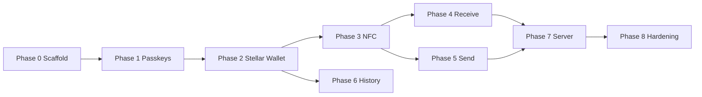
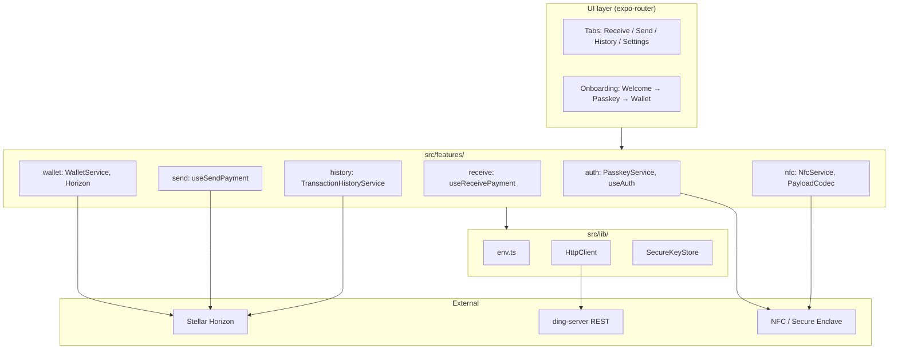
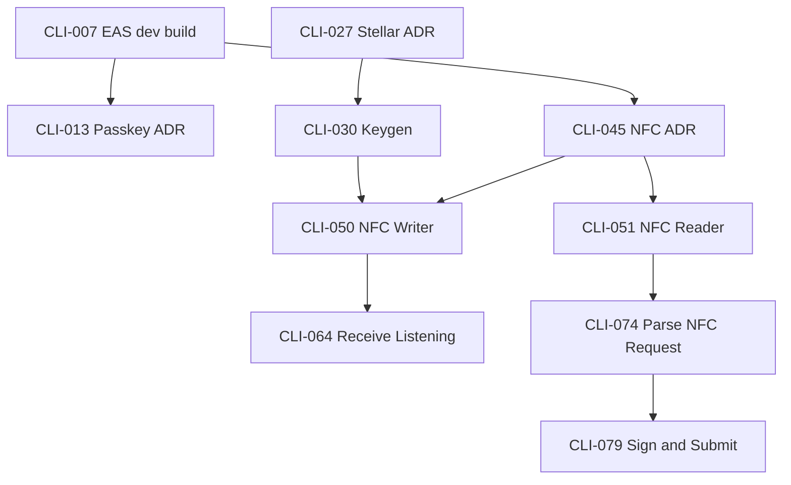

# Ding Payments — Client MVP Build Plan

**Purpose:** Executable guide for agents and developers implementing the Ding Payments mobile client (Expo 56 + React Native). Each task (CLI-NNN) is an independent unit of work with verifiable acceptance criteria.

**Audience:** Cursor agents, mobile developers, manual QA, and tech leads who prioritize the backlog.

**How to read this document**

1. Read **Executive Summary** and **Architecture** for context.
2. Execute phases in order 0→8; respect dependencies `Depends on`.
3. Each task includes files, steps, tests and `spec_ref` to the product spec.
4. Consult **Matrices** for blockers and **Appendices** for glossary and env vars.

**Task field legend**

| Field | Meaning |
|-------|-------------|
| Epic | E0–E8 domain grouping |
| Phase | 0=scaffold … 8=hardening |
| Priority | P0 critical MVP, P1 important, P2 nice-to-have |
| Complexity | Easy / Medium / Hard |
| Blocking | Hard=blocks subsequent phases, Soft=partial, None=does not block |
| Depends on | Previous CLI IDs required |
| Server contract | Endpoint ding-server if applicable |

**Phase dependencies**



**References**

- Product spec: [ding-payments.md](./ding-payments.md)
- Code layout: [FOLDER_LAYOUT](../.cursor/rules/FOLDER_LAYOUT.mdc)

## Table of contents

1. [Executive summary](#executive-summary)
2. [Client architecture](#client-architecture)
3. [ding-server contracts](#ding-server-contracts-client-integration)
4. [Tasks by phase](#tasks-by-phase)
   - [Phase 0 — Scaffold & DX (CLI-001–012)](#phase-0--scaffold--developer-experience-e0)
   - [Phase 1 — Passkey Auth (CLI-013–026)](#phase-1--passkey-authentication-e1)
   - [Phase 2 — Stellar Wallet (CLI-027–044)](#phase-2--stellar-wallet-e2)
   - [Phase 3 — NFC Protocol (CLI-045–060)](#phase-3--nfc-core-e3)
   - [Phase 4 — Receive Flow (CLI-061–072)](#phase-4--receive-payment-e4)
   - [Phase 5 — Send Flow (CLI-073–086)](#phase-5--send-payment-e5)
   - [Phase 6 — History (CLI-087–096)](#phase-6--transaction-history-e6)
   - [Phase 7 — Server Integration (CLI-097–106)](#phase-7--server-integration-e7)
   - [Phase 8 — Hardening & Release (CLI-107–120)](#phase-8--hardening--release-prep-e8)
5. [Planning matrices](#planning-matrices)
6. [Appendices A–F](#appendices)

## Executive summary

### Vision

Ding Payments offers peer-to-peer contactless (NFC) payments on Stellar with self-custodial wallet and passkey authentication. The experience should feel like Apple Pay/Google Pay: instant, minimal, and without visible blockchain jargon.

### MVP scope

**Included**

- Stellar self-custodial wallet (XLM + USDC testnet/mainnet configurable)
- Passkeys for login and payment authorization
- NFC P2P: receiver issues payment request, payer signs and sends tx
- Basic history via Horizon
- Optional integration with ding-server (registration, notify) without blocking settlement on-chain
- Development build EAS (NFC and passkeys do not work in Expo Go)

**Excluded**

- Merchant mode, QR payments, recurring, cross-chain, multisig, offline settlement
- App Store / Play Store submit (beta builds only)
- Soroban smart contracts

### Success metrics (MVP)

| Metric | Target |
|---------|----------|
| Payment completion rate | ≥ 85% in beta testing |
| Average payment time NFC→confirmation | < 5s on target devices |
| NFC connection success rate | ≥ 90% in E2E matrix |
| Transaction success rate (Horizon) | ≥ 95% excl. insufficient balance |
| Auth success rate (passkey) | ≥ 95% |

### Key risks

| Risk | Mitigation |
|--------|------------|
| NFC incompatible / payload limit | ADR library + device checklist + size validation |
| Expo Go does not support NFC/passkeys | EAS dev build required (CLI-007) |
| Loss of device = loss of funds | Copy self-custody clear; without seed export MVP |
| Server down during payment | Payments do not depend on server; Direct Horizon |
| stellar-sdk in RN | Spike CLI-027 + polyfills |

### Default decisions

| Topic | MVP default |
|------|-------------|
| Network default | Stellar testnet in development |
| Asset default receive | USDC if trustline OK, else XLM |
| Payment request expiry | 30 s |
| Session lock | 5 min background / 15 min idle |
| Server integration | Fire-and-forget; does not block UX |
| i18n | Spanish only for MVP |

## Client architecture



### Layers

| Layer | Responsibility |
|------|-----------------|
| `src/app/` | Thin expo-router routes; no domain logic |
| `src/features/*` | Vertical slices: auth, wallet, nfc, receive, send, history |
| `src/lib/` | Infra sharing: env, HTTP, secure store, analytics |
| `src/components/ui/` | Reusable UI Primitives |

### Confirmed stack

| Component | Technology |
|------------|------------|
| Framework | Expo 56 + React Native |
| Routing | expo-router (file-based) |
| State | zustand by feature |
| Validation | Zod in schemas/ |
| Blockchain | @stellar/stellar-sdk + Horizon |
| NFC | react-native-nfc-manager |
| Auth | passkeys (lib according to ADR CLI-013) |
| Secrets | expo-secure-store |
| Build | EAS (development / preview / production) |
| Server | ding-server NestJS REST (Phase 7) |

## ding-server contracts (client integration)

Settlement is on-chain via Horizon. The server is auxiliary: identity/wallet registration and analytics.

### Endpoint table

| Method | Route | Client use | Blocking UX |
|--------|------|-------------|-------------|
| GET | `/health` | Settings dev / banner status | No |
| POST | `/auth/passkey/register` | After creating passkey | No (retry) |
| POST | `/wallets/register` | After wallet ready | No (retry) |
| POST | `/transactions/notify` | After successful submit | No (fire-and-forget) |

### TypeScript interfaces (client)

```typescript
// POST /auth/passkey/register
interface RegisterPasskeyRequest {
  credentialId: string;
  publicKey: string;       // WebAuthn COSE key
  stellarPubkey?: string;  // if wallet already exists
  deviceLabel?: string;
}
interface RegisterPasskeyResponse {
  userId: string;
  registeredAt: string;
}

// POST /wallets/register
interface RegisterWalletRequest {
  pubkey: string;          // Stellar G...
  credentialId?: string;
  deviceId?: string;
}
interface RegisterWalletResponse {
  walletId: string;
  pubkey: string;
}

// POST /transactions/notify
interface NotifyTransactionRequest {
  txHash: string;
  from: string;
  to: string;
  amount: string;
  asset: 'XLM' | 'USDC';
  timestamp: number;
}
interface NotifyTransactionResponse {
  received: boolean;
}

// GET /health
interface HealthResponse {
  status: 'ok' | 'degraded';
  version?: string;
}
```

### API error policy

- 4xx: no automatic retry; show toast only if explicit user action failed.
- 5xx / network: retry GET up to 3x; POST notify no retry in UI (log + queue optional).

---

# Tasks by phase

### Phase 0 — Scaffold & Developer Experience (E0)

Repo basics: Green CI, `src/features/` structure, EAS dev build, UI theme and navigation tabs. Without this phase there is no reliable environment for NFC or passkeys.

### CLI-001 — Fix CI scripts (build, lint, prettier)

| Field | Value |
|-------|-------|
| Epic | E0 |
| Phase | 0 |
| Priority | P0 |
| Complexity | Easy |
| Blocking | Hard |
| Depends on | — |
| Server contract | — |

**User story**  
As a developer, I want the CI pipeline to pass through each PR so that I can detect regressions before merge.

**Agent context**  
The workflow `.github/workflows/ci-client.yml` runs `npm run build`, `npm run lint` and Prettier, but `package.json` does not define `build` nor does it have ESLint/Prettier installed. This task unlocks the entire quality flow. Current repo: Expo 56 scaffold in `ding-payments/`.

**Scope**

In scope:
- Add `build` script (e.g. `expo export` or `tsc --noEmit`)
- Align CI with real scripts
- Verify CI passes on develop branch

Out of scope:
- EAS build in CI
- Automated E2E tests

**Files**

- (none)
- Modify: `package.json`
- Modify: `.github/workflows/ci-client.yml`

**Implementation guide**

1. Read `ci-client.yml` and list executed commands
2. Add `"build": "expo export --platform web"` or `"tsc --noEmit"` depending on the team's strategy
3. Install and configure ESLint + Prettier if the workflow calls them
4. Run the same CI commands locally
5. Push and verify green pipeline

**Acceptance criteria**

- [ ] `npm run build` exists and ends with exit 0
- [ ] `npm run lint` exists and ends with exit 0
- [ ] CI workflow passes in GitHub Actions

**Tests**

- Unit: N/A
- Manual: Run `npm run build && npm run lint` locally

**Definition of done**

- [ ] `npm run lint` and `npx tsc --noEmit` pass without errors
- [ ] Changes aligned with `src/features/` convention (FOLDER_LAYOUT)
- [ ] Documented in README or internal docs if the task requires it

**spec_ref**: Technical Architecture — Frontend

---

### CLI-002 — Configure ESLint and Prettier for Expo TypeScript

| Field | Value |
|-------|-------|
| Epic | E0 |
| Phase | 0 |
| Priority | P0 |
| Complexity | Easy |
| Blocking | Soft |
| Depends on | CLI-001 |
| Server contract | — |

**User story**  
As a developer, I want consistent lint and formatting rules so that I can maintain code quality across the team.

**Agent context**  
Expo 56 supports `expo lint` which wraps ESLint. Install `eslint`, `eslint-config-expo`, `prettier` and config files in root. Follow conventions of the official Expo template.

**Scope**

In scope:
- eslint.config.mjs or .eslintrc
- .prettierrc
- Scripts npm lint/format

Out of scope:
- Husky pre-commit hooks
- lint-staged

**Files**

- Create: `eslint.config.mjs`
- Create: `.prettierrc`
- Modify: `package.json`

**Implementation guide**

1. `npx expo lint` to detect existing setup
2. Install `eslint`, `eslint-config-expo`, `prettier`
3. Create `eslint.config.mjs` with config Expo + TypeScript
4. Create `.prettierrc` with singleQuote, trailingComma es5
5. Add script `"format": "prettier --write ."`

**Acceptance criteria**

- [ ] `npx expo lint` without errors in code base
- [ ] `npm run format` formats without pending changes after execution

**Tests**

- Unit: N/A
- Manual: Run lint in src/

**Definition of done**

- [ ] `npm run lint` and `npx tsc --noEmit` pass without errors
- [ ] Changes aligned with `src/features/` convention (FOLDER_LAYOUT)
- [ ] Documented in README or internal docs if the task requires it

**spec_ref**: Technical Architecture — Frontend

---

### CLI-003 — Create features and shared folder structure

| Field | Value |
|-------|-------|
| Epic | E0 |
| Phase | 0 |
| Priority | P0 |
| Complexity | Easy |
| Blocking | Hard |
| Depends on | — |
| Server contract | — |

**User story**  
As a developer, I want a vertical slice structure so that I can organize code by product domain.

**Agent context**  
Follow `.cursor/rules/FOLDER_LAYOUT.mdc`: each feature in `src/features/<name>/` with subfolders `components/`, `views/`, `hooks/`, `services/`, `schemas/`. Also create `src/lib/`, `src/components/ui/`, `src/constants/`. Add minimum `.gitkeep` or README per folder.

**Scope**

In scope:
- Base folders for auth, wallet, receive, send, history (empty)
- src/lib/, src/components/ui/, src/constants/

Out of scope:
- Implementation of features
- Migrate existing template screens

**Files**

- Create: `src/features/.gitkeep`
- Create: `src/lib/.gitkeep`
- Create: `src/components/ui/.gitkeep`
- Create: `src/constants/.gitkeep`

**Implementation guide**

1. Create directory tree according to FOLDER_LAYOUT
2. Document structure in comment in src/features/README.md
3. Verify that imports `@/` will resolve to these routes

**Acceptance criteria**

- [ ] Folder structure exists and is documented
- [ ] No domain file implemented yet (scaffold only)

**Tests**

- Unit: N/A
- Manual: Inspect tree with `find src/features`

**Definition of done**

- [ ] `npm run lint` and `npx tsc --noEmit` pass without errors
- [ ] Changes aligned with `src/features/` convention (FOLDER_LAYOUT)
- [ ] Documented in README or internal docs if the task requires it

**spec_ref**: Technical Architecture — Frontend

---

### CLI-004 — Configure path aliases @/ in TypeScript

| Field | Value |
|-------|-------|
| Epic | E0 |
| Phase | 0 |
| Priority | P0 |
| Complexity | Easy |
| Blocking | Soft |
| Depends on | CLI-003 |
| Server contract | — |

**User story**  
As a developer, I want to import with `@/features/...` so that I can avoid deep relative paths.

**Agent context**  
Configure `tsconfig.json` paths and `babel.config.js` module-resolver if necessary. Expo Router already uses `src/` as root in many projects — check `app.json` / expo-router config.

**Scope**

In scope:
- paths in tsconfig
- babel-plugin-module-resolver if applicable

Out of scope:
- Path aliases in Jest (later phase)

**Files**

- Create: `babel.config.js`
- Modify: `tsconfig.json`

**Implementation guide**

1. Add `"paths": { "@/*": ["./src/*"] }` in tsconfig
2. Create/update babel.config.js with module-resolver
3. Test import `@/constants/theme` from a test file
4. Delete test file

**Acceptance criteria**

- [ ] `import X from '@/lib/foo'` compiles without error
- [ ] IDE resolves paths correctly

**Tests**

- Unit: N/A
- Manual: `npx tsc --noEmit`

**Definition of done**

- [ ] `npm run lint` and `npx tsc --noEmit` pass without errors
- [ ] Changes aligned with `src/features/` convention (FOLDER_LAYOUT)
- [ ] Documented in README or internal docs if the task requires it

**spec_ref**: Technical Architecture — Frontend

---

### CLI-005 — Document Ding Payments project README

| Field | Value |
|-------|-------|
| Epic | E0 |
| Phase | 0 |
| Priority | P0 |
| Complexity | Medium |
| Blocking | None |
| Depends on | CLI-006, CLI-007 |
| Server contract | — |

**User story**  
As a new developer or agent, I want a project-specific README so that I can set up the environment without guessing.

**Agent context**  
Replace generic Expo README. Include: what is Ding Payments, requirements (Node 20+, Xcode/Android Studio), setup, environment variables, how to run dev client (not Expo Go for NFC), links to docs/ding-payments.md and this build plan.

**Scope**

In scope:
- README with complete setup
- NFC/passkeys troubleshooting section
- Link to spec and build plan

Out of scope:
- API server documentation
- Figma Design Guides

**Files**

- (none)
- Modify: `README.md`

**Implementation guide**

1. Replace boilerplate contents
2. Document `cp .env.example .env`
3. Document `eas build --profile development`
4. Add table from npm scripts
5. Link relevant docs

**Acceptance criteria**

- [ ] README mentions Ding Payments, Stellar, NFC
- [ ] Clear dev build instructions
- [ ] No broken references to reset-project.js if it doesn't exist

**Tests**

- Unit: N/A
- Manual: Follow README on a clean machine (smoke)

**Definition of done**

- [ ] `npm run lint` and `npx tsc --noEmit` pass without errors
- [ ] Changes aligned with `src/features/` convention (FOLDER_LAYOUT)
- [ ] Documented in README or internal docs if the task requires it

**spec_ref**: Overview, Technical Architecture

---

### CLI-006 — Configure Stellar and app environment variables

| Field | Value |
|-------|-------|
| Epic | E0 |
| Phase | 0 |
| Priority | P0 |
| Complexity | Medium |
| Blocking | Hard |
| Depends on | CLI-003 |
| Server contract | — |

**User story**  
As a developer, I want to configure Stellar network per environment so that I can switch testnet/mainnet without changing code.

**Agent context**  
Use `EXPO_PUBLIC_` prefix for client-accessible vars. Create `.env.example` with STELLAR_NETWORK, HORIZON_URL, RPC_URL, USDC_ISSUER_TESTNET, USDC_ISSUER_MAINNET. Never commit `.env`. See stellar-dev skill for testnet URLs.

**Scope**

In scope:
- .env.example
- src/lib/env.ts with validation
- README documentation

Out of scope:
- Secrets in EAS (CLI-007 can reference)

**Files**

- Create: `.env.example`
- Create: `src/lib/env.ts`
- Modify: `.gitignore`
- Modify: `README.md`

**Implementation guide**

1. Create `.env.example` with all the vars
2. Implement `getEnv()` with throws if required var is missing on mainnet
3. Add `.env` to .gitignore if it is not there
4. Export typed config from env.ts

**Acceptance criteria**

- [ ] App reads `EXPO_PUBLIC_STELLAR_NETWORK` in runtime
- [ ] .env.example documents each variable
- [ ] mainnet requires RPC explicit URL

**Tests**

- Unit: Unit test for env.ts with mock vars
- Manual: Change network in .env and check log

**Definition of done**

- [ ] `npm run lint` and `npx tsc --noEmit` pass without errors
- [ ] Changes aligned with `src/features/` convention (FOLDER_LAYOUT)
- [ ] Documented in README or internal docs if the task requires it

**spec_ref**: Wallet Architecture — Asset Support, Technical Architecture — Blockchain Layer

---

### CLI-007 — Setup EAS and development build profile

| Field | Value |
|-------|-------|
| Epic | E0 |
| Phase | 0 |
| Priority | P0 |
| Complexity | Hard |
| Blocking | Hard |
| Depends on | CLI-001 |
| Server contract | — |

**User story**  
As a developer, I want a native development build so that I can test NFC and passkeys that Expo Go does not support.

**Agent context**  
CRITICAL: Expo Go does not allow full NFC or production passkeys. Configure EAS with `eas.json` profiles: development, preview, production. Requires Expo account and physical devices. Hard blocker for Phase 3 (NFC) and Phase 1 (real passkeys).

**Scope**

In scope:
- eas.json with profiles
- app.config.ts if dynamic plugins
- iOS/Android dev build instructions

Out of scope:
- Submit to App Store
- OTA production updates

**Files**

- Create: `eas.json`
- Create: `app.config.ts`
- Modify: `app.json`
- Modify: `package.json`
- Modify: `README.md`

**Implementation guide**

1. `npm install -g eas-cli` and `eas login`
2. Create eas.json: development (dev client), preview, production
3. Migrate app.json to app.config.ts if plugins are needed
4. Add script `"dev:build:ios": "eas build --profile development --platform ios"`
5. Document installation of the .ipa/.apk on device

**Acceptance criteria**

- [ ] Development build installs on physical device
- [ ] App starts with `npx expo start --dev-client`
- [ ] eas.json versioned in repo

**Tests**

- Unit: N/A
- Manual: Build dev iOS or Android and open app

**Definition of done**

- [ ] `npm run lint` and `npx tsc --noEmit` pass without errors
- [ ] Changes aligned with `src/features/` convention (FOLDER_LAYOUT)
- [ ] Documented in README or internal docs if the task requires it

**spec_ref**: Technical Architecture — NFC Layer, Authentication Model

---

### CLI-008 — Configure app.json plugins NFC and secure store

| Field | Value |
|-------|-------|
| Epic | E0 |
| Phase | 0 |
| Priority | P0 |
| Complexity | Medium |
| Blocking | Hard |
| Depends on | CLI-007 |
| Server contract | — |

**User story**  
As a developer, I want native permissions declared so that NFC and secure storage work in build.

**Agent context**  
On iOS: `NFCReaderUsageDescription`, entitlement com.apple.developer.nfc.readersession.formats. On Android: `android.permission.NFC` in manifest via config plugin. Install `expo-secure-store` for keys. Prepare slot for `react-native-nfc-manager` config plugin in Phase 3.

**Scope**

In scope:
- NFC iOS/Android permissions
- expo-secure-store installed
- Usage descriptions in Spanish/English

Out of scope:
- NFC Implementation (Phase 3)

**Files**

- (none)
- Modify: `app.config.ts`
- Modify: `package.json`

**Implementation guide**

1. `npx expo install expo-secure-store`
2. Add NFC permission strings in app.config.ts
3. Investigate react-native-nfc-manager config plugin and pre-declare
4. Rebuild dev client after native changes

**Acceptance criteria**

- [ ] Info.plist / AndroidManifest include NFC permissions
- [ ] SecureStore available in runtime
- [ ] Rebuild documented in README

**Tests**

- Unit: N/A
- Manual: `SecureStore.setItemAsync` smoke test in dev build

**Definition of done**

- [ ] `npm run lint` and `npx tsc --noEmit` pass without errors
- [ ] Changes aligned with `src/features/` convention (FOLDER_LAYOUT)
- [ ] Documented in README or internal docs if the task requires it

**spec_ref**: Technical Architecture — NFC Layer, Security Considerations — Wallet Security

---

### CLI-009 — Theme tokens and base UI components

| Field | Value |
|-------|-------|
| Epic | E0 |
| Phase | 0 |
| Priority | P0 |
| Complexity | Medium |
| Blocking | Soft |
| Depends on | CLI-003, CLI-004 |
| Server contract | — |

**User story**  
As a user, I want a consistent and familiar interface so that I can trust the payment app.

**Agent context**  
Extend existing `src/constants/theme.ts`. Create primitives in `src/components/ui/`: Button, TextInput, Screen (SafeArea + scroll), LoadingSpinner, Card. Mobile-first, minimal, no blockchain jargon. Inspiration: Apple Pay / Google Pay — clean, high contrast.

**Scope**

In scope:
- Design tokens (colors, spacing, typography)
- 5 reusable UI components
- Light/dark support if hook already exists

Out of scope:
- Complete Figma design system
- Complex animations

**Files**

- Create: `src/components/ui/Button.tsx`
- Create: `src/components/ui/TextInput.tsx`
- Create: `src/components/ui/Screen.tsx`
- Create: `src/components/ui/LoadingSpinner.tsx`
- Create: `src/components/ui/Card.tsx`
- Create: `src/components/ui/index.ts`
- Modify: `src/constants/theme.ts`

**Implementation guide**

1. Define tokens: primary, success, error, surface, text
2. Implement Button with primary/secondary/danger variants
3. Screen with SafeAreaView and consistent padding
4. Export barrel index.ts
5. Optional Storybook — not required MVP

**Acceptance criteria**

- [ ] Components usable from `@/components/ui`
- [ ] Theme respects system color scheme
- [ ] Touch targets >= 44pt

**Tests**

- Unit: Optional Snapshot tests
- Manual: Render demo screen with all components

**Definition of done**

- [ ] `npm run lint` and `npx tsc --noEmit` pass without errors
- [ ] Changes aligned with `src/features/` convention (FOLDER_LAYOUT)
- [ ] Documented in README or internal docs if the task requires it

**spec_ref**: Core Vision, User Experience Principles — Simplicity

---

### CLI-010 — Main navigation shell (tabs/stack)

| Field | Value |
|-------|-------|
| Epic | E0 |
| Phase | 0 |
| Priority | P0 |
| Complexity | Medium |
| Blocking | Soft |
| Depends on | CLI-009 |
| Server contract | — |

**User story**  
As a user, I want to navigate between Receive, Send, History and Settings, to access the main functions.

**Agent context**  
Replace tabs template (Home/Explore) with: Receive, Send, History, Settings. Use expo-router file-based routing in `src/app/`. Keep layouts lean — logic in `src/features/*/views/`. Stack for modal flows (payment confirmation).

**Scope**

In scope:
- Tab navigator with 4 tabs
- Placeholder routes by feature
- Appropriate icons

Out of scope:
- Complete deep linking
- Onboarding stack (Phase 1)

**Files**

- Create: `src/app/(tabs)/receive.tsx`
- Create: `src/app/(tabs)/send.tsx`
- Create: `src/app/(tabs)/history.tsx`
- Create: `src/app/(tabs)/settings.tsx`
- Create: `src/features/receive/views/ReceiveHomeView.tsx`
- Create: `src/features/send/views/SendHomeView.tsx`
- Modify: `src/app/(tabs)/_layout.tsx`
- Modify: `src/app/_layout.tsx`

**Implementation guide**

1. Create (tabs)/_layout.tsx with 4 tabs
2. Each tab imports View placeholder of its feature
3. Delete or redirect index.tsx template
4. Configure tab bar labels in Spanish or i18n keys

**Acceptance criteria**

- [ ] 4 visible and navigable tabs
- [ ] No Expo Welcome screen in main flow
- [ ] Layouts < 50 lines each

**Tests**

- Unit: N/A
- Manual: Navigate between tabs in simulator

**Definition of done**

- [ ] `npm run lint` and `npx tsc --noEmit` pass without errors
- [ ] Changes aligned with `src/features/` convention (FOLDER_LAYOUT)
- [ ] Documented in README or internal docs if the task requires it

**spec_ref**: Recommended User Flow Summary, Main Use Case

---

### CLI-011 — Global boundary and toast system error

| Field | Value |
|-------|-------|
| Epic | E0 |
| Phase | 0 |
| Priority | P0 |
| Complexity | Easy |
| Blocking | None |
| Depends on | CLI-010 |
| Server contract | — |

**User story**  
As a user, I want to see friendly errors without silent crash so that I can understand what went wrong.

**Agent context**  
React Error Boundary in root layout. Toast/snackbar for recoverable errors (network, NFC timeout). Consider `react-native-toast-message` or minimal implementation with Animated. Do not show stack traces to the user.

**Scope**

In scope:
- ErrorBoundary in _layout
- API showToast(message, type)
- Friendly fallback UI

Out of scope:
- Sentry/Crashlytics integration

**Files**

- Create: `src/components/ErrorBoundary.tsx`
- Create: `src/lib/toast.ts`
- Modify: `src/app/_layout.tsx`

**Implementation guide**

1. Implement ErrorBoundary class component
2. Create toast helper and provider
3. Wrap root in ErrorBoundary + Toast
4. Try with intentional throw in dev

**Acceptance criteria**

- [ ] Component crash shows fallback
- [ ] toast.success/error visible
- [ ] No leak of sensitive data in messages

**Tests**

- Unit: ErrorBoundary render test
- Manual: Trigger error and toast in dev

**Definition of done**

- [ ] `npm run lint` and `npx tsc --noEmit` pass without errors
- [ ] Changes aligned with `src/features/` convention (FOLDER_LAYOUT)
- [ ] Documented in README or internal docs if the task requires it

**spec_ref**: Error Handling

---

### CLI-012 — Logging and analytics convention (no-op MVP)

| Field | Value |
|-------|-------|
| Epic | E0 |
| Phase | 0 |
| Priority | P0 |
| Complexity | Easy |
| Blocking | None |
| Depends on | CLI-003 |
| Server contract | — |

**User story**  
As a team, I want a single point of logging/events so that we can instrument metrics later without massive refactor.

**Agent context**  
Create `src/lib/analytics.ts` with methods: trackEvent(name, props), logError(error, context). MVP: console in __DEV__, no-op in prod. Prepare event names aligned to the spec's Success Metrics (payment_completed, nfc_failed, etc.). NEVER log private keys or complete payloads with PII.

**Scope**

In scope:
- analytics.ts interface
- List of event names constants
- Minimum integration on 1 screen

Out of scope:
- Mixpanel/Amplitude SDK
- Backend analytics

**Files**

- Create: `src/constants/analytics-events.ts`
- Create: `src/lib/analytics.ts`

**Implementation guide**

1. Define enum AnalyticsEvent
2. Implement trackEvent with __DEV__ console
3. Document policy: no secrets in logs
4. Export from @/lib/analytics

**Acceptance criteria**

- [ ] trackEvent callable without crash
- [ ] Event constants documented
- [ ] No-secrets policy in comment

**Tests**

- Unit: Test that trackEvent does not throw
- Manual: See console in dev when calling trackEvent

**Definition of done**

- [ ] `npm run lint` and `npx tsc --noEmit` pass without errors
- [ ] Changes aligned with `src/features/` convention (FOLDER_LAYOUT)
- [ ] Documented in README or internal docs if the task requires it

**spec_ref**: Success Metrics

---

### Phase 1 — Passkey Authentication (E1)

Biometric authentication without passwords or seed phrase. Passkey covers login and re-auth before signing. Session lock after inactivity.

### CLI-013 — Research spike: passkey lib compatible iOS/Android Expo

| Field | Value |
|-------|-------|
| Epic | E1 |
| Phase | 1 |
| Priority | P0 |
| Complexity | Hard |
| Blocking | Hard |
| Depends on | CLI-007, CLI-008 |
| Server contract | — |

**User story**  
As a developer, I want to evaluate passkey libraries for Expo dev client so that I can choose the right integration before implementing.

**Agent context**  
Expo Go does not support production passkeys. Evaluate `react-native-passkey`, `@simplewebauthn/react-native`, and `expo-local-authentication` as a biometric layer. Document matrix: iOS 16+, Android 9+ with Google Password Manager. Result: short ADR in docs/ with chosen library and limitations.

**Scope**

In scope:
- PoC in dev build iOS and Android
- Device compatibility matrix
- ADR with decision and rollback plan

Out of scope:
- Complete PasskeyService implementation
- WebAuthn server integration

**Files**

- Create: `docs/adr-passkey-library.md`
- Create: `src/features/auth/services/passkey-spike.ts`
- Modify: `README.md`

**Implementation guide**

1. Install candidates in branch spike
2. Test register + authenticate on physical device
3. Verify storage credential ID
4. Document exposed APIs and gaps Expo 56
5. Choose bookstore and close ADR
6. Remove spike code or move to PasskeyService

**Acceptance criteria**

- [ ] ADR published with chosen bookstore
- [ ] Register/auth successful on at least 1 iOS and 1 Android
- [ ] Documented limitations for agents

**Tests**

- Unit: N/A (spike)
- Manual: Register/auth flow on 2 devices

**Definition of done**

- [ ] `npm run lint` and `npx tsc --noEmit` pass without errors
- [ ] Changes aligned with `src/features/` convention (FOLDER_LAYOUT)
- [ ] Documented in README or internal docs if the task requires it

**spec_ref**: Authentication Model — Passkeys

---

### CLI-014 — PasskeyService (register, authenticate, revoke)

| Field | Value |
|-------|-------|
| Epic | E1 |
| Phase | 1 |
| Priority | P0 |
| Complexity | Hard |
| Blocking | Hard |
| Depends on | CLI-013 |
| Server contract | — |

**User story**  
As a user, I want to create and use passkey to access and authorize payments, without passwords or seed phrase.

**Agent context**  
Passkeys cover login AND transaction approval. Implement `PasskeyService` in `src/features/auth/services/` with methods: `register()`, `authenticate(reason)`, `revoke()`. Sensitive material only in Secure Enclave/Keychain via CLI-017. Never persist Stellar private key in passkey payload.

**Scope**

In scope:
- Interface TypeScript PasskeyService
- register with biometrics
- authenticate with reason string
- revoke to reset dev

Out of scope:
- iCloud Keychain cross-device synchronization
- Passkeys on the web

**Files**

- Create: `src/features/auth/services/PasskeyService.ts`
- Create: `src/features/auth/services/types.ts`
- Modify: `src/features/auth/services/passkey-spike.ts`

**Implementation guide**

1. Define interface and credential types
2. Implement register using ADR library
3. Implement authenticate with fallback UI
4. Implement revoke by cleaning secure store
5. Export singleton or factory
6. Add analytics logs without PII

**Acceptance criteria**

- [ ] register() returns credentialId
- [ ] authenticate() resolves or rejects with typed error
- [ ] revoke() clears auth state

**Tests**

- Unit: Mock native module in Jest
- Manual: Register and auth in dev build

**Definition of done**

- [ ] `npm run lint` and `npx tsc --noEmit` pass without errors
- [ ] Changes aligned with `src/features/` convention (FOLDER_LAYOUT)
- [ ] Documented in README or internal docs if the task requires it

**spec_ref**: Authentication Model, Security Considerations — Wallet Security

---

### CLI-015 — Onboarding welcome screen

| Field | Value |
|-------|-------|
| Epic | E1 |
| Phase | 1 |
| Priority | P0 |
| Complexity | Easy |
| Blocking | Soft |
| Depends on | CLI-010 |
| Server contract | — |

**User story**  
As a new user, I want to understand what Ding Payments does so that I can decide to create my account with passkey.

**Agent context**  
First post-install screen. Copy in Spanish, without blockchain jargon. Explain: contactless payments, self-custodial, passkey. Main CTA 'Get Started'. Minimal Apple Pay onboarding type design.

**Scope**

In scope:
- WelcomeView with copy and CTA
- NFC illustration or icon
- Navigation to create passkey

Out of scope:
- Video onboarding
- Login with existing account cross-device

**Files**

- Create: `src/features/auth/views/WelcomeView.tsx`
- Create: `src/app/(onboarding)/welcome.tsx`
- Modify: `src/app/_layout.tsx`

**Implementation guide**

1. Create stack (onboarding) in expo-router
2. Implement WelcomeView with Screen UI
3. Add CTA by navigating to passkey setup
4. Apply theme tokens
5. Verify safe area and accessibility labels

**Acceptance criteria**

- [ ] Screen visible on first launch
- [ ] CTA navigate to next step
- [ ] Copy without unnecessary technical terms

**Tests**

- Unit: N/A
- Manual: Fresh install flow

**Definition of done**

- [ ] `npm run lint` and `npx tsc --noEmit` pass without errors
- [ ] Changes aligned with `src/features/` convention (FOLDER_LAYOUT)
- [ ] Documented in README or internal docs if the task requires it

**spec_ref**: Core Vision, Recommended User Flow Summary

---

### CLI-016 — Create passkey screen with biometrics

| Field | Value |
|-------|-------|
| Epic | E1 |
| Phase | 1 |
| Priority | P0 |
| Complexity | Medium |
| Blocking | Hard |
| Depends on | CLI-014, CLI-015 |
| Server contract | — |

**User story**  
As a new user, I want to register my passkey with biometrics so that I can protect my wallet.

**Agent context**  
Step-by-step guide screen: explain Face ID/Touch ID/fingerprint, 'Create passkey' button, loading during register. Handle user cancellation without crash. After success, navigate to wallet generation (Phase 2) or home if wallet already exists.

**Scope**

In scope:
- UI create passkey
- PasskeyService.register integration
- Loading/error/success states

Out of scope:
- Passkey on second device
- Recovery codes

**Files**

- Create: `src/features/auth/views/CreatePasskeyView.tsx`
- Create: `src/app/(onboarding)/create-passkey.tsx`

**Implementation guide**

1. Create CreatePasskeyView
2. Call PasskeyService.register in press
3. Show LoadingSpinner during operation
4. Navigate to wallet setup successfully
5. Show toast on error/cancel

**Acceptance criteria**

- [ ] Passkey created with biometrics
- [ ] Cancellation shows friendly message
- [ ] No navigation if register fails

**Tests**

- Unit: N/A
- Manual: Create passkey on physical device

**Definition of done**

- [ ] `npm run lint` and `npx tsc --noEmit` pass without errors
- [ ] Changes aligned with `src/features/` convention (FOLDER_LAYOUT)
- [ ] Documented in README or internal docs if the task requires it

**spec_ref**: Authentication Model — Passkeys

---

### CLI-017 — Secure storage wrapper SecureKeyStore

| Field | Value |
|-------|-------|
| Epic | E1 |
| Phase | 1 |
| Priority | P0 |
| Complexity | Medium |
| Blocking | Hard |
| Depends on | CLI-008 |
| Server contract | — |

**User story**  
As a developer, I want a unified secure storage API so that I can store keys and secrets without exposing them.

**Agent context**  
Wrapper over `expo-secure-store` with API: get/set/remove, prefixes per domain (auth, wallet). Options: requireAuthentication on iOS. Never use AsyncStorage for secrets. Prepare migration to Keychain access groups if needed.

**Scope**

In scope:
- SecureKeyStore class or functions
- Typed allowed keys
- Error handling if secure store unavailable

Out of scope:
- Hardware security module custom
- Encrypted SQLite

**Files**

- Create: `src/lib/SecureKeyStore.ts`
- Create: `src/lib/SecureKeyStore.types.ts`

**Implementation guide**

1. Define enum SecureStoreKey
2. Implement set/get/remove with expo-secure-store
3. Add requireAuthentication option
4. Test smoke in dev build
5. Document keys in comments

**Acceptance criteria**

- [ ] set/get roundtrip works
- [ ] Keys do not appear in logs
- [ ] Clear error if store unavailable

**Tests**

- Unit: Mock expo-secure-store
- Manual: SecureStore smoke on device

**Definition of done**

- [ ] `npm run lint` and `npx tsc --noEmit` pass without errors
- [ ] Changes aligned with `src/features/` convention (FOLDER_LAYOUT)
- [ ] Documented in README or internal docs if the task requires it

**spec_ref**: Security Considerations — Wallet Security

---

### CLI-018 — Auth state machine (unauthenticated → onboarding → ready)

| Field | Value |
|-------|-------|
| Epic | E1 |
| Phase | 1 |
| Priority | P0 |
| Complexity | Medium |
| Blocking | Soft |
| Depends on | CLI-016, CLI-017 |
| Server contract | — |

**User story**  
As an app, I want to manage authentication states predictably, to display the correct screen.

**Agent context**  
Use zustand or context + reducer. States: `unauthenticated`, `onboarding`, `authenticating`, `ready`, `locked`. Explicit transitions. Persist flag onboarding_complete in SecureKeyStore. Hook `useAuth()` exposes state and actions.

**Scope**

In scope:
- Auth store/state machine
- useAuth hook
- Minimum state persistence

Out of scope:
- OAuth social login
- Multi-wallet

**Files**

- Create: `src/features/auth/hooks/useAuth.ts`
- Create: `src/features/auth/state/authStore.ts`
- Modify: `src/app/_layout.tsx`

**Implementation guide**

1. Define states and transitions
2. Implement store with zustand
3. Create useAuth hook
4. Persist onboarding_complete
5. Connect layout root to state

**Acceptance criteria**

- [ ] States transition correctly
- [ ] useAuth available in features
- [ ] Rehydrate on cold start

**Tests**

- Unit: Tests reducer/store
- Manual: Complete onboarding flow

**Definition of done**

- [ ] `npm run lint` and `npx tsc --noEmit` pass without errors
- [ ] Changes aligned with `src/features/` convention (FOLDER_LAYOUT)
- [ ] Documented in README or internal docs if the task requires it

**spec_ref**: Authentication Model

---

### CLI-019 — Route guard: redirect if there is no wallet

| Field | Value |
|-------|-------|
| Epic | E1 |
| Phase | 1 |
| Priority | P0 |
| Complexity | Medium |
| Blocking | Soft |
| Depends on | CLI-018 |
| Server contract | — |

**User story**  
As an app, I want to redirect users without a wallet to onboarding, to avoid broken screens.

**Agent context**  
In expo-router, use redirect in `_layout.tsx` or AuthGuard component. If `authState !== ready` or wallet pubkey absent, redirect to `/(onboarding)/welcome`. Protected tabs. Future deep links considered but not MVP.

**Scope**

In scope:
- AuthGuard component
- Redirect logic in layouts
- Exception onboarding routes

Out of scope:
- Deep linking auth
- Guest mode

**Files**

- Create: `src/features/auth/components/AuthGuard.tsx`
- Modify: `src/app/(tabs)/_layout.tsx`
- Modify: `src/app/_layout.tsx`

**Implementation guide**

1. Create AuthGuard by reading useAuth
2. Wrap tabs layout
3. Redirect to onboarding if not ready
4. Try manual navigation back
5. Avoid redirect loops

**Acceptance criteria**

- [ ] Tabs inaccessible without auth ready
- [ ] Accessible onboarding without wallet
- [ ] No redirect loop

**Tests**

- Unit: N/A
- Manual: Open app without wallet configured

**Definition of done**

- [ ] `npm run lint` and `npx tsc --noEmit` pass without errors
- [ ] Changes aligned with `src/features/` convention (FOLDER_LAYOUT)
- [ ] Documented in README or internal docs if the task requires it

**spec_ref**: Recommended User Flow Summary

---

### CLI-020 — Re-authentication screen for sensitive actions

| Field | Value |
|-------|-------|
| Epic | E1 |
| Phase | 1 |
| Priority | P0 |
| Complexity | Medium |
| Blocking | Soft |
| Depends on | CLI-014 |
| Server contract | — |

**User story**  
As a user, I want to confirm my identity before paying so that I can protect my funds.

**Agent context**  
Modal or full-screen display that invokes `PasskeyService.authenticate('Confirm payment')` before signing tx. Reusable from send flow. Timeout 60s. Use on CLI-078 too.

**Scope**

In scope:
- ReAuthModal or ReAuthScreen
- Authenticate integration
- Callback onSuccess/onCancel

Out of scope:
- PIN fallback
- 2FA SMS

**Files**

- Create: `src/features/auth/components/ReAuthModal.tsx`
- Create: `src/features/auth/hooks/useReAuth.ts`

**Implementation guide**

1. Create ReAuthModal with reason prop
2. Implement useReAuth promise wrapper
3. Handle cancel and error
4. Export from auth feature
5. Document use in send flow

**Acceptance criteria**

- [ ] authenticate invoked with reason
- [ ] onSuccess executes callback
- [ ] Cancel does not execute callback

**Tests**

- Unit: Mock PasskeyService
- Manual: Trigger from test button

**Definition of done**

- [ ] `npm run lint` and `npx tsc --noEmit` pass without errors
- [ ] Changes aligned with `src/features/` convention (FOLDER_LAYOUT)
- [ ] Documented in README or internal docs if the task requires it

**spec_ref**: Secure Authentication, Transaction Safety

---

### CLI-021 — Handling auth errors (cancelled, not available, lockout)

| Field | Value |
|-------|-------|
| Epic | E1 |
| Phase | 1 |
| Priority | P0 |
| Complexity | Medium |
| Blocking | None |
| Depends on | CLI-014 |
| Server contract | — |

**User story**  
As a user, I want clear messages when authentication fails, so I know how to continue.

**Agent context**  
Map native errors to `AuthErrorCode` enum: CANCELLED, NOT_AVAILABLE, LOCKOUT, UNKNOWN. Messages in Spanish via toast. Analytics event `auth_failed` without PII. Integrate into CreatePasskeyView and ReAuthModal.

**Scope**

In scope:
-AuthErrorCode enum
- mapNativeAuthError()
- User messages in Spanish

Out of scope:
- Infinite automatic retry
- In-app chat technical support

**Files**

- Create: `src/features/auth/services/authErrors.ts`
- Modify: `src/features/auth/views/CreatePasskeyView.tsx`
- Modify: `src/features/auth/components/ReAuthModal.tsx`

**Implementation guide**

1. Define AuthErrorCode
2. Map passkey library errors
3. Create getAuthErrorMessage()
4. Integrate toast in views
5. Track auth_failed event

**Acceptance criteria**

- [ ] Cancel shows specific message
- [ ] NOT_AVAILABLE suggests configuring biometrics
- [ ] No stack traces in UI

**Tests**

- Unit: Tests mapNativeAuthError
- Manual: Intentionally cancel biometrics

**Definition of done**

- [ ] `npm run lint` and `npx tsc --noEmit` pass without errors
- [ ] Changes aligned with `src/features/` convention (FOLDER_LAYOUT)
- [ ] Documented in README or internal docs if the task requires it

**spec_ref**: Error Handling — Wallet Errors

---

### CLI-022 — Settings: view pubkey, logout/reset wallet (dev)

| Field | Value |
|-------|-------|
| Epic | E1 |
| Phase | 1 |
| Priority | P0 |
| Complexity | Easy |
| Blocking | None |
| Depends on | CLI-018 |
| Server contract | — |

**User story**  
As a user, I want to see my public address and be able to reset in development so that I can debug and verify.

**Agent context**  
In Settings tab: show truncated pubkey (G...XXXX) with copy-to-clipboard. 'Logout' button revokes local passkey. 'Reset wallet' button only in __DEV__ that clears secure store and returns to onboarding.

**Scope**

In scope:
- SettingsAuthSection component
- Copy pubkey
- Logout and dev reset

Out of scope:
- Export seed phrase
- Multi-account switcher

**Files**

- Create: `src/features/auth/components/SettingsAuthSection.tsx`
- Modify: `src/app/(tabs)/settings.tsx`

**Implementation guide**

1. Create SettingsAuthSection
2. Show pubkey from wallet hook (stub until Phase 2)
3. Implement logout with revoke
4. Add dev reset gated by __DEV__
5. Confirm reset with Alert

**Acceptance criteria**

- [ ] Pubkey visible and copyable
- [ ] Logout redirige a onboarding
- [ ] Reset only in dev

**Tests**

- Unit: N/A
- Manual: Copy pubkey, logout flow

**Definition of done**

- [ ] `npm run lint` and `npx tsc --noEmit` pass without errors
- [ ] Changes aligned with `src/features/` convention (FOLDER_LAYOUT)
- [ ] Documented in README or internal docs if the task requires it

**spec_ref**: Wallet Architecture

---

### CLI-023 — PasskeyService unit tests (mocked)

| Field | Value |
|-------|-------|
| Epic | E1 |
| Phase | 1 |
| Priority | P0 |
| Complexity | Medium |
| Blocking | None |
| Depends on | CLI-014 |
| Server contract | — |

**User story**  
As a developer, I want to test the PasskeyService so that I can prevent auth regressions.

**Agent context**  
Jest + mocks of the native passkey module. Cover register success/fail, authenticate success/cancel, revoke. No tests on real device in CI — only mocks.

**Scope**

In scope:
- __tests__/PasskeyService.test.ts
- Native module mocks
- Coverage of main paths

Out of scope:
- Detox E2E auth
- Tests on CI hardware

**Files**

- Create: `src/features/auth/services/__tests__/PasskeyService.test.ts`
- Create: `src/features/auth/services/__mocks__/passkeyNative.ts`
- Modify: `package.json`

**Implementation guide**

1. Set jest if it does not exist
2. Create mock native module
3. Tests register success/error
4. Tests authenticate cancel
5. Revoke tests
6. Add test script in package.json

**Acceptance criteria**

- [ ] Tests pass in CI
- [ ] Mock covers native API
- [ ] Without hardware dependency in CI

**Tests**

- Unit: Self — jest suite
- Manual: npm test

**Definition of done**

- [ ] `npm run lint` and `npx tsc --noEmit` pass without errors
- [ ] Changes aligned with `src/features/` convention (FOLDER_LAYOUT)
- [ ] Documented in README or internal docs if the task requires it

**spec_ref**: Authentication Model

---

### CLI-024 — Document auth flow in docs/auth-flow.md

| Field | Value |
|-------|-------|
| Epic | E1 |
| Phase | 1 |
| Priority | P0 |
| Complexity | Easy |
| Blocking | None |
| Depends on | CLI-018 |
| Server contract | — |

**User story**  
As an agent or developer, I want documentation of the auth flow, to implement without re-reading code.

**Agent context**  
Document: mermaid diagram auth states, register sequence, integration with wallet, common errors, key files. Bind ADR passkey and ding-payments.md Authentication Model.

**Scope**

In scope:
- Complete docs/auth-flow.md
- Mermaid diagram diagram
- Auth errors table

Out of scope:
- WebAuthn server documentation
- Video tutorial

**Files**

- Create: `docs/auth-flow.md`
- Modify: `README.md`

**Implementation guide**

1. Create auth-flow.md with TOC
2. State machine diagram
3. Register→wallet sequence
4. List files and hooks
5. Link from README

**Acceptance criteria**

- [ ] Doc exists without placeholders
- [ ] Mermaid renders on GitHub
- [ ] README links to doc

**Tests**

- Unit: N/A
- Manual: Review links

**Definition of done**

- [ ] `npm run lint` and `npx tsc --noEmit` pass without errors
- [ ] Changes aligned with `src/features/` convention (FOLDER_LAYOUT)
- [ ] Documented in README or internal docs if the task requires it

**spec_ref**: Authentication Model

---

### CLI-025 — AuthApiClient stub with server interfaces

| Field | Value |
|-------|-------|
| Epic | E1 |
| Phase | 1 |
| Priority | P0 |
| Complexity | Easy |
| Blocking | Soft |
| Depends on | CLI-003 |
| Server contract | POST /auth/passkey/register (future SRV) |

**User story**  
As a developer, I want an auth API stub so that I can integrate with the server when it is ready.

**Agent context**  
Create `AuthApiClient` with methods that match future server contracts: registerPasskey(credential, pubkey). MVP: mock that solves OK. Exported TypeScript interfaces for Phase 7.

**Scope**

In scope:
- AuthApiClient stub
- Types RegisterPasskeyRequest/Response
- Mock implementation

Out of scope:
- HTTP real a ding-server
- Token refresh

**Files**

- Create: `src/features/auth/services/AuthApiClient.ts`
- Create: `src/features/auth/schemas/authApi.ts`

**Implementation guide**

1. Define Zod/TS types for register
2. Implement AuthApiClient interface
3. Mock that logs and resolves
4. Export for use in Phase 7
5. Document expected endpoint

**Acceptance criteria**

- [ ] Stable interface exported
- [ ] Callable mock without network
- [ ] Types match SERVER_CONTRACTS

**Tests**

- Unit: Test mock register
- Manual: Call from dev menu

**Definition of done**

- [ ] `npm run lint` and `npx tsc --noEmit` pass without errors
- [ ] Changes aligned with `src/features/` convention (FOLDER_LAYOUT)
- [ ] Documented in README or internal docs if the task requires it

**spec_ref**: Authentication Model

---

### CLI-026 — Session expiry + background re-prompt policy

| Field | Value |
|-------|-------|
| Epic | E1 |
| Phase | 1 |
| Priority | P0 |
| Complexity | Medium |
| Blocking | Soft |
| Depends on | CLI-018, CLI-020 |
| Server contract | — |

**User story**  
As a user, I want the app to request re-auth after inactivity so that I can protect my wallet.

**Agent context**  
Policy: after 5 min background or 15 min foreground idle, status `locked`. When returning, show ReAuthModal before tabs. Configurable in constants. No lock during active NFC session.

**Scope**

In scope:
- Session policy constants
- AppState listener
- Lock/unlock transitions

Out of scope:
- Timeout server-side session
- Remote wipe

**Files**

- Create: `src/features/auth/hooks/useSessionPolicy.ts`
- Create: `src/constants/session.ts`
- Modify: `src/features/auth/state/authStore.ts`
- Modify: `src/app/_layout.tsx`

**Implementation guide**

1. Define timeouts in session.ts
2. Implement useSessionPolicy with AppState
3. Transition to locked at timeout
4. Show ReAuth when unlocking
5. Exclude lock during NFC active flag

**Acceptance criteria**

- [ ] App lock after background timeout
- [ ] ReAuth unlocks to ready
- [ ] NFC session not interrupted by lock

**Tests**

- Unit: Mock AppState timers
- Manual: Background app 5+ min

**Definition of done**

- [ ] `npm run lint` and `npx tsc --noEmit` pass without errors
- [ ] Changes aligned with `src/features/` convention (FOLDER_LAYOUT)
- [ ] Documented in README or internal docs if the task requires it

**spec_ref**: Security Considerations — Wallet Security

---

### Phase 2 — Stellar Wallet (E2)

Self-custodial wallet: keypair generation, secure storage, on-chain account, XLM/USDC balances, USDC trustline, transaction builders.

### CLI-027 — Research spike: @stellar/stellar-sdk in Expo dev client

| Field | Value |
|-------|-------|
| Epic | E2 |
| Phase | 2 |
| Priority | P0 |
| Complexity | Hard |
| Blocking | Hard |
| Depends on | CLI-006, CLI-007 |
| Server contract | — |

**User story**  
As a developer, I want to validate stellar-sdk in Expo 56 dev build so that I can avoid blockers when building the wallet.

**Agent context**  
The @stellar/stellar-sdk SDK may require polyfills (buffer, crypto) in React Native. PoC: generate Keypair and query Horizon testnet on physical device. Result: ADR in docs/adr-stellar-sdk.md with pinned version and list of required polyfills.

**Scope**

In scope:
- PoC Keypair + Horizon in dev build
- ADR with SDK version
- Metro polyfills matrix

Out of scope:
- Complete WalletService
- Soroban

**Files**

- Create: `docs/adr-stellar-sdk.md`
- Create: `src/features/wallet/services/stellar-spike.ts`
- Modify: `package.json`
- Modify: `README.md`

**Implementation guide**

1. Install @stellar/stellar-sdk and polyfills
2. Generate Keypair on device
3. GET account Horizon testnet
4. Measure bundle impact
5. Document ADR decisively
6. Remove spike or migrate to WalletService

**Acceptance criteria**

- [ ] ADR without placeholders
- [ ] Keypair on iOS or Android dev build
- [ ] Horizon responds on testnet
- [ ] Polyfills documented

**Tests**

- Unit: N/A (spike)
- Manual: PoC in physical dev client

**Definition of done**

- [ ] `npm run lint` and `npx tsc --noEmit` pass without errors
- [ ] Changes aligned with `src/features/` convention (FOLDER_LAYOUT)
- [ ] Documented in README or internal docs if the task requires it

**spec_ref**: Wallet Architecture, Technical Architecture — Blockchain Layer

---

### CLI-028 — Install stellar-sdk and React Native polyfills

| Field | Value |
|-------|-------|
| Epic | E2 |
| Phase | 2 |
| Priority | P0 |
| Complexity | Medium |
| Blocking | Hard |
| Depends on | CLI-027 |
| Server contract | — |

**User story**  
As a developer, I want Stellar dependencies installed correctly so that I can build the wallet on a stable foundation.

**Agent context**  
Per ADR CLI-027: install agreed version of @stellar/stellar-sdk, buffer, react-native-get-random-values. Import polyfills into entry before any Stellar import. Adjust metro.config.js if the ADR indicates it.

**Scope**

In scope:
- package.json with pinned deps
- Polyfills in entry
- Metro config if applicable

Out of scope:
- Wallet business logic
- Trustlines

**Files**

- (none)
- Modify: `package.json`
- Modify: `src/app/_layout.tsx`
- Modify: `metro.config.js`

**Implementation guide**

1. Install ADR packages
2. Import polyfills at the beginning of _layout.tsx
3. Adjust meter if necessary
4. npx tsc --noEmit
5.Smoke import Keypair

**Acceptance criteria**

- [ ] Bundle compiles
- [ ] Polyfills before wallet code
- [ ] SDK version set in lockfile

**Tests**

- Unit: N/A
- Manual: Start dev build without crash stellar-sdk

**Definition of done**

- [ ] `npm run lint` and `npx tsc --noEmit` pass without errors
- [ ] Changes aligned with `src/features/` convention (FOLDER_LAYOUT)
- [ ] Documented in README or internal docs if the task requires it

**spec_ref**: Technical Architecture — Blockchain Layer

---

### CLI-029 — Typed StellarHorizonClient wrapper

| Field | Value |
|-------|-------|
| Epic | E2 |
| Phase | 2 |
| Priority | P0 |
| Complexity | Medium |
| Blocking | Hard |
| Depends on | CLI-028, CLI-006 |
| Server contract | — |

**User story**  
As a developer, I want a centralized Horizon client so that I can query accounts and send transactions with a single network config.

**Agent context**  
StellarHorizonClient in src/features/wallet/services/ reads HORIZON_URL from env.ts. Methods: getAccount, submitTransaction, getPayments. Timeout 30s. Errors mapped to HorizonError typed for CLI-041.

**Scope**

In scope:
- StellarHorizonClient class
- getAccount, submitTransaction, getPayments
- env.ts integration

Out of scope:
- Soroban RPC
- Failover multi-horizon

**Files**

- Create: `src/features/wallet/services/StellarHorizonClient.ts`
- Create: `src/features/wallet/services/horizonErrors.ts`
- Modify: `src/lib/env.ts`

**Implementation guide**

1. Constructor with network passphrase
2. getAccount with 404 typed
3. submitTransaction with parse result
4. basic paginated getPayments
5. Singleton getHorizonClient()
6. Tests with mock Server

**Acceptance criteria**

- [ ] getAccount returns balances
- [ ] 404 → ACCOUNT_NOT_FOUND
- [ ] submit propagates success or type error

**Tests**

- Unit: Mock Server Jest
- Manual: Fetch known testnet account

**Definition of done**

- [ ] `npm run lint` and `npx tsc --noEmit` pass without errors
- [ ] Changes aligned with `src/features/` convention (FOLDER_LAYOUT)
- [ ] Documented in README or internal docs if the task requires it

**spec_ref**: Technical Architecture — Blockchain Layer

---

### CLI-030 — WalletService: generate Ed25519 keypair

| Field | Value |
|-------|-------|
| Epic | E2 |
| Phase | 2 |
| Priority | P0 |
| Complexity | Hard |
| Blocking | Hard |
| Depends on | CLI-028, CLI-017 |
| Server contract | — |

**User story**  
As a new user, I want the app to generate my Stellar wallet locally so that I am self-custodial from the first use.

**Agent context**  
WalletService.generateKeypair() uses Keypair.random(). return publicKey; secretKey only in transient memory until CLI-031. Never log in secret. Exported interface for tests and mocks.

**Scope**

In scope:
- generateKeypair()
- WalletKeypair Types
- No persistence here

Out of scope:
- Encrypted storage
- Create account on-chain

**Files**

- Create: `src/features/wallet/services/WalletService.ts`
- Create: `src/features/wallet/services/types.ts`

**Implementation guide**

1. Define WalletService interface
2. generateKeypair with Keypair.random()
3. Validate pubkey format G...
4. Guard no-log secrets
5.Export barrel
6. Document types.ts

**Acceptance criteria**

- [ ] Valid Stellar Keypair
- [ ] Secret never in logs
- [ ] Pubkey correct format

**Tests**

- Unit: Mock Keypair.random
- Manual: generateKeypair in dev menu

**Definition of done**

- [ ] `npm run lint` and `npx tsc --noEmit` pass without errors
- [ ] Changes aligned with `src/features/` convention (FOLDER_LAYOUT)
- [ ] Documented in README or internal docs if the task requires it

**spec_ref**: Wallet Architecture — Wallet Type

---

### CLI-031 — Encrypt and persist secret key in SecureKeyStore

| Field | Value |
|-------|-------|
| Epic | E2 |
| Phase | 2 |
| Priority | P0 |
| Complexity | Hard |
| Blocking | Hard |
| Depends on | CLI-030, CLI-017 |
| Server contract | — |

**User story**  
As a user, I want my private key protected on the device so that only I can sign transactions.

**Agent context**  
persistKeypair(pubkey, secret) in SecureKeyStore with requireAuthentication. loadSecretKey() only after passkey gate. removeKeypair() on reset dev. Never AsyncStorage for secrets.

**Scope**

In scope:
- persistKeypair, loadSecretKey, removeKeypair
- Key WALLET_SECRET
- Auth gate on load

Out of scope:
- Multi-wallet
- Export seed phrase

**Files**

- Create: `src/features/wallet/services/WalletKeyStore.ts`
- Modify: `src/lib/SecureKeyStore.ts`
- Modify: `src/features/wallet/services/WalletService.ts`

**Implementation guide**

1.SecureStoreKey.WALLET_SECRET
2. persist with requireAuthentication
3. load with flag auth
4. Integrate remove into dev reset
5.Roundtrip dev build
6. Comment threat model

**Acceptance criteria**

- [ ] Secret persists after restart
- [ ] load fails without auth
- [ ] remove clears everything

**Tests**

- Unit: Mock SecureKeyStore
- Manual: Restart without re-auth does not expose secret

**Definition of done**

- [ ] `npm run lint` and `npx tsc --noEmit` pass without errors
- [ ] Changes aligned with `src/features/` convention (FOLDER_LAYOUT)
- [ ] Documented in README or internal docs if the task requires it

**spec_ref**: Security Considerations — Wallet Security

---

### CLI-032 — WalletStore: states none → ready

| Field | Value |
|-------|-------|
| Epic | E2 |
| Phase | 2 |
| Priority | P0 |
| Complexity | Medium |
| Blocking | Soft |
| Depends on | CLI-031 |
| Server contract | — |

**User story**  
As an app, I want predictable wallet status, to show the correct screen based on account existence and funds.

**Agent context**  
Zustand in wallet/state: none, generating, unfunded, funding, ready, error. Only pubkey in React state; secret never. Transitions on generate, fund, and first positive balance.

**Scope**

In scope:
- Typed walletStore
- Actions setPubkey, setStatus, reset
- Only pubkey in store

Out of scope:
- Balances in store
- History

**Files**

- Create: `src/features/wallet/state/walletStore.ts`
- Modify: `src/features/auth/state/authStore.ts`

**Implementation guide**

1. WalletStatus enum
2. Store zustand
3. Persist pubkey on generate
4. Reset on logout
5. Transition tests
6. Exported selectors

**Acceptance criteria**

- [ ] Correct transitions
- [ ] Pubkey after setup
- [ ] Reset → none

**Tests**

- Unit: Store transition tests
- Manual: Flow generate wallet

**Definition of done**

- [ ] `npm run lint` and `npx tsc --noEmit` pass without errors
- [ ] Changes aligned with `src/features/` convention (FOLDER_LAYOUT)
- [ ] Documented in README or internal docs if the task requires it

**spec_ref**: Wallet Architecture

---

### CLI-033 — Hook useWallet (pubkey, balances, status)

| Field | Value |
|-------|-------|
| Epic | E2 |
| Phase | 2 |
| Priority | P0 |
| Complexity | Medium |
| Blocking | Soft |
| Depends on | CLI-032, CLI-036 |
| Server contract | — |

**User story**  
As a UI component, I want to useWallet() so that I can read pubkey and balances without coupling to internal services.

**Agent context**  
Combine walletStore + BalanceService. Exposes publicKey, status, balances, refreshBalances(), isReady, isLoading. No MVP polling — refresh on-focus and manual.

**Scope**

In scope:
- Exported useWallet
- refreshBalances async
- loading/error states

Out of scope:
- Account creation
- txs signature

**Files**

- Create: `src/features/wallet/hooks/useWallet.ts`
- Modify: `src/features/wallet/state/walletStore.ts`

**Implementation guide**

1. Hook reads store
2. Integrate BalanceService
3. refreshBalances
4. useState loading
5. Use in Settings
6. Document API

**Acceptance criteria**

- [ ] Pubkey when ready
- [ ] refresh updates UI
- [ ] No secret in return

**Tests**

- Unit: Hook test mock
- Manual: Settings shows pubkey

**Definition of done**

- [ ] `npm run lint` and `npx tsc --noEmit` pass without errors
- [ ] Changes aligned with `src/features/` convention (FOLDER_LAYOUT)
- [ ] Documented in README or internal docs if the task requires it

**spec_ref**: Wallet Architecture — Wallet Responsibilities

---

### CLI-034 — WalletSetupView post-passkey screen

| Field | Value |
|-------|-------|
| Epic | E2 |
| Phase | 2 |
| Priority | P0 |
| Complexity | Medium |
| Blocking | Hard |
| Depends on | CLI-016, CLI-030, CLI-032 |
| Server contract | — |

**User story**  
As a new user, I want to configure my wallet after creating a passkey so that I can receive payments.

**Agent context**  
Onboarding after CreatePasskeyView. Spanish copy about self-custody without jargon. CTA Create my wallet → generateKeypair + persist. Navigate to funding or tabs if already funded.

**Scope**

In scope:
- Spanish WalletSetupView
- integrated generateKeypair
- loading/error

Out of scope:
- Auto-fund mainnet
- Seed phrase UI

**Files**

- Create: `src/features/wallet/views/WalletSetupView.tsx`
- Create: `src/app/(onboarding)/wallet-setup.tsx`
- Modify: `src/app/(onboarding)/create-passkey.tsx`

**Implementation guide**

1. wallet-setup path
2. UI Screen + Card
3. CTA → WalletService
4. Update store
5. Browse by status
6. Toast errors

**Acceptance criteria**

- [ ] Wallet created after CTA
- [ ] Accessible copy
- [ ] Friendly error

**Tests**

- Unit: N/A
- Manual: Complete onboarding on device

**Definition of done**

- [ ] `npm run lint` and `npx tsc --noEmit` pass without errors
- [ ] Changes aligned with `src/features/` convention (FOLDER_LAYOUT)
- [ ] Documented in README or internal docs if the task requires it

**spec_ref**: Recommended User Flow Summary

---

### CLI-035 — Create on-chain account (friendbot testnet)

| Field | Value |
|-------|-------|
| Epic | E2 |
| Phase | 2 |
| Priority | P0 |
| Complexity | Hard |
| Blocking | Hard |
| Depends on | CLI-029, CLI-034 |
| Server contract | — |

**User story**  
As a testnet user, I want a Stellar on-chain account to receive XLM and USDC.

**Agent context**  
Testnet: sponsored friendbot or createAccount. Mainnet: FundWalletView with minimum XLM deposit instructions. AccountService.createAccount signs and submits. Manage existing account.

**Scope**

In scope:
- friendbot testnet
- UI mainnet deposit
- Duplicate handling

Out of scope:
- Faucet custom
- Gas sponsorship prod

**Files**

- Create: `src/features/wallet/services/AccountService.ts`
- Create: `src/features/wallet/views/FundWalletView.tsx`
- Modify: `src/features/wallet/services/WalletService.ts`
- Modify: `src/app/(onboarding)/wallet-setup.tsx`

**Implementation guide**

1. friendbot helper
2. createAccount tx
3. FundWalletView mainnet
4. Store → funded
5. Retry network
6. Analytics wallet_funded

**Acceptance criteria**

- [ ] Account on Horizon testnet
- [ ] Mainnet clear instructions
- [ ] Duplicate handled

**Tests**

- Unit: Mock submit
- Manual: Verify stellar.expert testnet

**Definition of done**

- [ ] `npm run lint` and `npx tsc --noEmit` pass without errors
- [ ] Changes aligned with `src/features/` convention (FOLDER_LAYOUT)
- [ ] Documented in README or internal docs if the task requires it

**spec_ref**: Wallet Architecture, Blockchain Layer

---

### CLI-036 — BalanceService: fetch XLM and USDC

| Field | Value |
|-------|-------|
| Epic | E2 |
| Phase | 2 |
| Priority | P0 |
| Complexity | Medium |
| Blocking | Soft |
| Depends on | CLI-029, CLI-035 |
| Server contract | — |

**User story**  
As a user, I want to see XLM and USDC balance so that I know how much I can send.

**Agent context**  
BalanceService.getBalances(pubkey) parse account.balances. Native XLM + USDC by USDC_ISSUER env. formatBalance() for UI with correct decimals.

**Scope**

In scope:
- Typed getBalances
- formatBalance helper
- USDC by issuer env

Out of scope:
- Other assets
- Fiat price

**Files**

- Create: `src/features/wallet/services/BalanceService.ts`
- Create: `src/features/wallet/utils/formatBalance.ts`
- Modify: `src/lib/env.ts`

**Implementation guide**

1. Fetch via HorizonClient
2. Filter USDC issuer
3. Parse available
4. formatBalance UI
5. Cache memory 10s
6. Fixture JSON tests

**Acceptance criteria**

- [ ] Correct testnet balances
- [ ] USDC issuer match
- [ ] XLM yes funded

**Tests**

- Unit: Fixture tests
- Manual: Compare with explorer

**Definition of done**

- [ ] `npm run lint` and `npx tsc --noEmit` pass without errors
- [ ] Changes aligned with `src/features/` convention (FOLDER_LAYOUT)
- [ ] Documented in README or internal docs if the task requires it

**spec_ref**: Wallet Architecture — Asset Support

---

### CLI-037 — Automatic USDC Trustline

| Field | Value |
|-------|-------|
| Epic | E2 |
| Phase | 2 |
| Priority | P0 |
| Complexity | Hard |
| Blocking | Soft |
| Depends on | CLI-036, CLI-039 |
| Server contract | — |

**User story**  
As a user, I want to receive USDC without setting up trustlines so that I get a frictionless experience.

**Agent context**  
ensureUsdcTrustline() if missing when choosing USDC. changeTrust tx signed and sent. UI Preparing USDC. Verify sufficient XLM reserves before attempting.

**Scope**

In scope:
- ensureUsdcTrustline()
- changeTrust tx
- UI loading

Out of scope:
- Arbitrary trustlines
- Liquidity pools

**Files**

- Create: `src/features/wallet/services/TrustlineService.ts`
- Modify: `src/features/wallet/services/WalletService.ts`
- Modify: `src/lib/env.ts`

**Implementation guide**

1. USDC_ISSUER env
2. Check trustlines
3. Build changeTrust
4. Sign submit
5. Insufficient reserve error
6. Hook receive/send

**Acceptance criteria**

- [ ] Trustline if absent
- [ ] Idempotent if it exists
- [ ] Error without XLM reserve

**Tests**

- Unit: Mock builder
- Manual: USDC testnet after trustline

**Definition of done**

- [ ] `npm run lint` and `npx tsc --noEmit` pass without errors
- [ ] Changes aligned with `src/features/` convention (FOLDER_LAYOUT)
- [ ] Documented in README or internal docs if the task requires it

**spec_ref**: Wallet Architecture — Asset Support

---

### CLI-038 — Asset helpers and AssetSelector

| Field | Value |
|-------|-------|
| Epic | E2 |
| Phase | 2 |
| Priority | P0 |
| Complexity | Easy |
| Blocking | Soft |
| Depends on | CLI-036 |
| Server contract | — |

**User story**  
As a user, I want to choose XLM or USDC easily so that I can pay in my preferred asset.

**Agent context**  
STELLAR_ASSETS with code, issuer, displayName, decimals. AssetSelector segmented control reusable in receive and send.

**Scope**

In scope:
- STELLAR_ASSETS constants
- AssetSelector component
- Tipo StellarAsset

Out of scope:
- Horizon dynamic list
- Custom tokens

**Files**

- Create: `src/features/wallet/constants/assets.ts`
- Create: `src/features/wallet/components/AssetSelector.tsx`
- Modify: `src/constants/theme.ts`

**Implementation guide**

1. Define XLM/USDC
2. AssetSelector UI
3. onChange callback
4. A11y labels
5. Export feature
6. Placeholder receive

**Acceptance criteria**

- [ ] Shows XLM and USDC
- [ ] Selection in form
- [ ] Touch >= 44pt

**Tests**

- Unit: N/A
- Manual: Toggle in receive

**Definition of done**

- [ ] `npm run lint` and `npx tsc --noEmit` pass without errors
- [ ] Changes aligned with `src/features/` convention (FOLDER_LAYOUT)
- [ ] Documented in README or internal docs if the task requires it

**spec_ref**: Wallet Architecture — Asset Support

---

### CLI-039 — TransactionBuilder utilities (payment ops)

| Field | Value |
|-------|-------|
| Epic | E2 |
| Phase | 2 |
| Priority | P0 |
| Complexity | Hard |
| Blocking | Hard |
| Depends on | CLI-029, CLI-031 |
| Server contract | — |

**User story**  
As a developer, I want builders for payment ops so that I can sign NFC payments consistently.

**Agent context**  
buildPaymentTx({source, dest, asset, amount, memo?}) → Transaction. Network passphrase env. Timebounds 300s default. StellarAsset to sdk Asset conversion.

**Scope**

In scope:
- buildPaymentTx()
- Asset conversion
- Timebounds

Out of scope:
- Path payments
- Multi-op

**Files**

- Create: `src/features/wallet/services/TransactionBuilder.ts`
- Create: `src/features/wallet/schemas/paymentTx.ts`
- Modify: `src/lib/env.ts`

**Implementation guide**

1. Zod payment params
2. Asset → sdk Asset
3. Builder timeout
4. Export buildPaymentTx
5. Known vector tests
6. Memo policy doc

**Acceptance criteria**

- [ ] valid testnet tx
- [ ] Correct Stroops
- [ ] Timebounds applied

**Tests**

- Unit: Vector tests
- Manual: Lab stellar sim

**Definition of done**

- [ ] `npm run lint` and `npx tsc --noEmit` pass without errors
- [ ] Changes aligned with `src/features/` convention (FOLDER_LAYOUT)
- [ ] Documented in README or internal docs if the task requires it

**spec_ref**: Transaction Lifecycle, Payment Payload

---

### CLI-040 — Fee estimation and reservation validation

| Field | Value |
|-------|-------|
| Epic | E2 |
| Phase | 2 |
| Priority | P0 |
| Complexity | Medium |
| Blocking | Soft |
| Depends on | CLI-039, CLI-036 |
| Server contract | — |

**User story**  
As a user, I want to know if there is enough balance including fees so that I can avoid failed transactions.

**Agent context**  
FeeService: estimateFee(), canAffordPayment(pubkey, amount, asset). Base fee 100 stroops + reserves. Use in send review before confirming.

**Scope**

In scope:
- estimateFee
- canAffordPayment
- Insufficient messages

Out of scope:
- Fee sponsorship
- Dynamic Auction

**Files**

- Create: `src/features/wallet/services/FeeService.ts`
- Modify: `src/features/wallet/services/BalanceService.ts`

**Implementation guide**

1. Base fee Horizon/const
2. Calculate reservations
3. canAffordPayment
4. Integrate send review
5. Dust edge tests
6. Doc send flow

**Acceptance criteria**

- [ ] false if balance < amount+fee
- [ ] Fee in review
- [ ] Dust rejected

**Tests**

- Unit: Amount tests
- Manual: Payment > balance

**Definition of done**

- [ ] `npm run lint` and `npx tsc --noEmit` pass without errors
- [ ] Changes aligned with `src/features/` convention (FOLDER_LAYOUT)
- [ ] Documented in README or internal docs if the task requires it

**spec_ref**: Error Handling — Wallet Errors

---

### CLI-041 — Map Horizon errors → WalletErrorCode

| Field | Value |
|-------|-------|
| Epic | E2 |
| Phase | 2 |
| Priority | P0 |
| Complexity | Medium |
| Blocking | None |
| Depends on | CLI-029 |
| Server contract | — |

**User story**  
As a user, I want clear messages when Stellar fails, so I know how to continue.

**Agent context**  
WalletErrorCode enum aligned to spec. mapHorizonError() + getWalletErrorMessage() Spanish. Integrate toast and analytics wallet_error without PII.

**Scope**

In scope:
-WalletErrorCode
-mapHorizonError
- Spanish messages

Out of scope:
- Infinite retry
- Chat soporte

**Files**

- Create: `src/features/wallet/services/walletErrors.ts`
- Modify: `src/features/wallet/services/StellarHorizonClient.ts`
- Modify: `src/lib/toast.ts`

**Implementation guide**

1. Define codes
2. Map result_codes
3. User messages
4. Integrate submit
5. Analytics event
6. Table tests

**Acceptance criteria**

- [ ] INSUFFICIENT_BALANCE claro
- [ ] NETWORK_ERROR retry
- [ ] No JSON raw UI

**Tests**

- Unit: Table tests
- Manual: Tx failed testnet

**Definition of done**

- [ ] `npm run lint` and `npx tsc --noEmit` pass without errors
- [ ] Changes aligned with `src/features/` convention (FOLDER_LAYOUT)
- [ ] Documented in README or internal docs if the task requires it

**spec_ref**: Error Handling — Wallet/Network

---

### CLI-042 — Integrate wallet in AuthGuard and Settings

| Field | Value |
|-------|-------|
| Epic | E2 |
| Phase | 2 |
| Priority | P0 |
| Complexity | Easy |
| Blocking | Soft |
| Depends on | CLI-033, CLI-019 |
| Server contract | — |

**User story**  
As an app, I want routes protected with wallet ready, to avoid payments without an account.

**Agent context**  
AuthGuard requires walletStore.status === ready in addition to auth. Real pubkey settings via useWallet. Logout cleans wallet store.

**Scope**

In scope:
- Guard wallet ready
- Settings pubkey
- Logout clears

Out of scope:
- Multi-wallet
- Watch-only

**Files**

- (none)
- Modify: `src/features/auth/components/AuthGuard.tsx`
- Modify: `src/features/auth/components/SettingsAuthSection.tsx`
- Modify: `src/features/auth/state/authStore.ts`

**Implementation guide**

1. Guard reads wallet
2. Redirect wallet-setup
3. Settings useWallet
4. Reset dev
5. No redirect loop
6. Update tests

**Acceptance criteria**

- [ ] Tabs without wallet blocked
- [ ] Correct pubkey in settings
- [ ] Logout clears stores

**Tests**

- Unit: N/A
- Manual: Without wallet → onboarding

**Definition of done**

- [ ] `npm run lint` and `npx tsc --noEmit` pass without errors
- [ ] Changes aligned with `src/features/` convention (FOLDER_LAYOUT)
- [ ] Documented in README or internal docs if the task requires it

**spec_ref**: Recommended User Flow Summary

---

### CLI-043 — WalletService and TransactionBuilder unit tests

| Field | Value |
|-------|-------|
| Epic | E2 |
| Phase | 2 |
| Priority | P0 |
| Complexity | Medium |
| Blocking | None |
| Depends on | CLI-039, CLI-030 |
| Server contract | — |

**User story**  
As a developer, I want to test wallet core so that I can prevent signature regressions.

**Agent context**  
Jest + mocks stellar-sdk and SecureKeyStore. generateKeypair, buildPaymentTx amounts, mapHorizonError. No network in CI.

**Scope**

In scope:
- WalletService tests
- TransactionBuilder tests
- Mocks sdk

Out of scope:
- Horizon integration CI
- Hardware signing

**Files**

- Create: `src/features/wallet/services/__tests__/WalletService.test.ts`
- Create: `src/features/wallet/services/__tests__/TransactionBuilder.test.ts`
- Modify: `package.json`

**Implementation guide**

1. Jest config
2. Mock Keypair Server
3. Tests stroops
4. Error mapping
5. npm test CI
6. 80% services

**Acceptance criteria**

- [ ] CI green
- [ ] Without network
- [ ] Edge amounts

**Tests**

- Unit: Self jest
- Manual: npm test

**Definition of done**

- [ ] `npm run lint` and `npx tsc --noEmit` pass without errors
- [ ] Changes aligned with `src/features/` convention (FOLDER_LAYOUT)
- [ ] Documented in README or internal docs if the task requires it

**spec_ref**: Wallet Architecture

---

### CLI-044 — Document wallet-flow.md

| Field | Value |
|-------|-------|
| Epic | E2 |
| Phase | 2 |
| Priority | P0 |
| Complexity | Easy |
| Blocking | None |
| Depends on | CLI-033, CLI-035 |
| Server contract | — |

**User story**  
As an agent, I want to doc the wallet flow, to implement receive/send without rereading code.

**Agent context**  
docs/wallet-flow.md: mermaid passkey→keygen→fund→ready. Table files, env vars, errors. ADR links stellar-sdk and ding-payments.md.

**Scope**

In scope:
- wallet-flow.md
- Mermaid diagram
- Errors table

Out of scope:
- Video
- Soroban

**Files**

- Create: `docs/wallet-flow.md`
- Modify: `README.md`

**Implementation guide**

1. OCD
2. walletStore diagram
3. createAccount sequence
4. Files and hooks
5. README Link
6. No placeholders

**Acceptance criteria**

- [ ] Render GitHub
- [Valid] Mermaid
- [ ] README link

**Tests**

- Unit: N/A
- Manual: Review links

**Definition of done**

- [ ] `npm run lint` and `npx tsc --noEmit` pass without errors
- [ ] Changes aligned with `src/features/` convention (FOLDER_LAYOUT)
- [ ] Documented in README or internal docs if the task requires it

**spec_ref**: Wallet Architecture

---

### Phase 3 — NFC Core (E3)

NFC layer independent of the payment flow: payload schema, writer (receiver), reader (payer), expiry validation, errors and documentation.

### CLI-045 — Research spike: react-native-nfc-manager at Expo

| Field | Value |
|-------|-------|
| Epic | E3 |
| Phase | 3 |
| Priority | P0 |
| Complexity | Hard |
| Blocking | Hard |
| Depends on | CLI-007, CLI-008 |
| Server contract | — |

**User story**  
As a developer, I want to validate NFC in dev build so that I can choose the API before implementing payments.

**Agent context**  
Evaluate react-native-nfc-manager with Expo config plugin on iOS Core NFC and Android NDEF. PoC: Read/write small NDEF JSON between two devices. ADR docs/adr-nfc-library.md with payload limits and permissions.

**Scope**

In scope:
-PoC NDEF read/write
- ADR NFC library
- Matrix iOS/Android devices

Out of scope:
- NfcService production
- QR fallback

**Files**

- Create: `docs/adr-nfc-library.md`
- Create: `src/features/nfc/services/nfc-spike.ts`
- Modify: `app.config.ts`
- Modify: `README.md`

**Implementation guide**

1. Install react-native-nfc-manager
2. Config plugin in app.config
3.PoC write/read NDEF
4. Measure max payload
5. Document ADR
6. Remove spike

**Acceptance criteria**

- [ ] ADR without placeholders
- [ ] NDEF roundtrip 2 devices
- [ ] Documented payload limits
- [ ] Verified permissions

**Tests**

- Unit: N/A (spike)
- Manual: 2 physical NFC devices

**Definition of done**

- [ ] `npm run lint` and `npx tsc --noEmit` pass without errors
- [ ] Changes aligned with `src/features/` convention (FOLDER_LAYOUT)
- [ ] Documented in README or internal docs if the task requires it

**spec_ref**: Technical Architecture — NFC Layer

---

### CLI-046 — Install and configure react-native-nfc-manager

| Field | Value |
|-------|-------|
| Epic | E3 |
| Phase | 3 |
| Priority | P0 |
| Complexity | Medium |
| Blocking | Hard |
| Depends on | CLI-045 |
| Server contract | — |

**User story**  
As a developer, I want native NFC configured so that I can build tap-to-pay flows.

**Agent context**  
According to ADR: install lib, config plugin, rebuild dev client required. Check isSupported() at runtime. Document rebuild in README.

**Scope**

In scope:
- package.json + plugin
- app.config NFC entitlements
- Rebuild dev client

Out of scope:
- Payment payload logic
- UI receive/send

**Files**

- (none)
- Modify: `package.json`
- Modify: `app.config.ts`
- Modify: `README.md`

**Implementation guide**

1. Install ADR lib
2. iOS/Android plugin configuration
3. Rebuild eas development
4. Smoke isSupported()
5. Document rebuild
6. Commit lockfile

**Acceptance criteria**

- [ ] Dev build with NFC APIs
- [ ] isSupported no crash
- [ ] README rebuild NFC

**Tests**

- Unit: N/A
- Manual: Dev build post-install

**Definition of done**

- [ ] `npm run lint` and `npx tsc --noEmit` pass without errors
- [ ] Changes aligned with `src/features/` convention (FOLDER_LAYOUT)
- [ ] Documented in README or internal docs if the task requires it

**spec_ref**: Technical Architecture — NFC Layer

---

### CLI-047 — NfcService abstraction (isSupported, session)

| Field | Value |
|-------|-------|
| Epic | E3 |
| Phase | 3 |
| Priority | P0 |
| Complexity | Hard |
| Blocking | Hard |
| Depends on | CLI-046 |
| Server contract | — |

**User story**  
As a developer, I want a unified NfcService so that I can isolate native APIs from features.

**Agent context**  
Interface: isSupported(), isEnabled(), startReaderSession(), startWriterSession(), cancelSession(). Implementation on nfc-manager. No payment business logic here.

**Scope**

In scope:
- NfcService interface
- Native implementation
- cancelSession cleanup

Out of scope:
- Payment validation
- UI screens

**Files**

- Create: `src/features/nfc/services/NfcService.ts`
- Create: `src/features/nfc/services/NfcService.native.ts`
- Modify: `src/features/nfc/services/nfc-spike.ts`

**Implementation guide**

1. Define interface
2. Wrap nfc-manager
3. isSupported/isEnabled
4. start/cancel sessions
5. Singleton export
6. Mock for tests

**Acceptance criteria**

- [ ] Stable API exported
- [ ] cancel libera NFC
- [ ] Mock available

**Tests**

- Unit: Mock NfcService Jest
- Manual: isSupported on device

**Definition of done**

- [ ] `npm run lint` and `npx tsc --noEmit` pass without errors
- [ ] Changes aligned with `src/features/` convention (FOLDER_LAYOUT)
- [ ] Documented in README or internal docs if the task requires it

**spec_ref**: Technical Architecture — NFC Layer

---

### CLI-048 — PaymentRequest schema Zod

| Field | Value |
|-------|-------|
| Epic | E3 |
| Phase | 3 |
| Priority | P0 |
| Complexity | Medium |
| Blocking | Hard |
| Depends on | CLI-038 |
| Server contract | — |

**User story**  
As a developer, I want validated schema of the NFC payload so that I can prevent corrupted data.

**Agent context**  
Zod schema aligned to JSON spec: type payment_request, recipient G..., asset, amount string decimal, timestamp, expiresAt. Validate expiry in parse. Export inferred types.

**Scope**

In scope:
- paymentRequestSchema Zod
- Types PaymentRequest
- validateExpiry helper

Out of scope:
- Payload cryptographic signature
- QR encoding

**Files**

- Create: `src/features/nfc/schemas/paymentRequest.ts`
- Modify: `src/features/wallet/constants/assets.ts`

**Implementation guide**

1. Define schema Zod
2. Infer TypeScript types
3.validateExpiry()
4. Valid/invalid payload tests
5. Export from nfc/schemas
6. Doc fields in comment

**Acceptance criteria**

- [ ] Schema rejects invalid pubkey
- [ ] Expiry in past tense fails
- [ ] Amount decimal format

**Tests**

- Unit: Zod parse tests
- Manual: N/A

**Definition of done**

- [ ] `npm run lint` and `npx tsc --noEmit` pass without errors
- [ ] Changes aligned with `src/features/` convention (FOLDER_LAYOUT)
- [ ] Documented in README or internal docs if the task requires it

**spec_ref**: Proposed Payment Payload Structure

---

### CLI-049 — Serialize/deserialize NFC JSON payload

| Field | Value |
|-------|-------|
| Epic | E3 |
| Phase | 3 |
| Priority | P0 |
| Complexity | Medium |
| Blocking | Hard |
| Depends on | CLI-048 |
| Server contract | — |

**User story**  
As a developer, I want to encode/decode NDEF JSON so that I can transfer payment requests between phones.

**Agent context**  
NfcPayloadCodec: encode(PaymentRequest)→Uint8Array/string, decode(bytes)→PaymentRequest. UTF-8 compact JSON. Check size < ADR limit (~880 NDEF bytes typical).

**Scope**

In scope:
- encode/decode functions
- Size guard
- Typed NfcPayloadError

Out of scope:
- Compression
- Encryption payload

**Files**

- Create: `src/features/nfc/services/NfcPayloadCodec.ts`
- Modify: `src/features/nfc/schemas/paymentRequest.ts`

**Implementation guide**

1. encode JSON.stringify minified
2. decode with Zod parse
3. checkMaxSize()
4. Tests roundtrip
5. Handle malformed JSON
6. Export codec

**Acceptance criteria**

- [ ] identical roundtrip
- [ ] Oversize rejected
- [ ] Malformed → type error

**Tests**

- Unit: Codec unit tests
- Manual: N/A

**Definition of done**

- [ ] `npm run lint` and `npx tsc --noEmit` pass without errors
- [ ] Changes aligned with `src/features/` convention (FOLDER_LAYOUT)
- [ ] Documented in README or internal docs if the task requires it

**spec_ref**: Proposed Payment Payload Structure

---

### CLI-050 — NFC writer session (receiver emits request)

| Field | Value |
|-------|-------|
| Epic | E3 |
| Phase | 3 |
| Priority | P0 |
| Complexity | Hard |
| Blocking | Hard |
| Depends on | CLI-047, CLI-049 |
| Server contract | — |

**User story**  
As a recipient, I want to issue my payment request by NFC so that the payer can receive it when phones are tapped together.

**Agent context**  
startWriterSession(payload): Publish NDEF with PaymentRequest encoded. Timeout 60s. Callback onWritten. Used by receive flow. iOS: reader as writer pattern according to ADR.

**Scope**

In scope:
- writePaymentRequest()
- Session timeout 60s
- Cleanup on unmount

Out of scope:
- Reader on receiver
- Background NFC

**Files**

- Create: `src/features/nfc/services/NfcWriter.ts`
- Create: `src/features/nfc/hooks/useNfcWriter.ts`
- Modify: `src/features/nfc/services/NfcService.ts`

**Implementation guide**

1. Implement writer session
2. Integrate codec encode
3. Timeout auto-cancel
4. Hook useNfcWriter
5. Analytics nfc_write_started
6. NfcService mock tests

**Acceptance criteria**

- [ ] Payload written in PoC
- [ ] Timeout cancels session
- [ ] Cleanup without leak

**Tests**

- Unit: Mock writer tests
- Manual: Receiver device PoC

**Definition of done**

- [ ] `npm run lint` and `npx tsc --noEmit` pass without errors
- [ ] Changes aligned with `src/features/` convention (FOLDER_LAYOUT)
- [ ] Documented in README or internal docs if the task requires it

**spec_ref**: NFC Communication Flow — Step 3

---

### CLI-051 — NFC reader session (sender receives request)

| Field | Value |
|-------|-------|
| Epic | E3 |
| Phase | 3 |
| Priority | P0 |
| Complexity | Hard |
| Blocking | Hard |
| Depends on | CLI-047, CLI-049 |
| Server contract | — |

**User story**  
As a payer, I want to read the recipient's payment request via NFC so that I can review and confirm the payment.

**Agent context**  
startReaderSession(): NDEF listener, decode to PaymentRequest, callback onRequest. Timeout 45s. A single request per session. Integrate into send flow.

**Scope**

In scope:
- readPaymentRequest()
- onRequest callback
- Single-read policy

Out of scope:
- Multi-tap batch
- Background scan always-on

**Files**

- Create: `src/features/nfc/services/NfcReader.ts`
- Create: `src/features/nfc/hooks/useNfcReader.ts`
- Modify: `src/features/nfc/services/NfcService.ts`

**Implementation guide**

1. Reader session API
2. Decode + Zod validate
3. Reject expired
4. Hook useNfcReader
5. Cancel on blur
6. Mock tests

**Acceptance criteria**

- [ ] Valid Request delivered to callback
- [ ] Expired rejected
- [ ] Second reading ignored

**Tests**

- Unit: Mock reader tests
- Manual: Sender reads receiver PoC

**Definition of done**

- [ ] `npm run lint` and `npx tsc --noEmit` pass without errors
- [ ] Changes aligned with `src/features/` convention (FOLDER_LAYOUT)
- [ ] Documented in README or internal docs if the task requires it

**spec_ref**: NFC Communication Flow — Step 2-3

---

### CLI-052 — NfcSessionStore state machine

| Field | Value |
|-------|-------|
| Epic | E3 |
| Phase | 3 |
| Priority | P0 |
| Complexity | Medium |
| Blocking | Soft |
| Depends on | CLI-050, CLI-051 |
| Server contract | — |

**User story**  
As an app, I want centralized NFC state, to coordinate reader/writer without conflicts.

**Agent context**  
States: idle, scanning, writing, success, error. Only one active session. Flag nfcActive for session policy CLI-026. Zustand in nfc/state.

**Scope**

In scope:
- nfcSessionStore
- nfcActive flag
- Explicit transitions

Out of scope:
- Payment business logic
- History

**Files**

- Create: `src/features/nfc/state/nfcSessionStore.ts`
- Modify: `src/features/auth/hooks/useSessionPolicy.ts`

**Implementation guide**

1. Define NfcSessionStatus
2. Store zustand
3. setActive for auth lock
4. Reset on error
5. Tests transitions
6. Export selectors

**Acceptance criteria**

- [ ] One session at a time
- [ ] nfcActive blocks app lock
- [ ] Reset → idle

**Tests**

- Unit: Store tests
- Manual: Toggle sessions manual

**Definition of done**

- [ ] `npm run lint` and `npx tsc --noEmit` pass without errors
- [ ] Changes aligned with `src/features/` convention (FOLDER_LAYOUT)
- [ ] Documented in README or internal docs if the task requires it

**spec_ref**: NFC Communication Flow

---

### CLI-053 — NfcAvailabilityBanner and redirect to settings

| Field | Value |
|-------|-------|
| Epic | E3 |
| Phase | 3 |
| Priority | P0 |
| Complexity | Easy |
| Blocking | Soft |
| Depends on | CLI-047 |
| Server contract | — |

**User story**  
As a user without NFC, I want a clear message and path to configuration so that I can enable contactless payments.

**Agent context**  
Component detects !isSupported or !isEnabled. Banner in receive/send tabs. Button opens OS NFC settings (Linking.openSettings). Spanish copy.

**Scope**

In scope:
- NfcAvailabilityBanner
- Link to OS settings
- Spanish copy

Out of scope:
- QR fallback
- Merchant mode

**Files**

- Create: `src/features/nfc/components/NfcAvailabilityBanner.tsx`
- Modify: `src/app/(tabs)/receive.tsx`
- Modify: `src/app/(tabs)/send.tsx`

**Implementation guide**

1. Create banner component
2. Check isSupported/isEnabled
3. openSettings helper
4. Integrate in tabs
5. A11y labels
6. Analytics nfc_unavailable

**Acceptance criteria**

- [ ] Banner if NFC off
- [ ] Settings opens OS
- [ ] Does not block navigation

**Tests**

- Unit: N/A
- Manual: Disable NFC and see banner

**Definition of done**

- [ ] `npm run lint` and `npx tsc --noEmit` pass without errors
- [ ] Changes aligned with `src/features/` convention (FOLDER_LAYOUT)
- [ ] Documented in README or internal docs if the task requires it

**spec_ref**: Error Handling — NFC Errors

---

### CLI-054 — Expiry validation and replay protection

| Field | Value |
|-------|-------|
| Epic | E3 |
| Phase | 3 |
| Priority | P0 |
| Complexity | Medium |
| Blocking | Soft |
| Depends on | CLI-048, CLI-051 |
| Server contract | — |

**User story**  
As a system, I want to reject expired or duplicate requests so that we can prevent NFC replay.

**Agent context**  
validatePaymentRequest(): check expiresAt > now, timestamp skew ±120s, dedupe by hash(recipient+amount+timestamp) in memory 5min. Integrate in reader before callback.

**Scope**

In scope:
- validatePaymentRequest()
- Dedupe cache TTL 5min
- Skew clock tolerance

Out of scope:
- Signed payloads
- Server nonce

**Files**

- Create: `src/features/nfc/services/paymentRequestValidation.ts`
- Modify: `src/features/nfc/services/NfcReader.ts`

**Implementation guide**

1. Expiry check
2. Skew tolerance
3. Dedupe Map TTL
4. Integrate reader
5. Tests expired/replay
6. Analytics nfc_replay_rejected

**Acceptance criteria**

- [ ] Expired rejected
- [ ] Replay within 5min rejected
- [ ] Valid pass

**Tests**

- Unit: Validation unit tests
- Manual: Replay manual test

**Definition of done**

- [ ] `npm run lint` and `npx tsc --noEmit` pass without errors
- [ ] Changes aligned with `src/features/` convention (FOLDER_LAYOUT)
- [ ] Documented in README or internal docs if the task requires it

**spec_ref**: Security Considerations — NFC Security

---

### CLI-055 — NFC security: prohibit secrets in payload

| Field | Value |
|-------|-------|
| Epic | E3 |
| Phase | 3 |
| Priority | P0 |
| Complexity | Easy |
| Blocking | None |
| Depends on | CLI-048 |
| Server contract | — |

**User story**  
As a team, I want lint/review rules so that no one puts private keys in NFC payload.

**Agent context**  
Document and enforce: PaymentRequest only public fields of the spec. ESLint custom rule or static test that fails if schema includes secret/key/seed. Code review checklist at nfc-flow.md.

**Scope**

In scope:
- Doc security rules
- Static schema test
- Checklist review

Out of scope:
- Encryption layer
- HSM

**Files**

- Create: `src/features/nfc/schemas/__tests__/paymentRequest.security.test.ts`
- Modify: `docs/nfc-flow.md`
- Modify: `src/features/nfc/schemas/paymentRequest.ts`

**Implementation guide**

1. List forbidden fields
2. Test schema keys
3. Doc in nfc-flow
4. CI runs test
5. Comment in schema
6. PR template note

**Acceptance criteria**

- [ ] Test fails if secret in schema
- [ ] Doc lists forbidden fields
- [ ] CI incluye test

**Tests**

- Unit: Security schema test
- Manual: N/A

**Definition of done**

- [ ] `npm run lint` and `npx tsc --noEmit` pass without errors
- [ ] Changes aligned with `src/features/` convention (FOLDER_LAYOUT)
- [ ] Documented in README or internal docs if the task requires it

**spec_ref**: Security Considerations — NFC Security

---

### CLI-056 — Config iOS Core NFC sessions

| Field | Value |
|-------|-------|
| Epic | E3 |
| Phase | 3 |
| Priority | P0 |
| Complexity | Hard |
| Blocking | Soft |
| Depends on | CLI-046 |
| Server contract | — |

**User story**  
As an iOS developer, I want NFC sessions properly configured, to comply with Apple guidelines.

**Agent context**  
Info.plist NFCReaderUsageDescription, entitlement TAG. Session invalidateAfterFirstRead according to flow. Handle foreground requirement. Document devices without NFC (iPhone without NFC excluded).

**Scope**

In scope:
- iOS verified entitlements
- Usage description Spanish
-Foreground docs

Out of scope:
- Background NFC
- HCE card emulation

**Files**

- (none)
- Modify: `app.config.ts`
- Modify: `docs/nfc-device-checklist.md`

**Implementation guide**

1. Check eas entitlements
2. Usage strings ES/EN
3. Document foreground
4. Test iPhone NFC-capable
5. Note excluded devices
6. Rebuild iOS

**Acceptance criteria**

- [ ] Info.plist correct
- [ ] Session in foreground
- [ ] Device checklist

**Tests**

- Unit: N/A
- Manual: NFC physical iPhone

**Definition of done**

- [ ] `npm run lint` and `npx tsc --noEmit` pass without errors
- [ ] Changes aligned with `src/features/` convention (FOLDER_LAYOUT)
- [ ] Documented in README or internal docs if the task requires it

**spec_ref**: Technical Architecture — NFC Layer

---

### CLI-057 — Config Android foreground dispatch NFC

| Field | Value |
|-------|-------|
| Epic | E3 |
| Phase | 3 |
| Priority | P0 |
| Complexity | Hard |
| Blocking | Soft |
| Depends on | CLI-046 |
| Server contract | — |

**User story**  
As an Android developer, I want NFC in the foreground, for reliable read/write.

**Agent context**  
AndroidManifest NFC permission, intent filters if required by lib. Foreground dispatch during active sessions. Document OEM quirks (Samsung, Pixel).

**Scope**

In scope:
- Android permission NFC
- Foreground dispatch
- OEM notes doc

Out of scope:
- HCE card emulation
- Background scan

**Files**

- (none)
- Modify: `app.config.ts`
- Modify: `docs/nfc-device-checklist.md`

**Implementation guide**

1. Manifest permission
2. Foreground in NfcService
3. Test Pixel + Samsung if possible
4. Doc OEM quirks
5. Rebuild android
6. Update checklist

**Acceptance criteria**

- [ ] NFC permission in manifest
- [ ] Foreground session works
- [ ] OEM doc updated

**Tests**

- Unit: N/A
- Manual: Physical Android NFC

**Definition of done**

- [ ] `npm run lint` and `npx tsc --noEmit` pass without errors
- [ ] Changes aligned with `src/features/` convention (FOLDER_LAYOUT)
- [ ] Documented in README or internal docs if the task requires it

**spec_ref**: Technical Architecture — NFC Layer

---

### CLI-058 — Hook useNfc() composer

| Field | Value |
|-------|-------|
| Epic | E3 |
| Phase | 3 |
| Priority | P0 |
| Complexity | Medium |
| Blocking | Soft |
| Depends on | CLI-052, CLI-047 |
| Server contract | — |

**User story**  
As a UI feature, I want to useNfc() so that start reader/writer regardless of low services.

**Agent context**  
useNfc exposes: status, isAvailable, startWriting(request), startReading(onRequest), cancel(). Delegates to store and services. Handles mount/unmount cleanup.

**Scope**

In scope:
- useNfc hook
- Auto cleanup unmount
- Error state

Out of scope:
- Payment UI
- Analytics

**Files**

- Create: `src/features/nfc/hooks/useNfc.ts`
- Modify: `src/features/nfc/state/nfcSessionStore.ts`

**Implementation guide**

1. Composable hook
2. Wire writer/reader
3. Cleanup useEffect
4. Expose status
5. Error to toast
6. Export feature

**Acceptance criteria**

- [ ] Cleanup on unmount
- [ ] Simple API for views
- [ ] Errors to toast

**Tests**

- Unit: Hook tests mock
- Manual: Receive/send integration

**Definition of done**

- [ ] `npm run lint` and `npx tsc --noEmit` pass without errors
- [ ] Changes aligned with `src/features/` convention (FOLDER_LAYOUT)
- [ ] Documented in README or internal docs if the task requires it

**spec_ref**: NFC Communication Flow

---

### CLI-059 — NFC error handling and analytics

| Field | Value |
|-------|-------|
| Epic | E3 |
| Phase | 3 |
| Priority | P0 |
| Complexity | Medium |
| Blocking | None |
| Depends on | CLI-047, CLI-011 |
| Server contract | — |

**User story**  
As a user, I want clear NFC messages so that recover from connection failures.

**Agent context**  
NfcErrorCode: UNAVAILABLE, DISABLED, TIMEOUT, INTERRUPTED, PAYLOAD_INVALID. mapNfcError() Spanish. Analytics: nfc_failed, nfc_timeout, nfc_success without PII.

**Scope**

In scope:
- NfcErrorCode enum
- mapNfcError Spanish
- Analytics events

Out of scope:
- Infinite auto-retry
- Support chat

**Files**

- Create: `src/features/nfc/services/nfcErrors.ts`
- Modify: `src/constants/analytics-events.ts`
- Modify: `src/features/nfc/hooks/useNfc.ts`

**Implementation guide**

1. Define codes
2. Map native errors
3. User messages
4. Integrate toast
5. Analytics events
6. Test mapping

**Acceptance criteria**

- [ TIMEOUT ] specific message
- [ ] DISABLED → settings
- [ ] No payload in analytics

**Tests**

- Unit: mapNfcError tests
- Manual: Simulate timeout

**Definition of done**

- [ ] `npm run lint` and `npx tsc --noEmit` pass without errors
- [ ] Changes aligned with `src/features/` convention (FOLDER_LAYOUT)
- [ ] Documented in README or internal docs if the task requires it

**spec_ref**: Error Handling — NFC Errors

---

### CLI-060 — Document nfc-flow.md

| Field | Value |
|-------|-------|
| Epic | E3 |
| Phase | 3 |
| Priority | P0 |
| Complexity | Easy |
| Blocking | None |
| Depends on | CLI-058, CLI-054 |
| Server contract | — |

**User story**  
As an agent, I want complete NFC doc, to implement receive/send tap-to-pay.

**Agent context**  
docs/nfc-flow.md: mermaid handshake, writer vs reader roles, payload spec, errors, device checklist link, security rules. Link ADR nfc-library.

**Scope**

In scope:
- nfc-flow.md
- Mermaid diagram handshake
- Errors table NFC

Out of scope:
- Video demo
- QR hybrid

**Files**

- Create: `docs/nfc-flow.md`
- Modify: `README.md`
- Modify: `docs/nfc-device-checklist.md`

**Implementation guide**

1. TOC and diagrams
2. Writer/reader sequence
3. Payload spec ref
4. Errors table
5. Security section
6. README link

**Acceptance criteria**

- [Valid] Mermaid
- [ ] No placeholders
- [ ] README links

**Tests**

- Unit: N/A
- Manual: Review links

**Definition of done**

- [ ] `npm run lint` and `npx tsc --noEmit` pass without errors
- [ ] Changes aligned with `src/features/` convention (FOLDER_LAYOUT)
- [ ] Documented in README or internal docs if the task requires it

**spec_ref**: NFC Communication Flow

---

### Phase 4 — Receive Payment (E4)

Complete receiver flow: amount → payment request → NFC broadcast → wait for payment → success/failure.

### CLI-061 — ReceiveHomeView: input amount and asset

| Field | Value |
|-------|-------|
| Epic | E4 |
| Phase | 4 |
| Priority | P0 |
| Complexity | Medium |
| Blocking | Hard |
| Depends on | CLI-010, CLI-038, CLI-033 |
| Server contract | — |

**User story**  
As a recipient, I want to enter the amount and asset to be collected so that prepare the NFC payment.

**Agent context**  
ReceiveHomeView in receive/views: TextInput amount with decimal keyboard, AssetSelector, show pubkey truncated. CTA Continue validates and navigates to listening. Mobile-first, copy Receive payment.

**Scope**

In scope:
- ReceiveHomeView UI
- Input decimal amount
- Integrated AssetSelector

Out of scope:
- NFC session here
- History

**Files**

- Create: `src/features/receive/views/ReceiveHomeView.tsx`
- Modify: `src/app/(tabs)/receive.tsx`
- Modify: `src/features/wallet/components/AssetSelector.tsx`

**Implementation guide**

1. Layout Screen + Card
2. Amount input controlled
3.AssetSelector state
4. Basic UI validation
5. CTA Continue
6. A11y labels

**Acceptance criteria**

- [ ] Editable amount
- [ ] Asset toggle works
- [ ] CTA disabled if empty

**Tests**

- Unit: N/A
- Manual: Enter amount in simulator

**Definition of done**

- [ ] `npm run lint` and `npx tsc --noEmit` pass without errors
- [ ] Changes aligned with `src/features/` convention (FOLDER_LAYOUT)
- [ ] Documented in README or internal docs if the task requires it

**spec_ref**: Recommended User Flow — Receive

---

### CLI-062 — Receive amount validation scheme (Zod)

| Field | Value |
|-------|-------|
| Epic | E4 |
| Phase | 4 |
| Priority | P0 |
| Complexity | Easy |
| Blocking | Soft |
| Depends on | CLI-061 |
| Server contract | — |

**User story**  
As a system, I want to validate charging amounts so that reject invalid values before NFC.

**Agent context**  
receiveAmountSchema: string decimal >0, max 8 decimals, max amount configurable (e.g. 10_000 USDC). Spanish error messages. Integrate react-hook-form or manual validation.

**Scope**

In scope:
- receiveAmountSchema Zod
- Spanish messages
- Max amount constant

Out of scope:
- FX conversion
- Tips/gratuity

**Files**

- Create: `src/features/receive/schemas/receiveAmount.ts`
- Modify: `src/features/receive/views/ReceiveHomeView.tsx`

**Implementation guide**

1. Define schema
2. Min/max/decimals
3. getReceiveAmountError()
4. Integrate view
5. Tests edge 0, negative
6. Export types

**Acceptance criteria**

- [ ] 0 rejected
- [ ] >max rejected
- [ ] 8 decimals max

**Tests**

- Unit: Zod tests
- Manual: UI error messages

**Definition of done**

- [ ] `npm run lint` and `npx tsc --noEmit` pass without errors
- [ ] Changes aligned with `src/features/` convention (FOLDER_LAYOUT)
- [ ] Documented in README or internal docs if the task requires it

**spec_ref**: User Experience — Simplicity

---

### CLI-063 — PaymentRequestBuilder service

| Field | Value |
|-------|-------|
| Epic | E4 |
| Phase | 4 |
| Priority | P0 |
| Complexity | Medium |
| Blocking | Hard |
| Depends on | CLI-048, CLI-033, CLI-062 |
| Server contract | — |

**User story**  
As a recipient, I want to generate a valid payment request so that issue it via NFC.

**Agent context**  
PaymentRequestBuilder.build({amount, asset, pubkey}) creates PaymentRequest with timestamp now, expiresAt +30s, type payment_request. Uses pubkey from useWallet.

**Scope**

In scope:
- build() → PaymentRequest
- Expiry 30s default
- Recipient = wallet pubkey

Out of scope:
- Sign payload
- Server nonce

**Files**

- Create: `src/features/receive/services/PaymentRequestBuilder.ts`
- Modify: `src/features/nfc/schemas/paymentRequest.ts`

**Implementation guide**

1. Builder service
2. Defaults timestamp/expiry
3. Zod output parse
4. Field tests
5. Export service
6. Doc expiry policy

**Acceptance criteria**

- [ ] Payload matches spec JSON
- [ ] Correct recipient
- [ ] expiresAt in the future

**Tests**

- Unit: Builder unit tests
- Manual: N/A

**Definition of done**

- [ ] `npm run lint` and `npx tsc --noEmit` pass without errors
- [ ] Changes aligned with `src/features/` convention (FOLDER_LAYOUT)
- [ ] Documented in README or internal docs if the task requires it

**spec_ref**: Proposed Payment Payload Structure

---

### CLI-064 — ReceiveListeningView: NFC listen mode

| Field | Value |
|-------|-------|
| Epic | E4 |
| Phase | 4 |
| Priority | P0 |
| Complexity | Hard |
| Blocking | Hard |
| Depends on | CLI-063, CLI-050, CLI-058 |
| Server contract | — |

**User story**  
As a recipient, I want a screen to bring phones closer so that I can complete contactless payment collection.

**Agent context**  
UI animation tap phones, large amount, asset, countdown expiry. useNfc.startWriting(request). States: broadcasting, waiting, success redirect.

**Scope**

In scope:
- ReceiveListeningView
- Integrated NFC writer
- Countdown expiry UI

Out of scope:
- Receiver tx signing
- Merchant mode

**Files**

- Create: `src/features/receive/views/ReceiveListeningView.tsx`
- Create: `src/app/receive/listening.tsx`
- Modify: `src/features/receive/views/ReceiveHomeView.tsx`

**Implementation guide**

1. Listening route
2. UI amount + instructions
3. startWriting on mount
4. Countdown timer
5. Cancel button
6. Navigate success

**Acceptance criteria**

- [ ] Writer starts on enter
- [ ] Countdown visible
- [ ] Cancel returns home

**Tests**

- Unit: N/A
- Manual: 2 devices tap PoC

**Definition of done**

- [ ] `npm run lint` and `npx tsc --noEmit` pass without errors
- [ ] Changes aligned with `src/features/` convention (FOLDER_LAYOUT)
- [ ] Documented in README or internal docs if the task requires it

**spec_ref**: NFC Communication Flow — Receiver

---

### CLI-065 — useReceivePayment hook orchestrator

| Field | Value |
|-------|-------|
| Epic | E4 |
| Phase | 4 |
| Priority | P0 |
| Complexity | Medium |
| Blocking | Soft |
| Depends on | CLI-064, CLI-063 |
| Server contract | — |

**User story**  
As Receive feature, I want hook orchestrator, to coordinate build request + NFC write.

**Agent context**  
useReceivePayment: prepare(amount, asset), startListening(), cancel(), status. Encapsulates builder + useNfc writer + navigation.

**Scope**

In scope:
- useReceivePayment hook
- status enum
- cancel cleanup

Out of scope:
- Submit Stellar tx
- Server notify

**Files**

- Create: `src/features/receive/hooks/useReceivePayment.ts`
- Modify: `src/features/receive/views/ReceiveListeningView.tsx`

**Implementation guide**

1. Hook API design
2. Wire builder + nfc
3. Navigation helpers
4. Error handling
5. Export hook
6. Doc usage

**Acceptance criteria**

- [ ] prepare valid amount
- [ ] startListening starts NFC
- [ ] cancel clears session

**Tests**

- Unit: Hook mock tests
- Manual: Flow receive manual

**Definition of done**

- [ ] `npm run lint` and `npx tsc --noEmit` pass without errors
- [ ] Changes aligned with `src/features/` convention (FOLDER_LAYOUT)
- [ ] Documented in README or internal docs if the task requires it

**spec_ref**: Main Use Case — Receiver Flow

---

### CLI-066 — WaitingForPaymentView intermediate state

| Field | Value |
|-------|-------|
| Epic | E4 |
| Phase | 4 |
| Priority | P0 |
| Complexity | Easy |
| Blocking | Soft |
| Depends on | CLI-064 |
| Server contract | — |

**User story**  
As a recipient, I want feedback while I wait for the payer so that I know the app is active.

**Agent context**  
Sub-state after NFC write OK: Waiting for confirmation from the payer. Optional Polling Horizon MVP: refresh balance every 3s until increment or timeout 90s.

**Scope**

In scope:
- Waiting UI with spinner
- Optional balance poll
- Timeout 90s

Out of scope:
- WebSocket server
- Push notifications

**Files**

- Create: `src/features/receive/views/WaitingForPaymentView.tsx`
- Modify: `src/features/receive/views/ReceiveListeningView.tsx`
- Modify: `src/features/wallet/hooks/useWallet.ts`

**Implementation guide**

1. UI waiting state
2. Poll balance delta
3. Timeout → failed
4. Analytics receive_waiting
5. Accessible status text
6. Transition success

**Acceptance criteria**

- [ ] Spinner visible
- [ ] Detects balance +amount
- [ ] Timeout handles failed

**Tests**

- Unit: N/A
- Manual: Receive payment 2 devices

**Definition of done**

- [ ] `npm run lint` and `npx tsc --noEmit` pass without errors
- [ ] Changes aligned with `src/features/` convention (FOLDER_LAYOUT)
- [ ] Documented in README or internal docs if the task requires it

**spec_ref**: Transaction Lifecycle

---

### CLI-067 — ReceiveSuccessView confirmation

| Field | Value |
|-------|-------|
| Epic | E4 |
| Phase | 4 |
| Priority | P0 |
| Complexity | Easy |
| Blocking | Soft |
| Depends on | CLI-066 |
| Server contract | — |

**User story**  
As a recipient, I want a clear success screen so that confirm that I charged correctly.

**Agent context**  
Shows amount, asset, payer if available (future memo), time. CTA Ready returns to ReceiveHome. Optional confetti — not required. Analytics payment_received.

**Scope**

In scope:
- ReceiveSuccessView
- Amount and asset display
- CTA go back

Out of scope:
- Share receipt
- Email receipt

**Files**

- Create: `src/features/receive/views/ReceiveSuccessView.tsx`
- Create: `src/app/receive/success.tsx`
- Modify: `src/constants/analytics-events.ts`

**Implementation guide**

1. Success UI
2. Display tx summary
3. CTA reset flow
4. Analytics event
5. Optional auto-navigate back after 10s
6. A11y announce success

**Acceptance criteria**

- [ ] Correct amount shown
- [ ] CTA works
- [ ] Analytics fired

**Tests**

- Unit: N/A
- Manual: Complete receive flow

**Definition of done**

- [ ] `npm run lint` and `npx tsc --noEmit` pass without errors
- [ ] Changes aligned with `src/features/` convention (FOLDER_LAYOUT)
- [ ] Documented in README or internal docs if the task requires it

**spec_ref**: Transaction Lifecycle — Confirmed

---

### CLI-068 — ReceiveFailedView and recovery

| Field | Value |
|-------|-------|
| Epic | E4 |
| Phase | 4 |
| Priority | P0 |
| Complexity | Easy |
| Blocking | Soft |
| Depends on | CLI-066, CLI-059 |
| Server contract | — |

**User story**  
As a recipient, I want to know if the payment failed, so I can retry without restarting the app.

**Agent context**  
Reasons: timeout, NFC error, payment did not arrive. CTA Retry listens again with the same amount. CTA Change amount → home.

**Scope**

In scope:
- ReceiveFailedView
- Retry same amount
- NFC/timeout error message

Out of scope:
- Auto-refund
- Dispute flow

**Files**

- Create: `src/features/receive/views/ReceiveFailedView.tsx`
- Create: `src/app/receive/failed.tsx`
- Modify: `src/features/nfc/services/nfcErrors.ts`

**Implementation guide**

1. Failed UI
2. map error to copy
3. Retry navigation
4. Change amount
5. Analytics receive_failed
6. A11y

**Acceptance criteria**

- [ ] Specific error displayed
- [ ] Retry works
- [ ] No crash

**Tests**

- Unit: N/A
- Manual: Trigger timeout

**Definition of done**

- [ ] `npm run lint` and `npx tsc --noEmit` pass without errors
- [ ] Changes aligned with `src/features/` convention (FOLDER_LAYOUT)
- [ ] Documented in README or internal docs if the task requires it

**spec_ref**: Error Handling

---

### CLI-069 — Receive session timeout handler

| Field | Value |
|-------|-------|
| Epic | E4 |
| Phase | 4 |
| Priority | P0 |
| Complexity | Medium |
| Blocking | Soft |
| Depends on | CLI-064, CLI-054 |
| Server contract | — |

**User story**  
As a system, I want coordinated receive timeouts so that free up NFC and UI.

**Agent context**  
Coordinate: request expiry 30s, NFC write 60s, waiting 90s. Single timer receiveSession.ts. Cancel NFC and navigate failed at timeout.

**Scope**

In scope:
- receiveSession timers
- Coordinated cancel
- Clear state

Out of scope:
- Server-side expiry
- Extensions

**Files**

- Create: `src/features/receive/services/receiveSession.ts`
- Modify: `src/features/receive/hooks/useReceivePayment.ts`

**Implementation guide**

1. Define timeout constants
2. Timer orchestration
3. Cancel NFC on expiry
4. Navigate failed
5. Tests timer mock
6. Doc in receive-flow

**Acceptance criteria**

- [ ] NFC cancelled on timeout
- [ ] UI → failed
- [ ] Timers no leak

**Tests**

- Unit: Timer unit tests
- Manual: Wait full timeout

**Definition of done**

- [ ] `npm run lint` and `npx tsc --noEmit` pass without errors
- [ ] Changes aligned with `src/features/` convention (FOLDER_LAYOUT)
- [ ] Documented in README or internal docs if the task requires it

**spec_ref**: Security — NFC expiration

---

### CLI-070 — Receive: ensure USDC trustline before listening

| Field | Value |
|-------|-------|
| Epic | E4 |
| Phase | 4 |
| Priority | P0 |
| Complexity | Medium |
| Blocking | Soft |
| Depends on | CLI-037, CLI-064 |
| Server contract | — |

**User story**  
As a USDC receiver, I want trustline ready before NFC, so as not to fail to credit.

**Agent context**  
Before startListening, if you asset USDC call ensureUsdcTrustline(). Loading overlay Preparing USDC. Error if insufficient reserve.

**Scope**

In scope:
- Trustline hook pre-listen
- Loading overlay
- Error reserve

Out of scope:
- Other assets auto-trust
- Batch trustlines

**Files**

- (none)
- Modify: `src/features/receive/hooks/useReceivePayment.ts`
- Modify: `src/features/wallet/services/TrustlineService.ts`

**Implementation guide**

1. Check asset USDC
2. Call ensureUsdcTrustline
3. Show loading
4. Handle error toast
5. Skip for XLM
6. Test USDC path

**Acceptance criteria**

- [ ] USDC listen only if trustline OK
- [ ] Loading visible
- [ ] XLM without delay

**Tests**

- Unit: Mock TrustlineService
- Manual: USDC receive testnet

**Definition of done**

- [ ] `npm run lint` and `npx tsc --noEmit` pass without errors
- [ ] Changes aligned with `src/features/` convention (FOLDER_LAYOUT)
- [ ] Documented in README or internal docs if the task requires it

**spec_ref**: Wallet Architecture — Asset Support

---

### CLI-071 — Receive analytics events

| Field | Value |
|-------|-------|
| Epic | E4 |
| Phase | 4 |
| Priority | P0 |
| Complexity | Easy |
| Blocking | None |
| Depends on | CLI-065, CLI-012 |
| Server contract | — |

**User story**  
As a team, I want receive events instrumented so that we can measure completion rate.

**Agent context**  
Events: receive_started, receive_nfc_broadcast, receive_completed, receive_failed with props amount_bucket, asset, error_code. No full pubkey or PII.

**Scope**

In scope:
- Analytics in receive flow
- amount_bucket helper
- error_code prop

Out of scope:
- Backend analytics
- Mixpanel

**Files**

- (none)
- Modify: `src/features/receive/hooks/useReceivePayment.ts`
- Modify: `src/constants/analytics-events.ts`

**Implementation guide**

1. Define event constants
2. amount_bucket util
3. Integrate hook points
4. No PII guard test
5. Doc events
6. Verify __DEV__ console

**Acceptance criteria**

- [ ] 4 eventos emitidos
- [ ] No pubkey in props
- [ ] Correct buckets

**Tests**

- Unit: bucket util test
- Manual: Flow and view console

**Definition of done**

- [ ] `npm run lint` and `npx tsc --noEmit` pass without errors
- [ ] Changes aligned with `src/features/` convention (FOLDER_LAYOUT)
- [ ] Documented in README or internal docs if the task requires it

**spec_ref**: Success Metrics

---

### CLI-072 — Document receive-flow.md

| Field | Value |
|-------|-------|
| Epic | E4 |
| Phase | 4 |
| Priority | P0 |
| Complexity | Easy |
| Blocking | None |
| Depends on | CLI-065, CLI-067 |
| Server contract | — |

**User story**  
As an agent, I want a complete doc receive to implement NFC charging.

**Agent context**  
docs/receive-flow.md: mermaid UI states, build→write→wait→success sequence, files, errors, analytics. Link nfc-flow and wallet-flow.

**Scope**

In scope:
- receive-flow.md
- Mermaid diagram states
- Table files

Out of scope:
- Merchant mode
- QR fallback

**Files**

- Create: `docs/receive-flow.md`
- Modify: `README.md`

**Implementation guide**

1. TOC
2. State diagram
3. File map
4. Error table
5. Analytics list
6. README link

**Acceptance criteria**

- [ ] Mermaid OK
- [ ] No placeholders
- [ ] README link

**Tests**

- Unit: N/A
- Manual: Review links

**Definition of done**

- [ ] `npm run lint` and `npx tsc --noEmit` pass without errors
- [ ] Changes aligned with `src/features/` convention (FOLDER_LAYOUT)
- [ ] Documented in README or internal docs if the task requires it

**spec_ref**: Recommended User Flow — Receive

---

### Phase 5 — Send Payment (E5)

Payer flow: scan NFC → review → confirm → passkey → sign → submit Horizon → success/failure.

### CLI-073 — SendHomeView: tap to pay instruction

| Field | Value |
|-------|-------|
| Epic | E5 |
| Phase | 5 |
| Priority | P0 |
| Complexity | Medium |
| Blocking | Hard |
| Depends on | CLI-010, CLI-058, CLI-033 |
| Server contract | — |

**User story**  
As a payer, I want a clear initial screen to approach phones so that initiate contactless payment.

**Agent context**  
SendHomeView: tap illustration, CTA Scan payment NFC starts reader session. Shows summary balance sheet. Copy without jargon. Disabled if NFC unavailable.

**Scope**

In scope:
- SendHomeView UI
- CTA start reader
- Balance summary

Out of scope:
- Manual address entry
- QR scan

**Files**

- Create: `src/features/send/views/SendHomeView.tsx`
- Modify: `src/app/(tabs)/send.tsx`
- Modify: `src/features/nfc/components/NfcAvailabilityBanner.tsx`

**Implementation guide**

1. Layout Screen
2. Balance from useWallet
3. CTA → reader
4. NFC banner
5. A11y
6. Spanish copy

**Acceptance criteria**

- [ ] CTA starts flow
- [ ] Balance visible
- [ ] NFC off → banner

**Tests**

- Unit: N/A
- Manual: Open send tab

**Definition of done**

- [ ] `npm run lint` and `npx tsc --noEmit` pass without errors
- [ ] Changes aligned with `src/features/` convention (FOLDER_LAYOUT)
- [ ] Documented in README or internal docs if the task requires it

**spec_ref**: Recommended User Flow — Send

---

### CLI-074 — Parse incoming NFC payment request

| Field | Value |
|-------|-------|
| Epic | E5 |
| Phase | 5 |
| Priority | P0 |
| Complexity | Hard |
| Blocking | Hard |
| Depends on | CLI-051, CLI-054, CLI-073 |
| Server contract | — |

**User story**  
As a payer, I want to receive a request from the receiver via NFC so that I can review before paying.

**Agent context**  
Integrate useNfcReader in send flow: onRequest → validatePaymentRequest → store pendingRequest in send state. Navigate to review.

**Scope**

In scope:
- onRequest handler
- validate integration
- pendingRequest store

Out of scope:
- Manual entry
- Batch payments

**Files**

- Create: `src/features/send/state/sendStore.ts`
- Create: `src/features/send/hooks/useSendPayment.ts`
- Modify: `src/features/nfc/hooks/useNfcReader.ts`

**Implementation guide**

1. sendStore pendingRequest
2. Reader on mount SendHome
3. Validate + store
4. Navigate review
5. Error toast invalid
6. Cancel cleanup

**Acceptance criteria**

- [ ] Valid request → review
- [ ] Invalid → toast
- [ ] Expired rejected

**Tests**

- Unit: Validation integration test
- Manual: 2 device read

**Definition of done**

- [ ] `npm run lint` and `npx tsc --noEmit` pass without errors
- [ ] Changes aligned with `src/features/` convention (FOLDER_LAYOUT)
- [ ] Documented in README or internal docs if the task requires it

**spec_ref**: NFC Communication Flow — Step 4

---

### CLI-075 — PaymentReviewView: amount, recipient, asset

| Field | Value |
|-------|-------|
| Epic | E5 |
| Phase | 5 |
| Priority | P0 |
| Complexity | Medium |
| Blocking | Hard |
| Depends on | CLI-074, CLI-040 |
| Server contract | — |

**User story**  
As a payer, I want to review payment details to confirm before authorizing.

**Agent context**  
Shows large amount, asset, truncated recipient G...XXXX, estimated fee, total. CTA Confirm payment. Cancel link. canAfford check disables CTA.

**Scope**

In scope:
- PaymentReviewView
- Fee display
- canAfford gate

Out of scope:
- Edit amount
- Split bill

**Files**

- Create: `src/features/send/views/PaymentReviewView.tsx`
- Create: `src/app/send/review.tsx`
- Modify: `src/features/wallet/services/FeeService.ts`

**Implementation guide**

1. Review UI layout
2. Display recipient pubkey
3. FeeService estimate
4. Disable if !canAfford
5. Cancel navigation
6. A11y summary

**Acceptance criteria**

- [ ] Data matches NFC payload
- [ ] Fee visible
- [ ] Insufficient → disabled CTA

**Tests**

- Unit: N/A
- Manual: Review with request test

**Definition of done**

- [ ] `npm run lint` and `npx tsc --noEmit` pass without errors
- [ ] Changes aligned with `src/features/` convention (FOLDER_LAYOUT)
- [ ] Documented in README or internal docs if the task requires it

**spec_ref**: Transaction Safety — confirmation

---

### CLI-076 — Transaction preview / simulation before signing

| Field | Value |
|-------|-------|
| Epic | E5 |
| Phase | 5 |
| Priority | P0 |
| Complexity | Hard |
| Blocking | Soft |
| Depends on | CLI-075, CLI-039 |
| Server contract | — |

**User story**  
As a payer, I want to preview the Stellar transaction so that I can detect errors before signing.

**Agent context**  
Horizon simulate if available or local validation: dest exists (optional testnet), trustline USDC, amount format. Show warning if dest unfunded (create account risk — out MVP).

**Scope**

In scope:
- simulatePayment() helper
- Warnings UI
- Pre-sign validation

Out of scope:
- Full Horizon simulate mandatory
- Muxed accounts

**Files**

- Create: `src/features/send/services/TransactionPreviewService.ts`
- Modify: `src/features/wallet/services/TransactionBuilder.ts`

**Implementation guide**

1. Build unsigned tx
2. Validate params local
3. Optional Horizon simulate
4. Show warnings Card
5. Integrate review
6. Tests warnings

**Acceptance criteria**

- [ ] Invalid dest flagged
- [ ] USDC without trustline warning
- [ ] Preview before confirm

**Tests**

- Unit: Preview unit tests
- Manual: Testnet edge cases

**Definition of done**

- [ ] `npm run lint` and `npx tsc --noEmit` pass without errors
- [ ] Changes aligned with `src/features/` convention (FOLDER_LAYOUT)
- [ ] Documented in README or internal docs if the task requires it

**spec_ref**: Transaction Safety

---

### CLI-077 — ConfirmPaymentView with CTA and summary

| Field | Value |
|-------|-------|
| Epic | E5 |
| Phase | 5 |
| Priority | P0 |
| Complexity | Easy |
| Blocking | Soft |
| Depends on | CLI-075 |
| Server contract | — |

**User story**  
As a payer, I want explicit confirmation step so that I can avoid accidental payments.

**Agent context**  
Intermediate screen or section in review with checkbox I understand that I am sending funds. CTA requires scroll if amount > threshold (100 USDC). UX double confirmation.

**Scope**

In scope:
- Confirm step UI
- Large amount scroll gate
- Explicit copy

Out of scope:
- 3FA
- Delay timer

**Files**

- Create: `src/features/send/views/ConfirmPaymentView.tsx`
- Modify: `src/features/send/views/PaymentReviewView.tsx`

**Implementation guide**

1. Confirm UI
2. Threshold constant
3. Scroll gate
4. Navigate reauth
5. Cancel path
6. Spanish legal-simple copy

**Acceptance criteria**

- [ ] CTA requires confirm
- [ ] Large amount scroll
- [ ] Cancel works

**Tests**

- Unit: N/A
- Manual: High amount flow

**Definition of done**

- [ ] `npm run lint` and `npx tsc --noEmit` pass without errors
- [ ] Changes aligned with `src/features/` convention (FOLDER_LAYOUT)
- [ ] Documented in README or internal docs if the task requires it

**spec_ref**: Transaction Safety — Explicit confirmation

---

### CLI-078 — Integrate ReAuthModal before signing

| Field | Value |
|-------|-------|
| Epic | E5 |
| Phase | 5 |
| Priority | P0 |
| Complexity | Medium |
| Blocking | Hard |
| Depends on | CLI-077, CLI-020, CLI-031 |
| Server contract | — |

**User story**  
As a payer, I want a passkey before signing so that authorize the sending of funds.

**Agent context**  
After confirming, useReAuth → loadSecretKey → sign. If you cancel, stay in review. Integrate PasskeyService.authenticate(Confirm sending of {amount} {asset}).

**Scope**

In scope:
- ReAuth before sign
- loadSecretKey post-auth
- Cancel handling

Out of scope:
- PIN fallback
- 2FA

**Files**

- (none)
- Modify: `src/features/send/hooks/useSendPayment.ts`
- Modify: `src/features/auth/hooks/useReAuth.ts`

**Implementation guide**

1. Wire confirm → reauth
2. loadSecretKey
3. Abort on cancel
4. Error auth toast
5. Analytics auth before pay
6. Test cancel path

**Acceptance criteria**

- [ ] Passkey required
- [ ] Cancel does not sign
- [ ] Auth reason with amount

**Tests**

- Unit: Mock ReAuth
- Manual: Cancel biometrics

**Definition of done**

- [ ] `npm run lint` and `npx tsc --noEmit` pass without errors
- [ ] Changes aligned with `src/features/` convention (FOLDER_LAYOUT)
- [ ] Documented in README or internal docs if the task requires it

**spec_ref**: Secure Authentication

---

### CLI-079 — Sign and submit payment transaction

| Field | Value |
|-------|-------|
| Epic | E5 |
| Phase | 5 |
| Priority | P0 |
| Complexity | Hard |
| Blocking | Hard |
| Depends on | CLI-078, CLI-039, CLI-029 |
| Server contract | — |

**User story**  
As the payer, I want the tx to be signed and sent to Stellar, to complete the payment.

**Agent context**  
buildPaymentTx + sign with secret + submitTransaction. ensureUsdcTrustline if payer USDC. Loading Sending payment. Save tx hash in sendStore for success screen.

**Scope**

In scope:
- signAndSubmitPayment()
- Loading state
- txHash storage

Out of scope:
- Fee bump
- Multi-op

**Files**

- Create: `src/features/send/services/PaymentSubmissionService.ts`
- Modify: `src/features/wallet/services/TransactionBuilder.ts`
- Modify: `src/features/wallet/services/StellarHorizonClient.ts`

**Implementation guide**

1. Submission service
2. Build sign submit pipeline
3. Trustline yes USDC
4. Loading UI
5. Store txHash
6. Error map wallet errors

**Acceptance criteria**

- [ ] Tx hash on success
- [ ] Horizon accept
- [ ] Errors toast

**Tests**

- Unit: Mock Horizon submit
- Manual: Testnet payment E2E

**Definition of done**

- [ ] `npm run lint` and `npx tsc --noEmit` pass without errors
- [ ] Changes aligned with `src/features/` convention (FOLDER_LAYOUT)
- [ ] Documented in README or internal docs if the task requires it

**spec_ref**: Transaction Lifecycle — Submitted

---

### CLI-080 — SendSuccessView with tx details

| Field | Value |
|-------|-------|
| Epic | E5 |
| Phase | 5 |
| Priority | P0 |
| Complexity | Easy |
| Blocking | Soft |
| Depends on | CLI-079 |
| Server contract | — |

**User story**  
As a payer, I want confirmation of successful shipping so that I can trust that the payment was completed.

**Agent context**  
Shows amount, recipient, tx hash link to explorer (testnet/mainnet according to env). CTA Ready. Analytics payment_completed.

**Scope**

In scope:
- SendSuccessView
- Explorer link
- Analytics

Out of scope:
- Share receipt
- Push to receiver

**Files**

- Create: `src/features/send/views/SendSuccessView.tsx`
- Create: `src/app/send/success.tsx`
- Modify: `src/lib/env.ts`
- Modify: `src/constants/analytics-events.ts`

**Implementation guide**

1. Success UI
2. Explorer URL builder
3. CTA home
4. Analytics payment_completed
5. Clear pendingRequest
6. A11y

**Acceptance criteria**

- [ ] Correct hash
- [ ] Explorer opens
- [ ] Analytics fired

**Tests**

- Unit: N/A
- Manual: Complete send E2E

**Definition of done**

- [ ] `npm run lint` and `npx tsc --noEmit` pass without errors
- [ ] Changes aligned with `src/features/` convention (FOLDER_LAYOUT)
- [ ] Documented in README or internal docs if the task requires it

**spec_ref**: Transaction Lifecycle — Confirmed

---

### CLI-081 — SendFailedView and retries

| Field | Value |
|-------|-------|
| Epic | E5 |
| Phase | 5 |
| Priority | P0 |
| Complexity | Easy |
| Blocking | Soft |
| Depends on | CLI-079, CLI-041 |
| Server contract | — |

**User story**  
As a payer, I want to know if the shipment failed so that retry or cancel.

**Agent context**  
Horizon errors, auth cancel, NFC invalid. CTA Retry reauth+submit. CTA Return reads new NFC. mapHorizonError messages.

**Scope**

In scope:
- SendFailedView
- Retry submit
- Return to NFC

Out of scope:
- Auto-retry 3x
- Support ticket

**Files**

- Create: `src/features/send/views/SendFailedView.tsx`
- Create: `src/app/send/failed.tsx`
- Modify: `src/features/wallet/services/walletErrors.ts`

**Implementation guide**

1. Failed UI
2. Error mapping
3. Retry flow
4. New scan CTA
5. Analytics send_failed
6. Clear state option

**Acceptance criteria**

- [ ] Specific error
- [ ] Retry works
- [ ] New clean scan

**Tests**

- Unit: N/A
- Manual: Trigger insufficient balance

**Definition of done**

- [ ] `npm run lint` and `npx tsc --noEmit` pass without errors
- [ ] Changes aligned with `src/features/` convention (FOLDER_LAYOUT)
- [ ] Documented in README or internal docs if the task requires it

**spec_ref**: Error Handling

---

### CLI-082 — Insufficient balance UX in send flow

| Field | Value |
|-------|-------|
| Epic | E5 |
| Phase | 5 |
| Priority | P0 |
| Complexity | Medium |
| Blocking | Soft |
| Depends on | CLI-040, CLI-075 |
| Server contract | — |

**User story**  
As an unfunded payer, I want notice before confirming, so as not to fail Horizon.

**Agent context**  
canAffordPayment in review blocks CTA. Banner Insufficient balance with link See wallet. If you asset USDC and trustline is missing, different message.

**Scope**

In scope:
- Insufficient banner
- CTA disabled
- Trustline vs balance msgs

Out of scope:
- Auto-swap
- Top-up

**Files**

- Create: `src/features/send/components/InsufficientBalanceBanner.tsx`
- Modify: `src/features/send/views/PaymentReviewView.tsx`
- Modify: `src/features/wallet/services/FeeService.ts`

**Implementation guide**

1. Banner component
2. Integrate canAfford
3. Distinct messages
4. A11y alert
5. Analytics insufficient_balance
6. Tests message selection

**Acceptance criteria**

- [ ] CTA disabled insufficient
- [ ] Clear message
- [ ] Distingue trustline

**Tests**

- Unit: canAfford integration
- Manual: Pay > balance

**Definition of done**

- [ ] `npm run lint` and `npx tsc --noEmit` pass without errors
- [ ] Changes aligned with `src/features/` convention (FOLDER_LAYOUT)
- [ ] Documented in README or internal docs if the task requires it

**spec_ref**: Error Handling — Wallet Errors

---

### CLI-083 — useSendPayment hook orchestrator

| Field | Value |
|-------|-------|
| Epic | E5 |
| Phase | 5 |
| Priority | P0 |
| Complexity | Medium |
| Blocking | Soft |
| Depends on | CLI-074, CLI-079 |
| Server contract | — |

**User story**  
Like Send feature, I want hook orchestrator, to coordinate NFC read → review → sign → submit.

**Agent context**  
useSendPayment: startScan(), pendingRequest, confirm(), cancel(), status. Encapsulates reader, store, submission.

**Scope**

In scope:
- useSendPayment API
- status machine
- cancel cleanup

Out of scope:
- Server notify
- Contacts

**Files**

- Create: `src/features/send/hooks/useSendPayment.ts`
- Modify: `src/features/send/state/sendStore.ts`

**Implementation guide**

1. Design hook API
2. Wire all steps
3. Navigation helpers
4. Error boundaries
5. Export
6. Doc

**Acceptance criteria**

- [ ] startScan works
- [ ] confirm pipeline
- [ ] cancel resets

**Tests**

- Unit: Hook mock tests
- Manual: Full send manual

**Definition of done**

- [ ] `npm run lint` and `npx tsc --noEmit` pass without errors
- [ ] Changes aligned with `src/features/` convention (FOLDER_LAYOUT)
- [ ] Documented in README or internal docs if the task requires it

**spec_ref**: Main Use Case — Sender Flow

---

### CLI-084 — Send analytics events

| Field | Value |
|-------|-------|
| Epic | E5 |
| Phase | 5 |
| Priority | P0 |
| Complexity | Easy |
| Blocking | None |
| Depends on | CLI-083, CLI-012 |
| Server contract | — |

**User story**  
As a team, I want send events instrumented so that we can measure payment completion time.

**Agent context**  
Events: send_scan_started, send_review_shown, send_confirmed, send_completed, send_failed. Props: asset, amount_bucket, error_code, duration_ms. No PII.

**Scope**

In scope:
- Send analytics
- duration_ms tracking
- error_code

Out of scope:
- Server-side metrics
- Funnel dashboard

**Files**

- (none)
- Modify: `src/features/send/hooks/useSendPayment.ts`
- Modify: `src/constants/analytics-events.ts`

**Implementation guide**

1. Event constants
2. Timer duration
3. Hook integration
4. PII guard
5. Doc
6. Dev console verify

**Acceptance criteria**

- [ ] 5 eventos
- [ ] duration on completed
- [ ] No pubkey props

**Tests**

- Unit: duration util test
- Manual: E2E timing

**Definition of done**

- [ ] `npm run lint` and `npx tsc --noEmit` pass without errors
- [ ] Changes aligned with `src/features/` convention (FOLDER_LAYOUT)
- [ ] Documented in README or internal docs if the task requires it

**spec_ref**: Success Metrics

---

### CLI-085 — Unified send error handling

| Field | Value |
|-------|-------|
| Epic | E5 |
| Phase | 5 |
| Priority | P0 |
| Complexity | Medium |
| Blocking | None |
| Depends on | CLI-081, CLI-059, CLI-041 |
| Server contract | — |

**User story**  
As a user, I want consistent send errors so that I can understand NFC, wallet or network failures.

**Agent context**  
mapSendError combines NfcError, WalletError, AuthError. Single getSendErrorMessage(). Used in all views send.

**Scope**

In scope:
- mapSendError()
- Unified Spanish messages
- Toast integration

Out of scope:
- i18n EN
- Error reporting SDK

**Files**

- Create: `src/features/send/services/sendErrors.ts`
- Modify: `src/features/nfc/services/nfcErrors.ts`
- Modify: `src/features/wallet/services/walletErrors.ts`

**Implementation guide**

1. mapSendError
2. Priority: auth > nfc > wallet
3. Spanish messages
4. Replace ad-hoc toasts
5. Tests matrix
6. Export

**Acceptance criteria**

- [ ] NFC timeout unified
- [ ] Auth cancel unified
- [ ] Network unified

**Tests**

- Unit: Matrix tests
- Manual: Trigger each error

**Definition of done**

- [ ] `npm run lint` and `npx tsc --noEmit` pass without errors
- [ ] Changes aligned with `src/features/` convention (FOLDER_LAYOUT)
- [ ] Documented in README or internal docs if the task requires it

**spec_ref**: Error Handling

---

### CLI-086 — Document send-flow.md

| Field | Value |
|-------|-------|
| Epic | E5 |
| Phase | 5 |
| Priority | P0 |
| Complexity | Easy |
| Blocking | None |
| Depends on | CLI-083, CLI-080 |
| Server contract | — |

**User story**  
As an agent, I want complete doc send, to implement NFC payment.

**Agent context**  
docs/send-flow.md: mermaid scan→review→reauth→submit→success, files, errors, analytics, link wallet/nfc docs.

**Scope**

In scope:
- send-flow.md
- Mermaid diagram pipeline
- Error matrix

Out of scope:
- QR send
- Contacts send

**Files**

- Create: `docs/send-flow.md`
- Modify: `README.md`

**Implementation guide**

1. TOC
2. Pipeline diagram
3. File map
4. Error matrix
5. Analytics
6. README link

**Acceptance criteria**

- [ ] Mermaid OK
- [ ] No placeholders
- [ ] README link

**Tests**

- Unit: N/A
- Manual: Review links

**Definition of done**

- [ ] `npm run lint` and `npx tsc --noEmit` pass without errors
- [ ] Changes aligned with `src/features/` convention (FOLDER_LAYOUT)
- [ ] Documented in README or internal docs if the task requires it

**spec_ref**: Recommended User Flow — Send

---

### Phase 6 — Transaction History (E6)

History from Horizon with list, detail, pagination and light offline cache.

### CLI-087 — TransactionHistoryService (Horizon payments)

| Field | Value |
|-------|-------|
| Epic | E6 |
| Phase | 6 |
| Priority | P0 |
| Complexity | Medium |
| Blocking | Hard |
| Depends on | CLI-029, CLI-033 |
| Server contract | — |

**User story**  
As a user, I want to get history from Horizon so that I can see payments sent and received.

**Agent context**  
TransactionHistoryService.fetchPayments(pubkey, cursor?) calls getPayments, normalizes to TransactionItem: id, type sent/received, amount, asset, counterparty, createdAt, txHash.

**Scope**

In scope:
- Paginated fetchPayments
- TransactionItem type
- Sent/received inference

Out of scope:
- Server-side history
- Soroban events

**Files**

- Create: `src/features/history/services/TransactionHistoryService.ts`
- Create: `src/features/history/types.ts`
- Modify: `src/features/wallet/services/StellarHorizonClient.ts`

**Implementation guide**

1. Define TransactionItem
2. Fetch payments Horizon
3. Map sent vs received
4. Cursor pagination
5. Error handling
6. Unit tests fixture

**Acceptance criteria**

- [ ] Normalized items
- [ ] Pagination cursor
- [ ] Empty array OK

**Tests**

- Unit: Fixture tests
- Manual: Compare explorer

**Definition of done**

- [ ] `npm run lint` and `npx tsc --noEmit` pass without errors
- [ ] Changes aligned with `src/features/` convention (FOLDER_LAYOUT)
- [ ] Documented in README or internal docs if the task requires it

**spec_ref**: MVP Scope — Basic transaction history

---

### CLI-088 — TransactionListView with FlatList

| Field | Value |
|-------|-------|
| Epic | E6 |
| Phase | 6 |
| Priority | P0 |
| Complexity | Medium |
| Blocking | Hard |
| Depends on | CLI-087, CLI-010 |
| Server contract | — |

**User story**  
As a user, I want to list transactions in History tab so that I can review recent activity.

**Agent context**  
FlatList of TransactionRow: icon sent/received, amount, asset, relative date, truncated counterparty. Pull-to-refresh. Loading skeleton.

**Scope**

In scope:
- TransactionListView
- TransactionRow component
- Pull-to-refresh

Out of scope:
- Search/filter MVP
- Export CSV

**Files**

- Create: `src/features/history/views/TransactionListView.tsx`
- Create: `src/features/history/components/TransactionRow.tsx`
- Modify: `src/app/(tabs)/history.tsx`

**Implementation guide**

1. List view layout
2. Row component
3. RefreshControl
4. Loading skeleton
5. Empty → CLI-094
6. A11y

**Acceptance criteria**

- [ ] List renders
- [ ] Pull refresh works
- [ ] Readable rows

**Tests**

- Unit: N/A
- Manual: History tab with data

**Definition of done**

- [ ] `npm run lint` and `npx tsc --noEmit` pass without errors
- [ ] Changes aligned with `src/features/` convention (FOLDER_LAYOUT)
- [ ] Documented in README or internal docs if the task requires it

**spec_ref**: MVP Scope — Basic transaction history

---

### CLI-089 — TransactionDetailView

| Field | Value |
|-------|-------|
| Epic | E6 |
| Phase | 6 |
| Priority | P0 |
| Complexity | Easy |
| Blocking | Soft |
| Depends on | CLI-088 |
| Server contract | — |

**User story**  
As a user, I want to see details of a transaction so that verify hash and counterparty.

**Agent context**  
Modal or screen push: amount, asset, from/to, date, tx hash with copy and explorer link. Memo if present.

**Scope**

In scope:
- Detail view/modal
- Copy hash
- Explorer link

Out of scope:
- PDF receipt
- Notes

**Files**

- Create: `src/features/history/views/TransactionDetailView.tsx`
- Create: `src/app/history/[id].tsx`
- Modify: `src/lib/env.ts`

**Implementation guide**

1. Detail UI
2. Navigation from row
3. Copy clipboard
4. Explorer URL
5. Memo display optional
6. Back navigation

**Acceptance criteria**

- [ ] Copyable hash
- [ ] Explorer opens
- [ ] Complete data

**Tests**

- Unit: N/A
- Manual: Tap row → detail

**Definition of done**

- [ ] `npm run lint` and `npx tsc --noEmit` pass without errors
- [ ] Changes aligned with `src/features/` convention (FOLDER_LAYOUT)
- [ ] Documented in README or internal docs if the task requires it

**spec_ref**: MVP Scope — Basic transaction history

---

### CLI-090 — useTransactionHistory hook

| Field | Value |
|-------|-------|
| Epic | E6 |
| Phase | 6 |
| Priority | P0 |
| Complexity | Medium |
| Blocking | Soft |
| Depends on | CLI-087 |
| Server contract | — |

**User story**  
As a History feature, I want to hook with pagination so that feed the list.

**Agent context**  
useTransactionHistory: items, isLoading, isRefreshing, loadMore(), refresh(). Maintains cursor. Error state.

**Scope**

In scope:
- useTransactionHistory
- loadMore cursor
- refresh

Out of scope:
- Realtime updates
- WebSocket

**Files**

- Create: `src/features/history/hooks/useTransactionHistory.ts`
- Modify: `src/features/history/views/TransactionListView.tsx`

**Implementation guide**

1. Hook with useState/useCallback
2. Initial fetch on focus
3. loadMore onEndReached
4. refresh
5. Error toast
6. Export

**Acceptance criteria**

- [ ] Initial load
- [ ] loadMore appends
- [ ] refresh replaces

**Tests**

- Unit: Hook mock tests
- Manual: Scroll load more

**Definition of done**

- [ ] `npm run lint` and `npx tsc --noEmit` pass without errors
- [ ] Changes aligned with `src/features/` convention (FOLDER_LAYOUT)
- [ ] Documented in README or internal docs if the task requires it

**spec_ref**: MVP Scope — Basic transaction history

---

### CLI-091 — Pull-to-refresh and loading skeleton

| Field | Value |
|-------|-------|
| Epic | E6 |
| Phase | 6 |
| Priority | P0 |
| Complexity | Easy |
| Blocking | Soft |
| Depends on | CLI-088, CLI-090 |
| Server contract | — |

**User story**  
As a user, I want visual feedback when loading history so that I know the app is working.

**Agent context**  
RefreshControl on FlatList. Skeleton placeholders 5 rows during initial load. Shimmer optional — MVP acceptable spinner.

**Scope**

In scope:
- RefreshControl
- Skeleton 5 rows
- Loading states

Out of scope:
- Animated shimmer lib
- Background sync

**Files**

- Create: `src/features/history/components/HistoryListSkeleton.tsx`
- Modify: `src/features/history/views/TransactionListView.tsx`

**Implementation guide**

1. Skeleton component
2. Wire RefreshControl
3. isLoading initial
4. isRefreshing pull
5. Avoid double fetch
6. A11y busy

**Acceptance criteria**

- [ ] Skeleton on first load
- [ ] Pull shows indicator
- [ ] No duplicate fetch

**Tests**

- Unit: N/A
- Manual: Pull refresh manual

**Definition of done**

- [ ] `npm run lint` and `npx tsc --noEmit` pass without errors
- [ ] Changes aligned with `src/features/` convention (FOLDER_LAYOUT)
- [ ] Documented in README or internal docs if the task requires it

**spec_ref**: User Experience — Fast Interactions

---

### CLI-092 — Infinite scroll pagination

| Field | Value |
|-------|-------|
| Epic | E6 |
| Phase | 6 |
| Priority | P0 |
| Complexity | Medium |
| Blocking | Soft |
| Depends on | CLI-090 |
| Server contract | — |

**User story**  
As a user with many txs, I want to scroll infinitely to see the complete history.

**Agent context**  
onEndReached loads next page if hasMore. Footer loading spinner. Debounce 300ms. Stop if error.

**Scope**

In scope:
- onEndReached pagination
- hasMore flag
- Footer loader

Out of scope:
- Virtualization tuning advanced
- Prefetch all

**Files**

- (none)
- Modify: `src/features/history/hooks/useTransactionHistory.ts`
- Modify: `src/features/history/views/TransactionListView.tsx`

**Implementation guide**

1. hasMore from Horizon links
2. onEndReached debounce
3. Footer ActivityIndicator
4. Stop on error
5. Test mock pages
6. Doc limit 200 items

**Acceptance criteria**

- [ ] Loads page 2
- [ ] Stops when no more
- [ ] Debounce works

**Tests**

- Unit: Pagination mock
- Manual: Account with many txs

**Definition of done**

- [ ] `npm run lint` and `npx tsc --noEmit` pass without errors
- [ ] Changes aligned with `src/features/` convention (FOLDER_LAYOUT)
- [ ] Documented in README or internal docs if the task requires it

**spec_ref**: MVP Scope — Basic transaction history

---

### CLI-093 — Transaction status badges (pending/confirmed)

| Field | Value |
|-------|-------|
| Epic | E6 |
| Phase | 6 |
| Priority | P0 |
| Complexity | Easy |
| Blocking | Soft |
| Depends on | CLI-088 |
| Server contract | — |

**User story**  
As a user, I want to see the transaction status so that I know if it is confirmed.

**Agent context**  
MVP: Horizon payments are confirmed. Green Confirmed Badge. Placeholder Yellow pending for local txs pending (send flow) before confirm.

**Scope**

In scope:
- StatusBadge component
- confirmed default
- Optional pending from sendStore

Out of scope:
- Full tx tracking
- Lightning status

**Files**

- Create: `src/features/history/components/StatusBadge.tsx`
- Modify: `src/features/history/components/TransactionRow.tsx`

**Implementation guide**

1. Badge component variants
2. Map status colors theme
3. Integrate row
4. Pending from local cache
5. A11y status
6. Doc status rules

**Acceptance criteria**

- [ ] Confirmed badge green
- [ ] Pending if pre-confirmed
- [ ] Theme colors

**Tests**

- Unit: N/A
- Manual: Send then check history

**Definition of done**

- [ ] `npm run lint` and `npx tsc --noEmit` pass without errors
- [ ] Changes aligned with `src/features/` convention (FOLDER_LAYOUT)
- [ ] Documented in README or internal docs if the task requires it

**spec_ref**: Transaction Lifecycle

---

### CLI-094 — Empty state history

| Field | Value |
|-------|-------|
| Epic | E6 |
| Phase | 6 |
| Priority | P0 |
| Complexity | Easy |
| Blocking | Soft |
| Depends on | CLI-088 |
| Server contract | — |

**User story**  
As a new user, I want to message when there are no txs so that I can understand that there is no activity yet.

**Agent context**  
Simple illustration, copy You have no transactions yet, CTA Receive payment → receive tab.

**Scope**

In scope:
- HistoryEmptyState
- CTA a receive
- Spanish copy

Out of scope:
- Tutorial carousel
- Import history

**Files**

- Create: `src/features/history/components/HistoryEmptyState.tsx`
- Modify: `src/features/history/views/TransactionListView.tsx`

**Implementation guide**

1. Empty component
2. Show if items.length===0 && !loading
3. CTA router link
4. A11y
5. Theme consistent
6. Analytics history_empty

**Acceptance criteria**

- [ ] Shows when empty
- [ ] CTA navigates
- [ ] Not shown while loading

**Tests**

- Unit: N/A
- Manual: Fresh wallet history

**Definition of done**

- [ ] `npm run lint` and `npx tsc --noEmit` pass without errors
- [ ] Changes aligned with `src/features/` convention (FOLDER_LAYOUT)
- [ ] Documented in README or internal docs if the task requires it

**spec_ref**: User Experience — Simplicity

---

### CLI-095 — Local cache of recent transactions

| Field | Value |
|-------|-------|
| Epic | E6 |
| Phase | 6 |
| Priority | P0 |
| Complexity | Medium |
| Blocking | Soft |
| Depends on | CLI-090 |
| Server contract | — |

**User story**  
As a user, I want to see offline history briefly so that check the last payment without network.

**Agent context**  
AsyncStorage cache last 20 TransactionItem JSON, TTL 1h. Show stale with banner Offline — data may be out of date. Do not cache secrets.

**Scope**

In scope:
- Cache 20 items AsyncStorage
- TTL 1h
- Stale banner

Out of scope:
- Full offline mode
- Encrypted cache

**Files**

- Create: `src/features/history/services/historyCache.ts`
- Modify: `src/features/history/hooks/useTransactionHistory.ts`

**Implementation guide**

1. cacheGet/cacheSet
2. TTL check
3. Load cache on mount offline
4. Stale banner component
5. No secrets in cache
6. Tests TTL

**Acceptance criteria**

- [ ] Offline shows cache
- [ ] TTL expires refresh
- [ ] Banner if stale

**Tests**

- Unit: Cache TTL tests
- Manual: Airplane mode

**Definition of done**

- [ ] `npm run lint` and `npx tsc --noEmit` pass without errors
- [ ] Changes aligned with `src/features/` convention (FOLDER_LAYOUT)
- [ ] Documented in README or internal docs if the task requires it

**spec_ref**: Error Handling — Network

---

### CLI-096 — Document history-flow.md

| Field | Value |
|-------|-------|
| Epic | E6 |
| Phase | 6 |
| Priority | P0 |
| Complexity | Easy |
| Blocking | None |
| Depends on | CLI-090, CLI-089 |
| Server contract | — |

**User story**  
As an agent, I want doc history, to extend list and detail.

**Agent context**  
docs/history-flow.md: Horizon endpoints, TransactionItem shape, pagination, cache policy, files.

**Scope**

In scope:
- history-flow.md
- Item shape doc
- Cache policy

Out of scope:
- Analytics history
- Filters

**Files**

- Create: `docs/history-flow.md`
- Modify: `README.md`

**Implementation guide**

1. TOC
2. Data model
3. Pagination
4. Cache
5. Files
6. README link

**Acceptance criteria**

- [ ] Doc complete
- [ ] README link
- [ ] No placeholders

**Tests**

- Unit: N/A
- Manual: Review

**Definition of done**

- [ ] `npm run lint` and `npx tsc --noEmit` pass without errors
- [ ] Changes aligned with `src/features/` convention (FOLDER_LAYOUT)
- [ ] Documented in README or internal docs if the task requires it

**spec_ref**: MVP Scope — Basic transaction history

---

### Phase 7 — Server Integration (E7)

HTTP client, ding-server endpoints for registration and notify. NFC payments do not depend on the server.

### CLI-097 — HttpClient base (fetch, timeout, headers)

| Field | Value |
|-------|-------|
| Epic | E7 |
| Phase | 7 |
| Priority | P0 |
| Complexity | Medium |
| Blocking | Hard |
| Depends on | CLI-006, CLI-003 |
| Server contract | — |

**User story**  
As a developer, I want HTTP client base so that call ding-server consistently.

**Agent context**  
HttpClient in src/lib/: get/post with EXPO_PUBLIC_API_URL, timeout 15s, JSON headers, AbortController. Generic typing ApiResponse<T>. No auth token MVP — pubkey in body.

**Scope**

In scope:
- HttpClient class
- Timeout 15s
- JSON parse errors

Out of scope:
- Certificate pinning
- GraphQL

**Files**

- Create: `src/lib/HttpClient.ts`
- Create: `src/lib/apiTypes.ts`
- Modify: `src/lib/env.ts`

**Implementation guide**

1. Base URL from env
2. fetch wrapper
3. Timeout abort
4. Error ApiError type
5. Tests mock fetch
6. Export singleton

**Acceptance criteria**

- [ ] GET/POST work
- [ ] Timeout throws ApiError
- [ ] JSON errors handled

**Tests**

- Unit: Mock fetch tests
- Manual: N/A

**Definition of done**

- [ ] `npm run lint` and `npx tsc --noEmit` pass without errors
- [ ] Changes aligned with `src/features/` convention (FOLDER_LAYOUT)
- [ ] Documented in README or internal docs if the task requires it

**spec_ref**: Technical Architecture — Frontend

---

### CLI-098 — EXPO_PUBLIC_API_URL and env validation

| Field | Value |
|-------|-------|
| Epic | E7 |
| Phase | 7 |
| Priority | P0 |
| Complexity | Easy |
| Blocking | Soft |
| Depends on | CLI-006, CLI-097 |
| Server contract | — |

**User story**  
As a developer, I want server URL configured so that toggle local/staging/prod.

**Agent context**  
Add EXPO_PUBLIC_API_URL to .env.example and env.ts. Validate URL format. Default localhost:3000 dev. Document in README and APPENDICES.

**Scope**

In scope:
- API_URL in env.ts
- .env.example update
- README doc

Out of scope:
- mTLS
- Dynamic discovery

**Files**

- (none)
- Modify: `.env.example`
- Modify: `src/lib/env.ts`
- Modify: `README.md`

**Implementation guide**

1. Add env var
2. validateUrl()
3. getApiUrl() export
4. Document staging/prod
5. Example values
6. Test missing var dev

**Acceptance criteria**

- [ ] URL read runtime
- [ ] Invalid URL throws dev
- [ ] README documented

**Tests**

- Unit: env validation test
- Manual: Change .env URL

**Definition of done**

- [ ] `npm run lint` and `npx tsc --noEmit` pass without errors
- [ ] Changes aligned with `src/features/` convention (FOLDER_LAYOUT)
- [ ] Documented in README or internal docs if the task requires it

**spec_ref**: Technical Architecture

---

### CLI-099 — AuthApiClient HTTP real (register passkey)

| Field | Value |
|-------|-------|
| Epic | E7 |
| Phase | 7 |
| Priority | P0 |
| Complexity | Medium |
| Blocking | Hard |
| Depends on | CLI-097, CLI-025 |
| Server contract | — |

**User story**  
As an app, I want to register passkey+credential in server, to bind WebAuthn identity.

**Agent context**  
Replace mock: POST /auth/passkey/register with RegisterPasskeyRequest. Maintain interface CLI-025. Fallback mock if API_URL unset in dev.

**Scope**

In scope:
- HTTP implement AuthApiClient
- POST /auth/passkey/register
- Feature flag mock

Out of scope:
- Token sessions
- OAuth

**Files**

- Create: `src/features/auth/services/AuthApiClient.ts`
- Modify: `src/features/auth/schemas/authApi.ts`

**Implementation guide**

1. Implement post register
2. Wire types from schemas
3. Mock fallback __DEV__ optional
4. Error mapping
5. Integrate onboarding
6. Tests mock fetch

**Acceptance criteria**

- [ ] HTTP call correct shape
- [ ] Interface unchanged
- [ ] Typed errors

**Tests**

- Unit: Mock fetch register
- Manual: Hit local server

**Definition of done**

- [ ] `npm run lint` and `npx tsc --noEmit` pass without errors
- [ ] Changes aligned with `src/features/` convention (FOLDER_LAYOUT)
- [ ] Documented in README or internal docs if the task requires it

**spec_ref**: Authentication Model

---

### CLI-100 — WalletApiClient register pubkey

| Field | Value |
|-------|-------|
| Epic | E7 |
| Phase | 7 |
| Priority | P0 |
| Complexity | Medium |
| Blocking | Soft |
| Depends on | CLI-097, CLI-033 |
| Server contract | — |

**User story**  
As an app, I want to register Stellar pubkey on server, for backend correlation.

**Agent context**  
POST /wallets/register { pubkey, credentialId?, deviceId? }. Call after wallet ready. Idempotent server-side expected.

**Scope**

In scope:
- WalletApiClient
- POST /wallets/register
- Call after wallet ready

Out of scope:
- Balance sync server
- Custodial

**Files**

- Create: `src/features/wallet/services/WalletApiClient.ts`
- Create: `src/features/wallet/schemas/walletApi.ts`
- Modify: `src/features/wallet/hooks/useWallet.ts`

**Implementation guide**

1. Types Zod
2. HTTP client method
3. Call from wallet setup complete
4. Handle 409 exists
5. Analytics
6. Tests

**Acceptance criteria**

- [ ] Register on wallet ready
- [ ] Idempotent OK
- [ ] Types exported

**Tests**

- Unit: Mock POST
- Manual: Server integration

**Definition of done**

- [ ] `npm run lint` and `npx tsc --noEmit` pass without errors
- [ ] Changes aligned with `src/features/` convention (FOLDER_LAYOUT)
- [ ] Documented in README or internal docs if the task requires it

**spec_ref**: Wallet Architecture

---

### CLI-101 — TransactionApiClient notify submission

| Field | Value |
|-------|-------|
| Epic | E7 |
| Phase | 7 |
| Priority | P0 |
| Complexity | Medium |
| Blocking | Soft |
| Depends on | CLI-097, CLI-079 |
| Server contract | — |

**User story**  
As an app, I want to notify server of sent tx, for analytics and future push.

**Agent context**  
POST /transactions/notify { txHash, from, to, amount, asset, timestamp }. Fire-and-forget after submit OK. Don't block UX if it fails.

**Scope**

In scope:
- TransactionApiClient
- POST notify
- Fire-and-forget

Out of scope:
- Webhook receiver
- Real-time push

**Files**

- Create: `src/features/send/services/TransactionApiClient.ts`
- Create: `src/features/send/schemas/transactionApi.ts`
- Modify: `src/features/send/services/PaymentSubmissionService.ts`

**Implementation guide**

1. Schema notify body
2. HTTP post async
3. Call after submit success
4. Log error only
5. No UI block
6. Tests

**Acceptance criteria**

- [ ] Notify on success
- [ ] Failure no block UI
- [ ] txHash included

**Tests**

- Unit: Mock notify
- Manual: Server logs

**Definition of done**

- [ ] `npm run lint` and `npx tsc --noEmit` pass without errors
- [ ] Changes aligned with `src/features/` convention (FOLDER_LAYOUT)
- [ ] Documented in README or internal docs if the task requires it

**spec_ref**: Transaction Lifecycle

---

### CLI-102 — API error types and retry policy

| Field | Value |
|-------|-------|
| Epic | E7 |
| Phase | 7 |
| Priority | P0 |
| Complexity | Medium |
| Blocking | Soft |
| Depends on | CLI-097 |
| Server contract | — |

**User story**  
As a developer, I want consistent API errors with retry so that network resiliency.

**Agent context**  
ApiError: status, code, message. withRetry(fn, {max:3, backoff}) for GET idempotent. Do not retry POST notify. Spanish mapApiError.

**Scope**

In scope:
- ApiError class
- withRetry helper
- Spanish messages

Out of scope:
- Circuit breaker
- Offline queue

**Files**

- Create: `src/lib/apiErrors.ts`
- Create: `src/lib/withRetry.ts`
- Modify: `src/lib/HttpClient.ts`

**Implementation guide**

1. ApiError from response
2. Exponential backoff
3. Retry GET only
4. mapApiError messages
5. Integrate HttpClient
6. Tests backoff

**Acceptance criteria**

- [ ] 429/503 retry GET
- [ ] POST not auto-retry
- [ ] Spanish Messages

**Tests**

- Unit: Retry unit tests
- Manual: Simulate 503

**Definition of done**

- [ ] `npm run lint` and `npx tsc --noEmit` pass without errors
- [ ] Changes aligned with `src/features/` convention (FOLDER_LAYOUT)
- [ ] Documented in README or internal docs if the task requires it

**spec_ref**: Error Handling — Network

---

### CLI-103 — Server health check GET /health

| Field | Value |
|-------|-------|
| Epic | E7 |
| Phase | 7 |
| Priority | P0 |
| Complexity | Easy |
| Blocking | Soft |
| Depends on | CLI-097, CLI-098 |
| Server contract | — |

**User story**  
As a developer, I want to check server reachable so that debug and settings.

**Agent context**  
GET /health → { status: ok, version? }. Settings dev section: Server status green/red. Ping on settings open.

**Scope**

In scope:
- GET /health client
- Settings dev indicator
- Ping on open

Out of scope:
- Uptime monitoring
- Synthetic checks

**Files**

- Create: `src/lib/healthCheck.ts`
- Modify: `src/app/(tabs)/settings.tsx`
- Modify: `src/features/auth/components/SettingsAuthSection.tsx`

**Implementation guide**

1. healthCheck()
2. Settings dev UI __DEV__
3. Timeout 5s
4. Display version
5. Manual retry button
6. Doc endpoint

**Acceptance criteria**

- [ ] Green when ok
- [ ] Red when down
- [ ] Dev only section

**Tests**

- Unit: Mock health
- Manual: Stop server see red

**Definition of done**

- [ ] `npm run lint` and `npx tsc --noEmit` pass without errors
- [ ] Changes aligned with `src/features/` convention (FOLDER_LAYOUT)
- [ ] Documented in README or internal docs if the task requires it

**spec_ref**: Technical Architecture

---

### CLI-104 — Integrate server register in onboarding

| Field | Value |
|-------|-------|
| Epic | E7 |
| Phase | 7 |
| Priority | P0 |
| Complexity | Medium |
| Blocking | Soft |
| Depends on | CLI-099, CLI-100, CLI-034 |
| Server contract | — |

**User story**  
As a user, I want silent registration on server after setup so that synchronized backend.

**Agent context**  
Sequence: passkey register → wallet register. Non-blocking toasts if server down. Queue retry once on next app open.

**Scope**

In scope:
- Onboarding server calls
- Non-blocking errors
- Retry once

Out of scope:
- Blocking until server OK
- KYC

**Files**

- (none)
- Modify: `src/features/auth/views/CreatePasskeyView.tsx`
- Modify: `src/features/wallet/views/WalletSetupView.tsx`

**Implementation guide**

1. Wire AuthApiClient post-passkey
2. Wire WalletApiClient post-wallet
3. Toast server unavailable
4. Retry on next launch flag
5. Analytics server_register
6. Test offline

**Acceptance criteria**

- [ ] Calls in correct order
- [ ] Offline does not block onboarding
- [ ] Retry once

**Tests**

- Unit: Mock sequence
- Manual: Server down onboarding

**Definition of done**

- [ ] `npm run lint` and `npx tsc --noEmit` pass without errors
- [ ] Changes aligned with `src/features/` convention (FOLDER_LAYOUT)
- [ ] Documented in README or internal docs if the task requires it

**spec_ref**: Authentication Model

---

### CLI-105 — Offline fallback when server down

| Field | Value |
|-------|-------|
| Epic | E7 |
| Phase | 7 |
| Priority | P0 |
| Complexity | Medium |
| Blocking | Soft |
| Depends on | CLI-102, CLI-103 |
| Server contract | — |

**User story**  
As a user, I want NFC payments if the server is down so that Stellar settlement does not depend on the backend.

**Agent context**  
Payments are peer-to-peer + Horizon. Server only analytics/register. Optional banner Auxiliary services unavailable. Never block sign/submit.

**Scope**

In scope:
- Server down no block payments
- Optional banner
- Queue failed notifies

Out of scope:
- Full offline queue
- Server-signed txs

**Files**

- Create: `src/components/ServerStatusBanner.tsx`
- Modify: `src/app/_layout.tsx`
- Modify: `src/features/send/services/TransactionApiClient.ts`

**Implementation guide**

1. Banner component
2. Show if health fail
3. Payments still work doc
4. Queue notify retry
5. Test server down E2E
6. Doc architecture

**Acceptance criteria**

- [ ] NFC pay works server down
- [ ] Banner informative
- [ ] Notify queued

**Tests**

- Unit: N/A
- Manual: Stop server, pay NFC

**Definition of done**

- [ ] `npm run lint` and `npx tsc --noEmit` pass without errors
- [ ] Changes aligned with `src/features/` convention (FOLDER_LAYOUT)
- [ ] Documented in README or internal docs if the task requires it

**spec_ref**: MVP Scope

---

### CLI-106 — Document server-integration.md

| Field | Value |
|-------|-------|
| Epic | E7 |
| Phase | 7 |
| Priority | P0 |
| Complexity | Easy |
| Blocking | None |
| Depends on | CLI-099, CLI-101 |
| Server contract | — |

**User story**  
As an agent, I want doc server integration, to align with ding-server.

**Agent context**  
docs/server-integration.md: endpoints, request/response TS, sequence diagrams, error codes, env vars. Link SERVER_CONTRACTS in build plan.

**Scope**

In scope:
- server-integration.md
- Endpoint table
- Sequence mermaid diagram

Out of scope:
- OpenAPI codegen
- gRPC

**Files**

- Create: `docs/server-integration.md`
- Modify: `README.md`

**Implementation guide**

1. TOC
2. All endpoints
3. Types
4. Mermaid register flow
5. Error table
6. README link

**Acceptance criteria**

- [ ] Complete doc
- [ ] Matches SERVER_CONTRACTS
- [ ] README link

**Tests**

- Unit: N/A
- Manual: Review

**Definition of done**

- [ ] `npm run lint` and `npx tsc --noEmit` pass without errors
- [ ] Changes aligned with `src/features/` convention (FOLDER_LAYOUT)
- [ ] Documented in README or internal docs if the task requires it

**spec_ref**: Technical Architecture

---

### Phase 8 — Hardening & Release Prep (E8)

A11y, i18n, branding, security, E2E matrix, production build, metrics and release checklists.

### CLI-107 — Network connectivity banner

| Field | Value |
|-------|-------|
| Epic | E8 |
| Phase | 8 |
| Priority | P0 |
| Complexity | Easy |
| Blocking | Soft |
| Depends on | CLI-011 |
| Server contract | — |

**User story**  
As a user, I want to know if there is no internet so that I can understand why Horizon fails.

**Agent context**  
@react-native-community/netinfo banner Offline sticky top. Auto-hide on reconnect. Do not block NFC offline attempt — Horizon will fail afterwards.

**Scope**

In scope:
- NetInfo banner
- Reconnect auto-hide
- Non-blocking

Out of scope:
- Offline payment queue
- Mesh networking

**Files**

- Create: `src/components/NetworkBanner.tsx`
- Create: `src/hooks/useNetworkStatus.ts`
- Modify: `src/app/_layout.tsx`
- Modify: `package.json`

**Implementation guide**

1. Install netinfo
2. useNetworkStatus hook
3. Banner component
4. Integrate root layout
5. A11y announce
6. Test airplane mode

**Acceptance criteria**

- [ ] Banner on offline
- [ ] Hides on online
- [ ] Does not block UI

**Tests**

- Unit: N/A
- Manual: Airplane mode toggle

**Definition of done**

- [ ] `npm run lint` and `npx tsc --noEmit` pass without errors
- [ ] Changes aligned with `src/features/` convention (FOLDER_LAYOUT)
- [ ] Documented in README or internal docs if the task requires it

**spec_ref**: Error Handling — Network Errors

---

### CLI-108 — Accessibility labels audit (a11y)

| Field | Value |
|-------|-------|
| Epic | E8 |
| Phase | 8 |
| Priority | P0 |
| Complexity | Medium |
| Blocking | Soft |
| Depends on | CLI-009, CLI-073, CLI-061 |
| Server contract | — |

**User story**  
As a user with a screen reader, I want labels on critical controls so that use NFC payments.

**Agent context**  
Audit receive/send/auth: accessibilityLabel, accessibilityRole, accessibilityHint on NFC CTAs, amount inputs, tab bar. Fix issues P0 screens.

**Scope**

In scope:
- A11y pass P0 screens
- accessibilityLabel CTAs
- VoiceOver/TalkBack test notes

Out of scope:
- Full WCAG audit cert
- Dynamic type all screens

**Files**

- Create: `docs/a11y-checklist.md`
- Modify: `src/features/receive/views/ReceiveHomeView.tsx`
- Modify: `src/features/send/views/SendHomeView.tsx`
- Modify: `src/components/ui/Button.tsx`

**Implementation guide**

1. Audit tab screens
2. Fix Button default a11y
3. Amount input labels
4. NFC CTA hints
5. Document checklist
6. Manual VoiceOver pass

**Acceptance criteria**

- [ ] NFC CTA labeled
- [ ] Amount inputs labeled
- [ ] Checklist doc

**Tests**

- Unit: N/A
- Manual: VoiceOver walkthrough

**Definition of done**

- [ ] `npm run lint` and `npx tsc --noEmit` pass without errors
- [ ] Changes aligned with `src/features/` convention (FOLDER_LAYOUT)
- [ ] Documented in README or internal docs if the task requires it

**spec_ref**: User Experience Principles

---

### CLI-109 — Spanish i18n with expo-localization

| Field | Value |
|-------|-------|
| Epic | E8 |
| Phase | 8 |
| Priority | P1 |
| Complexity | Medium |
| Blocking | Soft |
| Depends on | CLI-010 |
| Server contract | — |

**User story**  
As a Spanish-speaking user, I want centralized Spanish texts so that the app maintains consistent copy.

**Agent context**  
expo-localization + i18n-js or similar. strings/es.json with keys receive.*, send.*, auth.*. MVP Spanish only; EN-ready structure.

**Scope**

In scope:
- es.json strings
- useTranslation hook
- Migrate hardcoded P0 strings

Out of scope:
- English locale
- RTL

**Files**

- Create: `src/i18n/index.ts`
- Create: `src/i18n/strings/es.json`
- Modify: `src/features/receive/views/ReceiveHomeView.tsx`
- Modify: `src/features/send/views/SendHomeView.tsx`

**Implementation guide**

1. Setup i18n
2. es.json initial keys
3. useTranslation hook
4. Migrate 5 critical screens
5. Doc adding keys
6. Test fallback key

**Acceptance criteria**

- [ ] Critical screens use i18n
- [ ] No missing keys crash
- [ ] es.json complete P0

**Tests**

- Unit: N/A
- Manual: Scan UI Spanish

**Definition of done**

- [ ] `npm run lint` and `npx tsc --noEmit` pass without errors
- [ ] Changes aligned with `src/features/` convention (FOLDER_LAYOUT)
- [ ] Documented in README or internal docs if the task requires it

**spec_ref**: User Experience — Simplicity

---

### CLI-110 — App icon and splash screen branding

| Field | Value |
|-------|-------|
| Epic | E8 |
| Phase | 8 |
| Priority | P1 |
| Complexity | Medium |
| Blocking | Soft |
| Depends on | CLI-007 |
| Server contract | — |

**User story**  
As a user, I want Ding Payments icon and splash so that professional product identity.

**Agent context**  
Replace default Expo assets. icon.png 1024, splash with centered logo on theme primary background. app.config.ts adaptive-icon Android.

**Scope**

In scope:
- Branded icon
- Splash screen
- app.config assets

Out of scope:
- Animated splash
- Marketing screenshots

**Files**

- Create: `assets/images/icon.png`
- Create: `assets/images/splash-icon.png`
- Modify: `app.config.ts`

**Implementation guide**

1. Design/export assets
2. Update app.config paths
3. Rebuild dev client
4. Verify iOS/Android
5. Document asset specs
6. Commit assets

**Acceptance criteria**

- [ ] Custom icon visible
- [ ] Splash on launch
- [ ] No Expo default

**Tests**

- Unit: N/A
- Manual: Rebuild and launch

**Definition of done**

- [ ] `npm run lint` and `npx tsc --noEmit` pass without errors
- [ ] Changes aligned with `src/features/` convention (FOLDER_LAYOUT)
- [ ] Documented in README or internal docs if the task requires it

**spec_ref**: Design Goals

---

### CLI-111 — Performance: memo FlatList and re-renders

| Field | Value |
|-------|-------|
| Epic | E8 |
| Phase | 8 |
| Priority | P1 |
| Complexity | Medium |
| Blocking | Soft |
| Depends on | CLI-088, CLI-064 |
| Server contract | — |

**User story**  
As a user, I want smooth UI in payments so that I can complete tap-to-pay under 5 seconds.

**Agent context**  
React.memo TransactionRow, useCallback handlers FlatList, avoid anonymous functions in listen screen timers. Profile with React DevTools notes in doc.

**Scope**

In scope:
- memo TransactionRow
- useCallback list handlers
- Listen screen optimize

Out of scope:
- Hermes profiling CI
- Reanimated

**Files**

- (none)
- Modify: `src/features/history/components/TransactionRow.tsx`
- Modify: `src/features/receive/views/ReceiveListeningView.tsx`

**Implementation guide**

1. Audit re-renders listen
2. memo row
3. stable callbacks
4. keyExtractor
5. Doc perf notes
6. Verify 60fps target

**Acceptance criteria**

- [ ] List scroll smooth
- [ ] Listen screen no jank
- [ ] Perf doc

**Tests**

- Unit: N/A
- Manual: React DevTools profile

**Definition of done**

- [ ] `npm run lint` and `npx tsc --noEmit` pass without errors
- [ ] Changes aligned with `src/features/` convention (FOLDER_LAYOUT)
- [ ] Documented in README or internal docs if the task requires it

**spec_ref**: Success Metrics — payment time

---

### CLI-112 — Security checklist pre-release

| Field | Value |
|-------|-------|
| Epic | E8 |
| Phase | 8 |
| Priority | P0 |
| Complexity | Hard |
| Blocking | Soft |
| Depends on | CLI-055, CLI-031, CLI-054 |
| Server contract | — |

**User story**  
As a team, I want MVP security checklist so that release with confidence.

**Agent context**  
docs/security-checklist.md: no secrets logs, SecureStore audit, NFC payload review, passkey flows, env vars, certificate pinning post-MVP. Sign-off table.

**Scope**

In scope:
- security-checklist.md
- Audit pass items
- Sign-off template

Out of scope:
- Contracted pen test
- Bug bounty

**Files**

- Create: `docs/security-checklist.md`
- Modify: `README.md`

**Implementation guide**

1. Checklist from spec Security section
2. Verify each item
3. Code grep secret patterns
4. NFC payload test
5. Passkey flow review
6. README link

**Acceptance criteria**

- [ ] All P0 items checked
- [ ] No secrets in grep
- [ ] Doc complete

**Tests**

- Unit: grep tests optional
- Manual: Manual security walk

**Definition of done**

- [ ] `npm run lint` and `npx tsc --noEmit` pass without errors
- [ ] Changes aligned with `src/features/` convention (FOLDER_LAYOUT)
- [ ] Documented in README or internal docs if the task requires it

**spec_ref**: Security Considerations

---

### CLI-113 — E2E manual test matrix NFC payments

| Field | Value |
|-------|-------|
| Epic | E8 |
| Phase | 8 |
| Priority | P0 |
| Complexity | Medium |
| Blocking | Hard |
| Depends on | CLI-072, CLI-086, CLI-067 |
| Server contract | — |

**User story**  
As a QA, I want to matrix E2E manual tests so that we can validate the MVP before release.

**Agent context**  
docs/e2e-test-matrix.md: cases XLM/USDC, insufficient balance, timeout, cancel auth, iOS+Android, 2 devices. Checklist with steps and expected.

**Scope**

In scope:
- e2e-test-matrix.md
- XLM + USDC cases
- iOS Android columns

Out of scope:
- Detox automated
- Maestro CI

**Files**

- Create: `docs/e2e-test-matrix.md`
- Modify: `README.md`

**Implementation guide**

1. Define matrix columns
2. Write 15+ cases
3. Include negative paths
4. Device requirements
5. Sign-off column
6. Link NFC checklist

**Acceptance criteria**

- [ ] 15+ test cases
- [ ] Both platforms
- [ ] Negative cases included

**Tests**

- Unit: N/A
- Manual: Execute full matrix

**Definition of done**

- [ ] `npm run lint` and `npx tsc --noEmit` pass without errors
- [ ] Changes aligned with `src/features/` convention (FOLDER_LAYOUT)
- [ ] Documented in README or internal docs if the task requires it

**spec_ref**: Success Metrics

---

### CLI-114 — Production EAS build profile

| Field | Value |
|-------|-------|
| Epic | E8 |
| Phase | 8 |
| Priority | P0 |
| Complexity | Hard |
| Blocking | Soft |
| Depends on | CLI-007, CLI-110 |
| Server contract | — |

**User story**  
As a team, I want profile production in EAS so that beta/release builds.

**Agent context**  
eas.json production: release channel, env production vars, autoIncrement. Separate from development. Document secrets in EAS dashboard not in repo.

**Scope**

In scope:
- production profile
- env production
- autoIncrement

Out of scope:
- App Store submit
- Play Store submit

**Files**

- (none)
- Modify: `eas.json`
- Modify: `app.config.ts`
- Modify: `README.md`

**Implementation guide**

1. Add production profile
2. Production env vars doc
3. autoIncrement buildNumber
4. Test preview build
5. Document EAS secrets
6. No secrets in repo

**Acceptance criteria**

- [ ] production profile exists
- [ ] Build succeeds
- [ ] Secrets not in git

**Tests**

- Unit: N/A
- Manual: eas build production

**Definition of done**

- [ ] `npm run lint` and `npx tsc --noEmit` pass without errors
- [ ] Changes aligned with `src/features/` convention (FOLDER_LAYOUT)
- [ ] Documented in README or internal docs if the task requires it

**spec_ref**: Technical Architecture — Frontend

---

### CLI-115 — Error reporting Sentry stub

| Field | Value |
|-------|-------|
| Epic | E8 |
| Phase | 8 |
| Priority | P1 |
| Complexity | Easy |
| Blocking | None |
| Depends on | CLI-011, CLI-012 |
| Server contract | — |

**User story**  
As a team, I want to hook crash reporting so that activate Sentry post-MVP without refactor.

**Agent context**  
errorReporting.ts: captureException, captureMessage. MVP: __DEV__ console, prod no-op or Sentry if DSN set. Integrate ErrorBoundary + logError.

**Scope**

In scope:
- errorReporting interface
- ErrorBoundary integration
- EXPO_PUBLIC_SENTRY_DSN optional

Out of scope:
- Full Sentry dashboards
- Performance monitoring

**Files**

- Create: `src/lib/errorReporting.ts`
- Modify: `src/components/ErrorBoundary.tsx`
- Modify: `src/lib/analytics.ts`
- Modify: `.env.example`

**Implementation guide**

1. Define interface
2. No-op default
3. Optional Sentry init if DSN
4. Wire ErrorBoundary
5. Scrub secrets filter
6. Doc DSN setup

**Acceptance criteria**

- [ ] captureException callable
- [ ] No crash without DSN
- [ ] Secrets scrubbed

**Tests**

- Unit: Mock capture tests
- Manual: Throw test error

**Definition of done**

- [ ] `npm run lint` and `npx tsc --noEmit` pass without errors
- [ ] Changes aligned with `src/features/` convention (FOLDER_LAYOUT)
- [ ] Documented in README or internal docs if the task requires it

**spec_ref**: Error Handling

---

### CLI-116 — Rate limit client: debounce duplicate payments

| Field | Value |
|-------|-------|
| Epic | E8 |
| Phase | 8 |
| Priority | P1 |
| Complexity | Easy |
| Blocking | Soft |
| Depends on | CLI-079 |
| Server contract | — |

**User story**  
As a system, I want to prevent double-submit payment so that we can avoid duplicate transactions from double tap.

**Agent context**  
Debounce confirmed CTA 2s. Disable button during submit. Idempotency key local tx draft hash optional. show toast If you have already sent this payment.

**Scope**

In scope:
- Debounce confirm 2s
- Disable during submit
- Duplicate guard

Out of scope:
- Server idempotency
- Nonce protocol

**Files**

- (none)
- Modify: `src/features/send/views/ConfirmPaymentView.tsx`
- Modify: `src/features/send/services/PaymentSubmissionService.ts`

**Implementation guide**

1. isSubmitting flag
2. debounce onPress
3. Guard same pendingRequest hash
4. Toast duplicate
5. Tests debounce
6. Analytics double_tap_prevented

**Acceptance criteria**

- [ ] Double tap one tx
- [ ] Button disabled submitting
- [ ] Toast on duplicate attempt

**Tests**

- Unit: Debounce unit test
- Manual: Double tap CTA

**Definition of done**

- [ ] `npm run lint` and `npx tsc --noEmit` pass without errors
- [ ] Changes aligned with `src/features/` convention (FOLDER_LAYOUT)
- [ ] Documented in README or internal docs if the task requires it

**spec_ref**: Transaction Safety

---

### CLI-117 — Deep link scaffolding (post-MVP prep)

| Field | Value |
|-------|-------|
| Epic | E8 |
| Phase | 8 |
| Priority | P2 |
| Complexity | Easy |
| Blocking | None |
| Depends on | CLI-010 |
| Server contract | — |

**User story**  
As a developer, I want ding:// URL scheme prepared so that future payment links without routing refactor.

**Agent context**  
app.config scheme ding. Placeholder route src/app/pay.tsx showing Coming Soon. Document intended deep link format ding://pay?...

**Scope**

In scope:
- URL scheme ding
- Placeholder /pay route
- Doc format

Out of scope:
- Full deep link pay
- Universal links

**Files**

- Create: `src/app/pay.tsx`
- Modify: `app.config.ts`
- Modify: `docs/deep-links.md`

**Implementation guide**

1. Add scheme app.config
2. Stub pay route
3. Doc future format
4. No production marketing links
5. Test linking dev
6. README note post-MVP

**Acceptance criteria**

- [ ] Scheme registered
- [ ] Route resolves
- [ ] Doc format

**Tests**

- Unit: N/A
- Manual: npx uri-scheme open

**Definition of done**

- [ ] `npm run lint` and `npx tsc --noEmit` pass without errors
- [ ] Changes aligned with `src/features/` convention (FOLDER_LAYOUT)
- [ ] Documented in README or internal docs if the task requires it

**spec_ref**: Future Features

---

### CLI-118 — Beta testing guide

| Field | Value |
|-------|-------|
| Epic | E8 |
| Phase | 8 |
| Priority | P1 |
| Complexity | Easy |
| Blocking | None |
| Depends on | CLI-113, CLI-114 |
| Server contract | — |

**User story**  
As PM, I want to guide beta testers, to distribute dev/preview builds.

**Agent context**  
docs/beta-testing-guide.md: install APK/IPA, testnet faucet, 2-device setup, report bugs GitHub Issues template, NFC-compatible devices.

**Scope**

In scope:
- beta-testing-guide.md
- Issue template
- Faucet instructions

Out of scope:
- TestFlight public
- Play internal track

**Files**

- Create: `docs/beta-testing-guide.md`
- Create: `.github/ISSUE_TEMPLATE/bug_report.md`
- Modify: `README.md`

**Implementation guide**

1. Write guide
2. Issue template
3. Link e2e matrix
4. Device requirements
5. Testnet only warning
6. Distribution steps

**Acceptance criteria**

- [ ] Guide complete
- [ ] Issue template works
- [ ] README link

**Tests**

- Unit: N/A
- Manual: Follow guide smoke

**Definition of done**

- [ ] `npm run lint` and `npx tsc --noEmit` pass without errors
- [ ] Changes aligned with `src/features/` convention (FOLDER_LAYOUT)
- [ ] Documented in README or internal docs if the task requires it

**spec_ref**: MVP release

---

### CLI-119 — Release checklist MVP

| Field | Value |
|-------|-------|
| Epic | E8 |
| Phase | 8 |
| Priority | P0 |
| Complexity | Medium |
| Blocking | Soft |
| Depends on | CLI-112, CLI-113, CLI-114 |
| Server contract | — |

**User story**  
As a release manager, I want to checklist go-live MVP, so as not to skip critical steps.

**Agent context**  
docs/release-checklist-mvp.md: CI green, e2e matrix signed, security checklist, production build, env prod, analytics smoke, rollback plan.

**Scope**

In scope:
- release-checklist-mvp.md
- Rollback section
- Sign-off owners

Out of scope:
- Store submission
- Marketing launch

**Files**

- Create: `docs/release-checklist-mvp.md`
- Modify: `README.md`

**Implementation guide**

1. Compile all prior checklists
2. Ordered release steps
3. Rollback plan
4. Owner column
5. Version bump note
6. Link EAS production

**Acceptance criteria**

- [ ] All sections present
- [ ] Links valid
- [ ] Rollback documented

**Tests**

- Unit: N/A
- Manual: Dry-run checklist

**Definition of done**

- [ ] `npm run lint` and `npx tsc --noEmit` pass without errors
- [ ] Changes aligned with `src/features/` convention (FOLDER_LAYOUT)
- [ ] Documented in README or internal docs if the task requires it

**spec_ref**: MVP Scope

---

### CLI-120 — Monitoring hooks and success metrics wiring

| Field | Value |
|-------|-------|
| Epic | E8 |
| Phase | 8 |
| Priority | P1 |
| Complexity | Medium |
| Blocking | Soft |
| Depends on | CLI-071, CLI-084, CLI-012 |
| Server contract | — |

**User story**  
As a team, I want instrumented MVP metrics so that we can measure the spec success metrics.

**Agent context**  
docs/metrics-mvp.md maps spec metrics → analytics events. Check all P0 wired events. Optional dashboard export JSON dev menu.

**Scope**

In scope:
- metrics-mvp.md mapping
- Verify all P0 events
- Dev menu metrics dump __DEV__

Out of scope:
- Mixpanel prod
- Datadog

**Files**

- Create: `docs/metrics-mvp.md`
- Modify: `src/constants/analytics-events.ts`
- Modify: `src/lib/analytics.ts`

**Implementation guide**

1. Map spec Success Metrics
2. Audit event coverage
3. Dev menu dump
4. Doc funnel definitions
5. Gap list if any
6. README link

**Acceptance criteria**

- [ ] All P0 metrics mapped
- [ ] Events fire in E2E
- [ ] Doc complete

**Tests**

- Unit: Event coverage test
- Manual: E2E verify console

**Definition of done**

- [ ] `npm run lint` and `npx tsc --noEmit` pass without errors
- [ ] Changes aligned with `src/features/` convention (FOLDER_LAYOUT)
- [ ] Documented in README or internal docs if the task requires it

**spec_ref**: Success Metrics

---

## Planning matrices

### Epic × phase matrix

| Epic | Name | Phase | Tasks | Objective |
|------|--------|-------|-------|----------|
| E0 | Scaffold & DX | 0 | CLI-001–012 | CI, folders, EAS, UI shell |
| E1 | Passkey Auth | 1 | CLI-013–026 | Biometric login, session lock |
| E2 | Stellar Wallet | 2 | CLI-027–044 | Keygen, Horizon, balances, USDC |
| E3 | NFC Core | 3 | CLI-045–060 | Payload, reader/writer, security |
| E4 | Receive Flow | 4 | CLI-061–072 | Charge via NFC |
| E5 | SendFlow | 5 | CLI-073–086 | Pay via NFC + sign tx |
| E6 | History | 6 | CLI-087–096 | Horizon txs list |
| E7 | Server Integration | 7 | CLI-097–106 | REST ding-server |
| E8 | Hardening & Release | 8 | CLI-107–120 | A11y, E2E, production build |

### Blocking graph (hard blockers)



### Hard blockers (list)

1. **CLI-007** — Without a dev build there is no real NFC or passkeys.
2. **CLI-013** — Passkey ADR before PasskeyService.
3. **CLI-027** — stellar-sdk ADR before wallet.
4. **CLI-045** — NFC ADR before NfcService.
5. **CLI-030 + CLI-031** — Wallet keygen + storage before payments.
6. **CLI-050 + CLI-051** — NFC writer/reader before receive/send E2E.
7. **CLI-079** — Sign/submit before beta release.

## Appendices

### Appendix A — Glossary

| Term | Definition |
|---------|------------|
| Passkey | WebAuthn credential stored in Secure Enclave / Google Password Manager |
| Payment request | Payload JSON NFC with amount, asset, recipient, expiry |
| Horizon | Stellar REST API for accounts, txs and payments |
| Trustline | Stellar authorization to receive issued asset (USDC) |
| Dev build | Native EAS binary with NFC/passkey modules (not Expo Go) |
| Self-custodial | User controls secret key; no centralized custody |

### Appendix B — Environment variables

| Variable | Required | Description |
|----------|-----------|-------------|
| `EXPO_PUBLIC_STELLAR_NETWORK` | Yes | `testnet` or `public` |
| `EXPO_PUBLIC_HORIZON_URL` | Yes | Horizon URL by network |
| `EXPO_PUBLIC_RPC_URL` | Mainnet | RPC if used in addition to Horizon |
| `EXPO_PUBLIC_USDC_ISSUER_TESTNET` | USDC Testnet | USDC testnet issuer |
| `EXPO_PUBLIC_USDC_ISSUER_MAINNET` | USDC Mainnet | USDC mainnet issuer |
| `EXPO_PUBLIC_API_URL` | Phase 7+ | Base URL ding-server |
| `EXPO_PUBLIC_SENTRY_DSN` | Optional | Crash reporting |

### Appendix C — NFC device checklist

| Requirement | iOS | Android |
|-----------|-----|---------|
| NFC hardware | iPhone 7+ (NFC read); recent models for better UX | NFC present |
| Minimal OS | iOS 16+ passkeys | Android 9+ |
| Permissions | NFCReaderUsageDescription | android.permission.NFC |
| Test | 2 iPhones or iPhone + Android | 2 Android Pixels/Samsung |
| Notes | Core NFC Foreground | OEM quirks documented in nfc-device-checklist |

### Appendix D — Spec → task mapping

| ding-payments.md section | Main tasks |
|----------------------------|-------------------|
| Authentication Model | CLI-013–026 |
| Wallet Architecture | CLI-027–044 |
| NFC Communication Flow | CLI-045–060, CLI-061–086 |
| Transaction Lifecycle | CLI-079–080, CLI-087–093 |
| Error Handling | CLI-041, CLI-059, CLI-085 |
| Security Considerations | CLI-031, CLI-054–055, CLI-112 |
| MVP Scope | CLI-061–096 |
| Success Metrics | CLI-071, CLI-084, CLI-120 |

### Appendix E — Post-MVP backlog

- QR + NFC hybrid fallback
- Merchant mode and tap-to-pay requests
- Username / social payments
- Soroban integrations
- Certificate pinning and Sentry production
- Detox/Automated E2E Master
- App Store and Play Store release
- Dynamic multi-asset from Horizon

### Appendix F — Open questions (from spec)

| Question | MVP status | Notes |
|----------|------------|-------|
| Usernames? | Not MVP | Truncated pubkey only |
| NFC auto-activate? | Partial | Auto upon entry listening/scan |
| Shareable receipts? | Not MVP | Backlog |
| Different Merchant UI? | Not MVP | Backlog |
| NFC recovery failed? | Yes | Retry + timeout views |
| Payment request signed? | Not MVP | Expiry + dedupe enough |
| Max payload NFC? | Documented in ADR | Validate in codec |
| Pre-simulate txs? | Yes CLI-076 | Local/Horizon Preview |