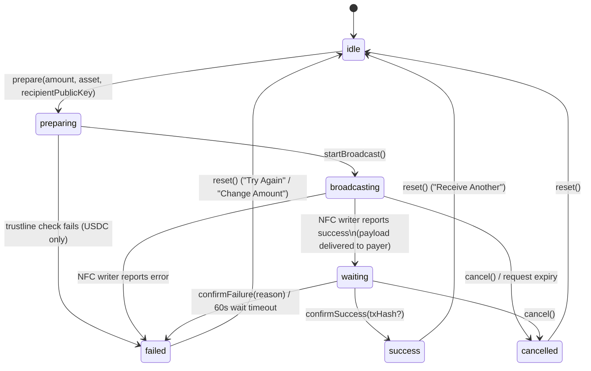

# Receive Payment Flow (C12)

The receive flow lets a user request a contactless payment: enter an amount,
broadcast a payment request over NFC, wait for the payer's on-chain payment,
and land on a success or failure screen. It is implemented as an explicit
finite-state machine (FSM) orchestrated by `useReceivePayment` and shared
across screens via `ReceivePaymentProvider`.

## 1. State diagram

Note: NFC delivery success is **not** the same as payment success — it only
means the request payload reached the payer's device. That's why
`broadcasting` moves to `waiting` (not `success`) once the NFC writer session
completes; `waiting` is resolved only by an explicit `confirmSuccess` /
`confirmFailure` call (today: the 60-second wait timeout in
`WaitingForPaymentView`; a future iteration can resolve it early via balance
polling).

## 2. File map

| File | Responsibility |
| --- | --- |
| `src/features/receive/schemas/receiveAmount.ts` | Zod validation for the amount + asset pair (CLI-062) |
| `src/features/receive/services/PaymentRequestBuilder.ts` | Builds a `PaymentRequest` via the shared `createPaymentRequest` (CLI-063) |
| `src/features/receive/services/receiveSession.ts` | Owns the request-expiry and wait-timeout timers, cancellable and ghost-free (CLI-069) |
| `src/features/wallet/services/TrustlineService.ts` | Checks whether the receiver has a USDC trustline before a USDC request is broadcast (CLI-070) |
| `src/features/receive/hooks/useReceivePayment.ts` | FSM orchestrator + `ReceivePaymentProvider`/`useReceivePaymentContext` for cross-screen state (CLI-065) |
| `src/features/receive/views/ReceiveHomeView.tsx` | Amount entry, asset selector, kicks off `prepare()` (CLI-061) |
| `src/features/receive/views/ReceiveListeningView.tsx` | Starts the NFC broadcast, shows countdown + NFC status (CLI-064) |
| `src/features/receive/views/WaitingForPaymentView.tsx` | Waits for payment settlement, 60s timeout (CLI-066) |
| `src/features/receive/views/ReceiveSuccessView.tsx` | Success summary, reset/home actions (CLI-067) |
| `src/features/receive/views/ReceiveFailedView.tsx` | Error-specific messaging, retry/change-amount actions (CLI-068) |
| `src/constants/analytics-events.ts` | Receive funnel event names + sanitized property shape (CLI-071) |
| `src/app/receive/{listening,waiting,success,failed}.tsx` | Expo Router screens for each non-home view |
| `src/app/(tabs)/receive.tsx` | Tab entry point, renders `ReceiveHomeView` |
| `src/app/_layout.tsx` | Mounts `ReceivePaymentProvider` above all routes so orchestrator state survives navigation |

## 3. Timeout model

Two independent timers, both owned by `ReceiveSessionManager` (`receiveSession`):

- **Request expiry** — `startRequestExpiry(expiresAtSeconds, onExpire)`. Started
  in `startBroadcast()` using the `PaymentRequest.expiresAt` timestamp set at
  build time (`DEFAULT_EXPIRY_TTL_SECONDS = 5 * 60`, i.e. 5 minutes from
  `prepare()`). If the broadcast is still active when the request expires, the
  orchestrator cancels the session (`cancel()`).
- **Wait timeout** — `startWaitTimeout(ms, onTimeout)`. Started by
  `WaitingForPaymentView` when it mounts (`WAIT_TIMEOUT_MS = 60_000`). If no
  success/failure confirmation arrives within 60 seconds, the view calls
  `confirmFailure('timeout')`.

**Interaction**: request expiry only matters while broadcasting (the payer
hasn't tapped yet); wait timeout only matters after the NFC handoff succeeded
and we're waiting on settlement. They are mutually exclusive by construction —
`startBroadcast()` cancels any prior expiry timer before starting a new one,
and `cancel()` / `reset()` always call `receiveSession.cancelAll()` so no timer
outlives its screen.

## 4. Error matrix

| Error code | Screen shown | User message | Recovery action |
| --- | --- | --- | --- |
| `timeout` | `ReceiveFailedView` | "Payment timed out. Please try again." | Try Again (same amount) or Change Amount |
| `nfc_error` | `ReceiveFailedView` | "NFC connection was lost." | Try Again (same amount) or Change Amount |
| `trustline_missing` | `ReceiveFailedView` | "USDC trustline not found. Set up your USDC account first." | Try Again (same amount) or Change Amount |
| *(anything else)* | `ReceiveFailedView` | "Payment failed. Please try again." | Try Again (same amount) or Change Amount |

"Try Again" preserves the previously entered amount/asset by forwarding them as
route params back to `ReceiveHomeView`; "Change Amount" resets fully and
returns to a blank form.

## 5. Analytics event mapping

All receive events live in `AnalyticsEvents` (`src/constants/analytics-events.ts`)
and carry only sanitized properties — **no public keys, no raw amounts, no
PII**. Amounts are bucketed via `amount_bucket`: `'<1' | '1-10' | '10-100' | '>100'`.

| State transition | Event | Sanitized properties |
| --- | --- | --- |
| `idle` → `preparing` (`prepare()` called) | `RECEIVE_STARTED` | `amount_bucket`, `asset` |
| `preparing` → `broadcasting` (`startBroadcast()`) | `RECEIVE_BROADCAST` | `amount_bucket`, `asset` |
| `broadcasting` → `waiting` (NFC write succeeded) | `RECEIVE_WAITING` | `amount_bucket`, `asset` |
| `waiting`/`broadcasting` → `success` (`confirmSuccess()`) | `RECEIVE_COMPLETED` | `amount_bucket`, `asset` |
| any → `failed` (`confirmFailure(reason)`) | `RECEIVE_FAILED` | `amount_bucket`, `asset`, `reason` |
| any → `cancelled` (`cancel()`) | `RECEIVE_CANCELLED` | `amount_bucket`, `asset` |

## 6. Related docs

- [NFC library ADR](adr-nfc-library.md) — payload size/encoding constraints the
  payment request payload must respect.
- [Product flows & system definition](ding-payments.md) — payment payload
  structure this flow builds on.
- [Client MVP build plan](build-plan-client-mvp.md) — where C12 sits in the
  overall build.
