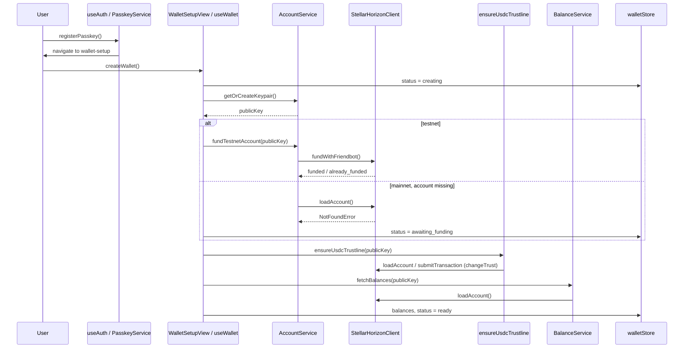
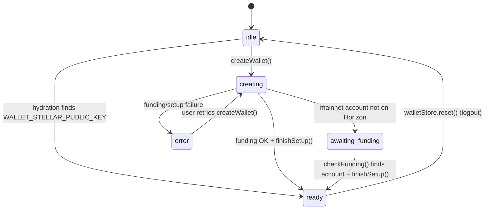

# Wallet Flow (C09)

The wallet domain provides self-custodial Stellar key management, testnet funding,
USDC trustline setup, balance reads, payment validation, unsigned transaction
building, and affordability checks. C09 completes the primitives required for
future send/receive payment flows without shipping a full end-to-end send UI yet.

## 1. Overview

C09 delivers the wallet **service layer** and **onboarding integration** for Ding
Payments:

- **Account lifecycle** — generate or reuse a Stellar keypair, check on-chain
  existence, fund on testnet via Friendbot.
- **Trustline & balances** — idempotent USDC trustline creation during setup;
  Horizon balance parsing for XLM and USDC.
- **Payment primitives** — Zod-validated payment params, unsigned
  `TransactionBuilder`, and `FeeService` affordability checks using stroops/bigint.
- **Error taxonomy** — stable `WalletErrorCode` values via `walletErrors.ts`.
- **Auth integration** — `AuthGuard` gates protected tabs on local wallet readiness;
  Settings shows the Stellar G-address; logout clears Stellar keys and resets
  `walletStore`.

What C09 does **not** include: a complete send flow (sign + submit from UI),
receive settlement polling, or on-chain funding verification inside `AuthGuard`.

## 2. Onboarding sequence

The real onboarding path after passkey registration:

1. **Passkey** — `useAuth.registerPasskey()` persists `PASSKEY_CREDENTIAL_ID` and
   `WALLET_PUBLIC_KEY` (credential ID placeholder), then navigates to
   `/(onboarding)/wallet-setup`.
2. **Keypair** — `useWallet.createWallet()` calls
   `AccountService.getOrCreateKeypair()` (reads or generates
   `WALLET_STELLAR_PUBLIC_KEY` / `WALLET_STELLAR_SECRET_KEY` in SecureKeyStore).
3. **Funding** — on **testnet**, `AccountService.fundTestnetAccount()` calls
   `StellarHorizonClient.fundWithFriendbot()`. On **mainnet**, if the account
   does not exist on Horizon, status becomes `awaiting_funding` and the user must
   deposit XLM externally (`FundWalletView` + `checkFunding()`).
4. **Trustline** — `finishSetup()` calls `ensureUsdcTrustline()` (signs and
   submits `changeTrust` when needed).
5. **Balances** — `fetchBalances()` loads XLM/USDC from Horizon into
   `walletStore`.
6. **Ready** — `walletStore.status` becomes `ready`; `WalletSetupView` redirects
   to `/(tabs)/receive`.

### Distinctions

| Step | What it does | What it does **not** do |
| --- | --- | --- |
| Keypair creation/reuse | Generates or reads local Stellar G/S keys | Does not activate the account on-chain by itself |
| Friendbot funding | Creates/funds testnet account via Horizon | Not available on mainnet |
| USDC trustline | Adds `changeTrust` for configured issuer | Does not run during receive read-only checks |
| Balance load | Parses Horizon `balances` into `WalletBalances` | Does not poll for incoming payments |
| Wallet ready | Local state: key present + setup finished | Does not prove ongoing on-chain solvency after hydration |

### Sequence diagram (current code)



### Cold-start hydration (separate path)

On app launch, `useWallet` reads `WALLET_STELLAR_PUBLIC_KEY` from SecureKeyStore.
If a key exists locally, it sets `publicKey` and `status = 'ready'` **without**
re-running funding checks or trustline setup. Balances are fetched lazily when
`status === 'ready'` and `balances` is null.

## 3. Authentication and wallet readiness

`AuthGuard` wraps the tab navigator (`src/app/(tabs)/_layout.tsx`) and runs
**after** auth state is resolved. It performs **no network calls**.

### Auth states handled

| Auth status | Guard behavior |
| --- | --- |
| `LOADING` | Renders nothing (splash handled elsewhere) |
| `UNAUTHENTICATED` | Redirect → `/(onboarding)/welcome` |
| `ONBOARDING` | Redirect → `/(onboarding)/create-passkey` |
| `LOCKED` | Redirect → `/(onboarding)/locked` |
| `READY` | Requires wallet readiness (see below) |

### Wallet-ready criteria (current)

When `auth.status === 'READY'`, the guard allows tab content only if:

```text
hasHydrated && status === 'ready' && publicKey
```

Otherwise it redirects to `/(onboarding)/wallet-setup`.

**Important:** This checks **local** wallet state only. The guard does **not**
verify on-chain funding, trustline presence, or balance sufficiency.

### Loop safety

`/(onboarding)/wallet-setup` lives under `(onboarding)/`, **outside** the
`(tabs)/` stack that `AuthGuard` protects. A user without a ready wallet is sent
to wallet-setup instead of bouncing between tabs and onboarding auth screens.

## 4. Wallet state machine

`walletStore` (`src/features/wallet/state/walletStore.ts`) defines:

| Status | Meaning |
| --- | --- |
| `idle` | Initial state before hydration or before create |
| `creating` | `createWallet()` in progress |
| `awaiting_funding` | Key exists locally; mainnet account not found on Horizon |
| `ready` | Setup complete (or hydrated from stored public key) |
| `error` | Setup failed; message in `walletStore.error` |

### State diagram



### Main transitions (implementation)

- **`createWallet`** — `idle|error` → `creating` → `ready` | `awaiting_funding` | `error`
- **`checkFunding`** — `awaiting_funding` → `ready` when `accountExistsOnNetwork` is true
- **Hydration** — `idle` → `ready` when a Stellar public key exists in SecureKeyStore
- **`reset` (logout)** — any → `idle` (full initial state, `hasHydrated: false`)

## 5. Service ownership

> **AccountService** fulfills the role described as **WalletService** in the C09
> specification. There is **no separate `WalletService.ts`** in this repository.

| Module | Responsibility | Main dependencies |
| --- | --- | --- |
| **AccountService** | Keypair get/create, on-chain existence check, testnet Friendbot funding | `SecureKeyStore`, `StellarHorizonClient`, `env` |
| **StellarHorizonClient** | Typed wrapper: `loadAccount`, `submitTransaction`, `fundWithFriendbot` | `@stellar/stellar-sdk` Horizon.Server, `env.horizonUrl` |
| **BalanceService** | Parse Horizon balances; fetch XLM/USDC; stroops helpers | `StellarHorizonClient`, `stellarReserve`, `STELLAR_ASSETS` |
| **TrustlineService** | `ensureUsdcTrustline` (setup); `checkUsdcTrustline` (read-only for receive) | `StellarHorizonClient`, `BalanceService`, `stellarReserve`, `walletErrors`, `SecureKeyStore` |
| **FeeService** | `estimateFee()`, `canAffordPayment()` — no submission | `BalanceService`, `TrustlineService.hasUsdcTrustline`, `paymentTx`, `StellarHorizonClient` |
| **TransactionBuilder** | Build **unsigned** XLM/USDC payment transactions | `paymentTx`, `StellarHorizonClient`, `env.networkPassphrase` |
| **walletErrors** | Map Horizon/SDK/validation failures to `WalletErrorCode` + Spanish messages | `paymentTx`, `FeeService`, `TrustlineService` types |
| **stellarReserve** | Reserve formulas and stroops conversion (shared constants) | None (pure utils) |
| **paymentTx** | Zod schema, amount parsing (bigint stroops), validation errors | `STELLAR_ASSETS` |
| **useWallet / walletStore** | UI hook + Zustand store: hydration, create, funding check, balances | `AccountService`, `TrustlineService`, `BalanceService`, `SecureKeyStore` |

## 6. Secure key and public key model

The app maintains **two unrelated public identifiers**:

| Identity | Storage key | Used for |
| --- | --- | --- |
| **Passkey credential ID** | `SECURE_KEYS.PASSKEY_CREDENTIAL_ID` | WebAuthn / passkey auth |
| **Auth “publicKey”** | `SECURE_KEYS.WALLET_PUBLIC_KEY` / `authStore.publicKey` | Passkey credential ID at runtime — **not** a Stellar G-address |
| **Stellar public key** | `SECURE_KEYS.WALLET_STELLAR_PUBLIC_KEY` / `walletStore.publicKey` | On-chain Stellar account (G…) |
| **Stellar secret key** | `SECURE_KEYS.WALLET_STELLAR_SECRET_KEY` | Signing (`ensureUsdcTrustline`; future send) — never exposed to UI |

`authStore.publicKey` is documented in code as the passkey credential ID placeholder.
It must **not** be shown as the Stellar wallet address.

**Settings** (`SettingsAuthSection`) displays the Stellar G-address from
`useWallet().publicKey` (wallet domain), not `useAuth().state.publicKey`.

## 7. Payment transaction flow

### Implemented in C09

```text
paymentTx schema (validate + parsePaymentAmount)
    → TransactionBuilder.buildPaymentTx()   [unsigned tx]
    → FeeService.canAffordPayment()         [affordability only]
```

- **Validation** — `PaymentTxValidationError` from Zod / amount rules before any
  Horizon call.
- **Build** — loads source account sequence from Horizon; returns unsigned
  `Transaction` (fee = `BASE_FEE`, default timeout 300s).
- **Affordability** — `AffordabilityResult` with `canAfford` and optional
  `AffordabilityReason`; uses payment reserve formula (no trustline buffer).

### Not implemented (future work)

```text
    → signing with WALLET_STELLAR_SECRET_KEY   [future]
    → StellarHorizonClient.submitTransaction() [future send UI / payer flow]
```

There is **no** production send screen wired to `buildPaymentTx` today. Receive
(C12) uses NFC + trustline checks but does not submit payer transactions from this
stack yet.

## 8. Reserve formulas

Implemented in `src/features/wallet/utils/stellarReserve.ts`.

### Payments (affordability / minimum balance)

```text
minimumBalance = (2 + subentryCount) × 0.5 XLM
```

Used by `getMinimumBalanceStroops()` → `FeeService.canAffordPayment()` and
`BalanceService.getMinimumBalanceStroops`. **No** extra subentry and **no**
0.01 XLM buffer.

### Trustline creation

```text
minimumBalance = (2 + subentryCount + 1) × 0.5 XLM + 0.01 XLM buffer
```

Used by `getMinimumBalanceStroopsForNewTrustline()` and
`getMinimumBalanceXlmForNewTrustline()` in `ensureUsdcTrustline()`. The
**0.01 XLM buffer applies only to trustline creation**, not payment affordability.

### Stroops / bigint

Monetary math uses **stroops** (`1 XLM = 10^7 stroops`) via `horizonBalanceToStroops`,
`parsePaymentAmount`, and `FeeService` to avoid JavaScript floating-point drift.
`getMinimumBalanceXlmForNewTrustline()` remains a Number helper for legacy checks
inside `TrustlineService.hasSufficientReserveForTrustline()`.

## 9. Error taxonomy

Keep Horizon/SDK details in services; expose stable codes/messages to UI via
`walletErrors.ts` (and `toast.walletError()` where integrated).

### Layers

| Layer | Type | When |
| --- | --- | --- |
| Input validation | `PaymentTxValidationError` | Invalid keys, asset, amount, memo before build |
| Build failures | `PaymentTxBuildError` | Source account load failure, missing USDC issuer config |
| Affordability | `AffordabilityReason` | Pre-flight balance/trustline/reserve checks (`FeeService`) |
| User-facing stable | `WalletErrorCode` / `WalletError` | Mapped Horizon, affordability, and validation failures |

### Mapping helpers

| Function | Purpose |
| --- | --- |
| `mapHorizonError(error)` | NotFound → `ACCOUNT_NOT_FOUND`; result codes → balance/trustline/recipient; network → `NETWORK_ERROR` |
| `mapAffordabilityReason(reason)` | Bridges `FeeService` reasons to `WalletErrorCode` |
| `mapPaymentValidationError(error)` | `PaymentTxValidationError` → `INVALID_AMOUNT` or `INVALID_PAYMENT_PARAMS` |
| `sanitizeWalletError(err)` | Strip `cause` before UI/analytics |

`TransactionBuilder` collapses all `loadAccount` failures into a single
`PaymentTxBuildError` message; callers that need `ACCOUNT_NOT_FOUND` vs
`NETWORK_ERROR` should map the **original** Horizon error with `mapHorizonError`
at the integration boundary.

### WalletErrorCode reference

| Code | Typical source |
| --- | --- |
| `ACCOUNT_NOT_FOUND` | Horizon `NotFoundError`, affordability `account_not_found` |
| `INVALID_RECIPIENT` | Horizon `op_no_destination` |
| `INSUFFICIENT_BALANCE` | Horizon underfund / line full; affordability `insufficient_balance` |
| `INSUFFICIENT_RESERVE` | Affordability `insufficient_xlm_for_fee_and_reserve`; trustline reserve |
| `NO_USDC_TRUSTLINE` | Horizon trust ops; affordability `no_usdc_trustline` |
| `INVALID_AMOUNT` | Amount validation messages from `paymentTx` |
| `INVALID_PAYMENT_PARAMS` | Other payment schema validation failures |
| `BAD_SEQUENCE` | Horizon `tx_bad_seq` |
| `TRANSACTION_FAILED` | Other failed transaction result codes |
| `NETWORK_ERROR` | HTTP 5xx, `TypeError`, affordability `network_error` |
| `TIMEOUT` | `AbortError` |
| `WALLET_KEY_MISSING` | Missing `WALLET_STELLAR_SECRET_KEY` during trustline setup |
| `CONFIG_ERROR` | Reserved for misconfiguration (e.g. USDC issuer) |
| `UNSUPPORTED_OPERATION` | Environment restrictions |
| `UNKNOWN` | Unclassified errors |

## 10. Environment variables

Defined in `src/lib/env.ts` (loaded from Expo public env vars):

| Variable | Purpose |
| --- | --- |
| `EXPO_PUBLIC_STELLAR_NETWORK` | `testnet` or `mainnet` — selects network profile and passphrase |
| `EXPO_PUBLIC_HORIZON_URL` | Horizon HTTP endpoint for `StellarHorizonClient` |
| `EXPO_PUBLIC_RPC_URL` | Soroban RPC URL (typed in `env`; wallet C09 uses Horizon primarily) |
| `EXPO_PUBLIC_USDC_ISSUER` | USDC issuer account ID for trustline and balance matching |

Derived at runtime (not env vars):

- `env.networkPassphrase` — `Networks.TESTNET` or `Networks.PUBLIC`
- `env.stellarNetwork`, `env.horizonUrl`, `env.rpcUrl`, `env.usdcIssuer`

Mainnet guardrail: if `EXPO_PUBLIC_STELLAR_NETWORK=mainnet`, Horizon/RPC URLs
must not contain `testnet`.

## 11. Logout and wallet cleanup

`useAuth.logout()` performs:

1. `PasskeyService.revoke()` — clears passkey credential artifacts
2. Deletes `WALLET_STELLAR_PUBLIC_KEY`, `WALLET_STELLAR_SECRET_KEY`, and
   `SESSION_LAST_ACTIVE` from SecureKeyStore
3. `useWalletStore.getState().reset()` — clears status, publicKey, balances,
   error, and `hasHydrated`
4. `dispatch({ type: 'LOGOUT' })` — auth returns to `UNAUTHENTICATED`

Passkey keys (`PASSKEY_CREDENTIAL_ID`, `WALLET_PUBLIC_KEY`) are revoked via
PasskeyService rather than deleted individually in this flow.

This prevents a previous session’s Stellar key from leaving `walletStore` in
`ready` after logout: the next user must pass auth and run wallet setup again.
`AuthGuard` will redirect to wallet-setup until a new wallet reaches `ready`.

## 12. Testing

C09 unit/integration tests use **mocked** Horizon and SecureKeyStore — no live
network required.

| Area | Test file |
| --- | --- |
| TransactionBuilder | `src/features/wallet/services/__tests__/TransactionBuilder.test.ts` |
| stellarReserve | `src/features/wallet/utils/stellarReserve.test.ts` |
| AccountService | `src/features/wallet/services/AccountService.test.ts` |
| FeeService | `src/features/wallet/services/FeeService.test.ts` |
| BalanceService | `src/features/wallet/services/BalanceService.test.ts` |
| TrustlineService | `src/features/wallet/services/TrustlineService.test.ts` |
| walletErrors | `src/features/wallet/services/walletErrors.test.ts` |
| StellarHorizonClient | `src/features/wallet/services/StellarHorizonClient.test.ts` |
| AuthGuard | `src/features/auth/components/__tests__/AuthGuard.test.tsx` |
| Settings Stellar pubkey | `src/features/auth/components/__tests__/SettingsAuthSection.test.tsx` |
| Logout wallet cleanup | `src/features/auth/hooks/__tests__/useAuth.logout.test.tsx` |

Run the C09 regression slice:

```bash
npm test -- --testPathPattern="TransactionBuilder|stellarReserve|AccountService|FeeService|BalanceService|TrustlineService|walletErrors|StellarHorizonClient|AuthGuard|SettingsAuthSection|useAuth.logout"
```

## 13. Manual testnet checklist

Use a **development build** on Stellar **testnet** with valid `.env` values.

- [ ] **Create / reuse wallet** — Complete passkey onboarding → wallet-setup →
      “Crear billetera”. Confirm a G-address appears in Settings after ready.
- [ ] **Testnet funding** — New account receives Friendbot XLM (or shows
      already funded). Mainnet: confirm `awaiting_funding` until external deposit.
- [ ] **USDC trustline** — After funding, account holds USDC trustline (check
      Horizon or balances in app). Trustline errors surface user-safe messages.
- [ ] **Balance read** — XLM and USDC balances load after ready; pull-to-refresh
      / re-entry updates via `refreshBalances()`.
- [ ] **Insufficient funds (affordability)** — Call `FeeService.canAffordPayment`
      (or future send UI) with amount exceeding balance; expect
      `insufficient_balance` or `insufficient_xlm_for_fee_and_reserve`.
- [ ] **Invalid destination** — `buildPaymentTx` with invalid G-address throws
      `PaymentTxValidationError` before Horizon.
- [ ] **Logout cleanup** — Logout → Stellar pubkey gone from Settings → accessing
      tabs redirects to wallet-setup → new wallet flow does not reuse old keys.

**Not in scope for manual send verification:** end-to-end XLM/USDC payment submit
from a Send screen — signing and submission are not wired in the current UI.

## 14. Related documentation

- [Stellar SDK ADR](adr-stellar-sdk.md) — SDK choice, polyfills, dev-client requirements
- [Product flows & system definition](ding-payments.md) — overall MVP scope
- [Receive payment flow (C12)](receive-flow.md) — receive FSM and trustline read checks
